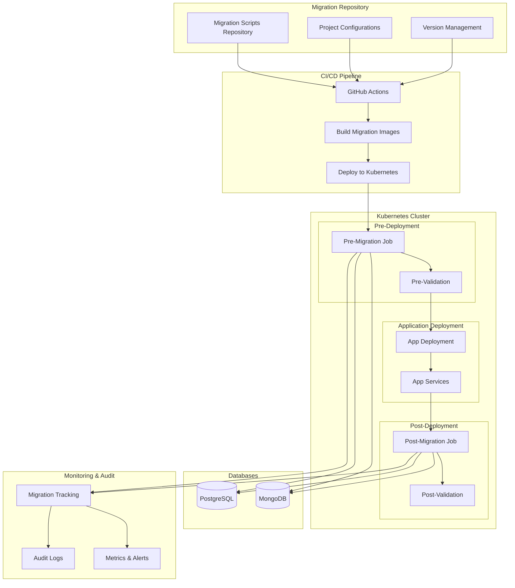
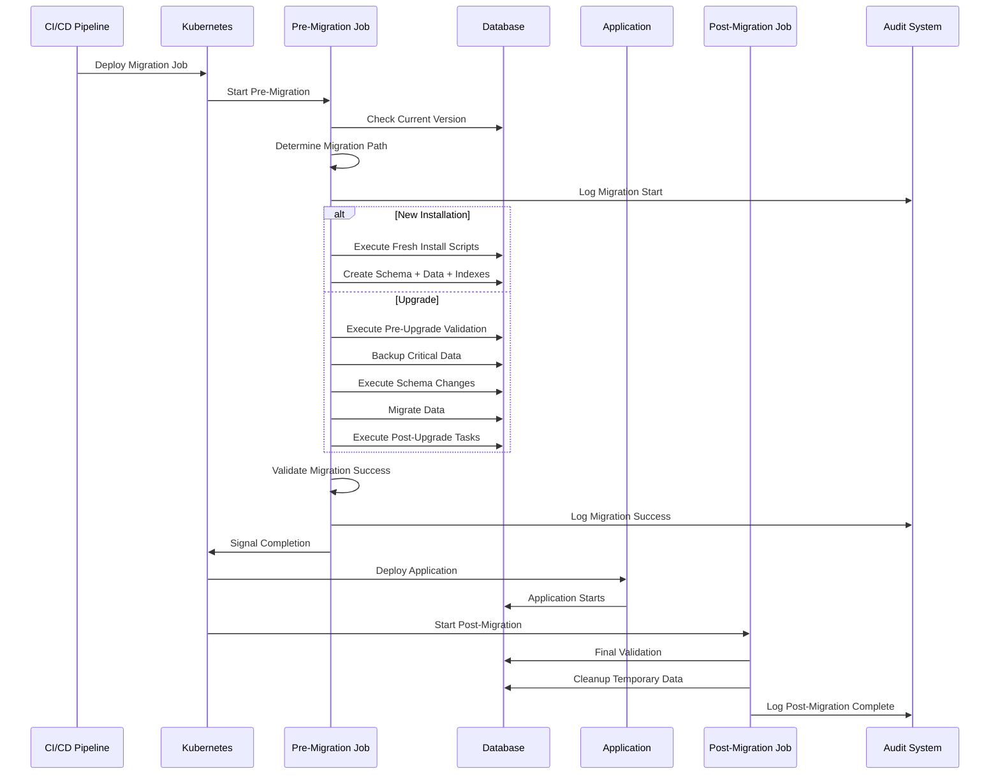
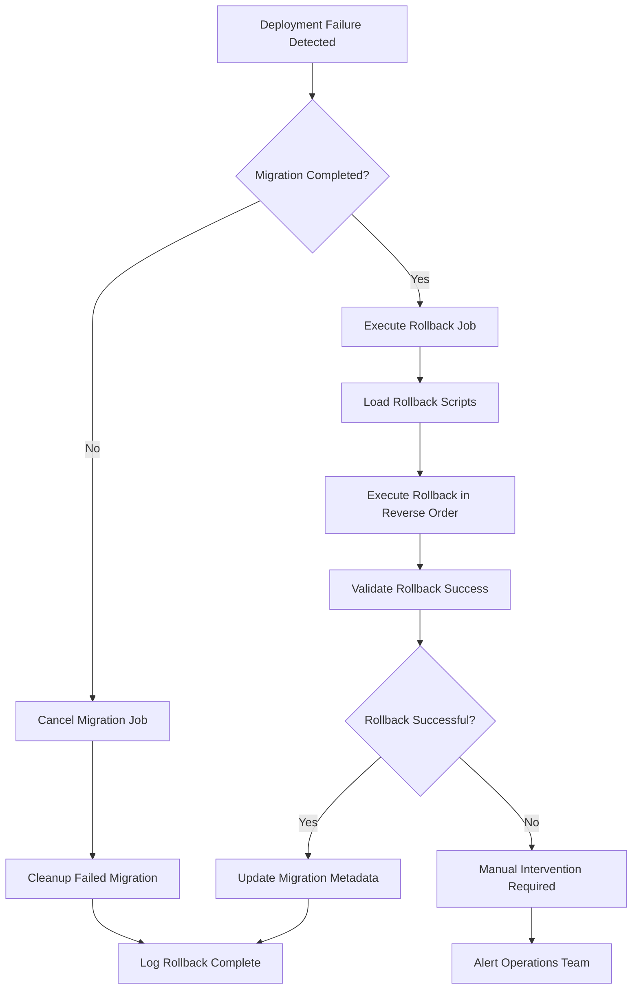
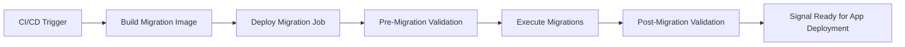
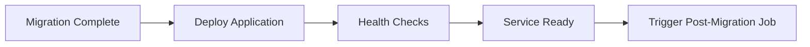
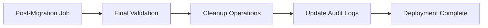

# Multi-Project Database Migration Strategy for Kubernetes

## 📋 Problem Statement

Modern cloud-native applications face significant challenges in database migration management:

### Current Pain Points
- **Manual Database Migrations**: Teams manually run database scripts during deployments, leading to human errors and inconsistencies
- **Lack of Version Control**: Database schema changes aren't properly versioned or tracked alongside application code
- **No Rollback Strategy**: Limited ability to rollback database changes when deployments fail
- **Environment Inconsistency**: Different database states across development, staging, and production environments
- **Multi-Project Complexity**: Managing migrations across multiple microservices with interdependencies
- **Deployment Pipeline Gaps**: Database migrations are often disconnected from CI/CD pipelines
- **Shared Database Access**: Teams need to share database credentials and access to run migrations manually
- **Zero Downtime Requirements**: Need to perform migrations without service interruption

### Business Impact
- **Deployment Delays**: Manual migration processes slow down release cycles
- **Production Incidents**: Failed migrations cause service outages and data corruption
- **Technical Debt**: Inconsistent database states across environments accumulate over time
- **Developer Productivity**: Teams spend significant time troubleshooting migration-related issues

## 🎯 Solution Overview

Our solution provides a **Kubernetes-native, multi-project database migration framework** that automates pre/post deployment database operations with industry-standard tools and practices.

### Key Benefits
- ✅ **Automated Migrations**: Zero-touch database migrations as part of deployment pipeline
- ✅ **Industry Standards**: Uses Flyway (PostgreSQL) and migrate-mongo (MongoDB) best practices
- ✅ **Idempotent Operations**: Safe to run multiple times without side effects
- ✅ **Complete Rollback**: Full rollback capabilities for all migration scenarios
- ✅ **Multi-Project Support**: Manages migrations across multiple microservices
- ✅ **Version-Aware**: Handles both fresh installs and incremental upgrades
- ✅ **Kubernetes Native**: Runs as Kubernetes Jobs with proper RBAC and security
- ✅ **CI/CD Integration**: Seamlessly integrates with GitHub Actions, Jenkins, etc.
- ✅ **Environment Consistency**: Ensures identical database states across all environments
- ✅ **Zero Downtime**: Supports online migrations with minimal service disruption
- ✅ **Audit Trails**: Complete migration history and change tracking

## 🏗️ High-Level Architecture



## 🚀 Technical Implementation Flow

### 1. Repository Structure Strategy

```
migrations/
├── projects/
│   └── {project-name}/
│       ├── project-config.yaml          # Project metadata & policies
│       ├── versions/
│       │   └── {version}/
│       │       ├── new-install/         # Fresh installation scripts
│       │       │   ├── postgresql/
│       │       │   │   ├── schema/      # V{version}.001__*.sql
│       │       │   │   ├── data/        # V{version}.100__*.sql
│       │       │   │   ├── indexes/     # V{version}.200__*.sql
│       │       │   │   └── rollback/    # U{version}.001__*.sql
│       │       │   └── mongodb/
│       │       │       ├── migrations/  # {timestamp}-{description}.js
│       │       │       └── rollbacks/   # {timestamp}-rollback-{description}.js
│       │       └── upgrade/
│       │           └── from-{old-version}/
│       │               ├── pre-upgrade/     # Validation & backup
│       │               ├── schema-changes/  # Incremental changes
│       │               ├── data-migration/  # Data transformations
│       │               ├── post-upgrade/    # Cleanup & validation
│       │               └── rollback/        # Rollback scripts
│       └── docker/
│           ├── postgresql-migrator/
│           └── mongodb-migrator/
└── k8s/
    ├── base/                            # Base Kubernetes templates
    └── projects/                        # Project-specific configurations
```

### 2. Migration Execution Flow



### 3. Rollback Strategy Flow



## 🛠️ Technical Components

### 1. Migration Orchestrator Script

The core orchestrator handles:
- **Version Detection**: Automatically detects current database version
- **Path Calculation**: Determines optimal upgrade path between versions
- **Migration Execution**: Executes appropriate migration scripts
- **Validation**: Validates migration success at each step
- **Rollback Management**: Handles rollback scenarios

### 2. Database-Specific Migrators

#### PostgreSQL (Flyway-based)
- Uses industry-standard Flyway migration tool
- Version-controlled SQL scripts with checksums
- Supports baseline, migration, and rollback operations
- Automatic schema validation and repair

#### MongoDB (migrate-mongo-based)
- JavaScript-based migration scripts
- Transaction support for atomic operations
- Flexible schema evolution for document databases
- Custom validation and rollback logic

### 3. Kubernetes Integration

#### Pre-Install/Pre-Upgrade Hooks
```yaml
annotations:
  "helm.sh/hook": pre-install,pre-upgrade
  "helm.sh/hook-weight": "-10"
  "helm.sh/hook-delete-policy": before-hook-creation,hook-succeeded
```

#### Post-Install/Post-Upgrade Hooks
```yaml
annotations:
  "helm.sh/hook": post-install,post-upgrade
  "helm.sh/hook-weight": "10"
  "helm.sh/hook-delete-policy": before-hook-creation,hook-succeeded
```

## 📚 Usage Examples

### Example 1: Fresh Installation

```bash
# Install e-commerce-api v1.1.0 from scratch
./migration-orchestrator.sh install \
  --project e-commerce-api \
  --version v1.1.0 \
  --database-type postgresql \
  --environment staging
```

### Example 2: Version Upgrade

```bash
# Upgrade e-commerce-api from v1.0.0 to v1.1.0
./migration-orchestrator.sh upgrade \
  --project e-commerce-api \
  --version v1.1.0 \
  --from-version v1.0.0 \
  --database-type postgresql \
  --environment production
```

### Example 3: Rollback Operation

```bash
# Rollback e-commerce-api from v1.1.0 to v1.0.0
./migration-orchestrator.sh rollback \
  --project e-commerce-api \
  --version v1.0.0 \
  --database-type postgresql \
  --environment production
```

### Example 4: CI/CD Integration

```yaml
# GitHub Actions workflow
name: Deploy with Database Migrations

on:
  push:
    branches: [main]

jobs:
  deploy:
    runs-on: ubuntu-latest
    steps:
    - name: Deploy with Helm
      run: |
        helm upgrade --install e-commerce-api ./helm-chart \
          --set migration.image=my-registry/migration-orchestrator:${{ github.sha }} \
          --set migration.project=e-commerce-api \
          --set migration.version=v1.1.0 \
          --set migration.fromVersion=v1.0.0 \
          --set migration.databaseType=postgresql \
          --wait --timeout=10m
```

## 🔧 Configuration Examples

### Project Configuration
```yaml
# projects/e-commerce-api/project-config.yaml
apiVersion: v1
kind: ProjectConfig
metadata:
  name: e-commerce-api
  description: "E-commerce API database migrations"

spec:
  databases:
    primary:
      type: postgresql
      name: ecommerce_db
      schemas: ["public", "audit", "reporting"]
    
  migration:
    policies:
      require_rollback: true
      require_validation: true
      dry_run_first: true
      backup_before_upgrade: true
    
  compatibility_matrix:
    v1.0.0:
      upgrades_to: ["v1.1.0"]
      rollback_to: []
    v1.1.0:
      upgrades_to: ["v2.0.0"]
      rollback_to: ["v1.0.0"]
```

### PostgreSQL Migration Script
```sql
-- V1.1.0.001__Add_orders_table.sql
-- Description: Add orders functionality - upgrade from v1.0.0 to v1.1.0

BEGIN;

-- Validate upgrade path
DO $$
DECLARE
    current_version TEXT;
BEGIN
    SELECT project_version INTO current_version 
    FROM project_metadata 
    WHERE project_name = 'e-commerce-api';
    
    IF current_version NOT IN ('v1.0.0', 'v1.0.1') THEN
        RAISE EXCEPTION 'Cannot upgrade from % to v1.1.0', current_version;
    END IF;
END $$;

-- Create orders table (idempotent)
CREATE TABLE IF NOT EXISTS orders (
    id UUID PRIMARY KEY DEFAULT gen_random_uuid(),
    user_id UUID NOT NULL,
    order_number VARCHAR(50) NOT NULL UNIQUE,
    status VARCHAR(20) NOT NULL DEFAULT 'pending',
    total_amount DECIMAL(10,2) NOT NULL,
    created_at TIMESTAMP DEFAULT CURRENT_TIMESTAMP,
    CONSTRAINT orders_status_check CHECK (status IN ('pending', 'confirmed', 'shipped', 'delivered'))
);

-- Create indexes
CREATE INDEX CONCURRENTLY IF NOT EXISTS idx_orders_user_id ON orders(user_id);
CREATE INDEX CONCURRENTLY IF NOT EXISTS idx_orders_status ON orders(status);

-- Update metadata
UPDATE project_metadata 
SET project_version = 'v1.1.0', updated_at = CURRENT_TIMESTAMP 
WHERE project_name = 'e-commerce-api';

COMMIT;
```

### MongoDB Migration Script
```javascript
// 001-add-orders-collection-v1.1.0.js
module.exports = {
  async up(db, client) {
    const session = client.startSession();
    
    try {
      await session.withTransaction(async () => {
        // Validate upgrade path
        const projectMeta = await db.collection('project_metadata').findOne({
          project_name: "e-commerce-api"
        }, { session });
        
        if (!["v1.0.0", "v1.0.1"].includes(projectMeta?.project_version)) {
          throw new Error(`Cannot upgrade from ${projectMeta?.project_version} to v1.1.0`);
        }
        
        // Create orders collection
        await db.createCollection('orders', {
          validator: {
            $jsonSchema: {
              bsonType: "object",
              required: ["user_id", "order_number", "status", "total_amount"],
              properties: {
                user_id: { bsonType: "objectId" },
                order_number: { bsonType: "string" },
                status: { 
                  bsonType: "string",
                  enum: ["pending", "confirmed", "shipped", "delivered"]
                },
                total_amount: { bsonType: "decimal" }
              }
            }
          },
          session
        });
        
        // Create indexes
        const orders = db.collection('orders');
        await orders.createIndex({ "user_id": 1 }, { session });
        await orders.createIndex({ "order_number": 1 }, { unique: true, session });
        await orders.createIndex({ "status": 1 }, { session });
        
        // Update metadata
        await db.collection('project_metadata').updateOne(
          { project_name: "e-commerce-api" },
          { 
            $set: { 
              project_version: "v1.1.0",
              updated_at: new Date()
            }
          },
          { session }
        );
      });
    } finally {
      await session.endSession();
    }
  },
  
  async down(db, client) {
    // Rollback implementation
    await db.collection('orders').drop();
    await db.collection('project_metadata').updateOne(
      { project_name: "e-commerce-api" },
      { $set: { project_version: "v1.0.0", updated_at: new Date() } }
    );
  }
};
```

### Kubernetes Job Template
```yaml
apiVersion: batch/v1
kind: Job
metadata:
  name: "{{ .Values.migration.project }}-migration-{{ .Values.migration.version }}"
  annotations:
    "helm.sh/hook": pre-install,pre-upgrade
    "helm.sh/hook-weight": "-10"
spec:
  template:
    spec:
      restartPolicy: Never
      containers:
      - name: migration-orchestrator
        image: "{{ .Values.migration.image }}:{{ .Values.migration.tag }}"
        command: ["/usr/local/bin/migration-orchestrator.sh"]
        args:
        - "{{ .Values.migration.operation }}"
        - "--project"
        - "{{ .Values.migration.project }}"
        - "--version"
        - "{{ .Values.migration.version }}"
        - "--from-version"
        - "{{ .Values.migration.fromVersion }}"
        - "--database-type"
        - "{{ .Values.migration.databaseType }}"
        - "--environment"
        - "{{ .Values.environment }}"
        env:
        - name: DB_HOST
          value: "{{ .Values.database.host }}"
        - name: DB_USER
          valueFrom:
            secretKeyRef:
              name: db-credentials
              key: username
        - name: DB_PASSWORD
          valueFrom:
            secretKeyRef:
              name: db-credentials
              key: password
```

## 🚦 Migration Execution Workflow

### 1. Pre-Deployment Phase


### 2. Application Deployment Phase


### 3. Post-Deployment Phase


## 📊 Monitoring and Observability

### Migration Metrics
- **Migration Execution Time**: Track how long migrations take
- **Success/Failure Rates**: Monitor migration reliability
- **Rollback Frequency**: Track rollback occurrences
- **Database Performance Impact**: Monitor database performance during migrations

### Audit Trail
- **Migration History**: Complete log of all migrations executed
- **Change Tracking**: What changed in each migration
- **User Attribution**: Who triggered each migration
- **Environment Tracking**: Which environment each migration ran in

### Alerts and Notifications
```yaml
# Example Prometheus alert
- alert: MigrationJobFailed
  expr: kube_job_status_failed{job_name=~".*-migration-.*"} > 0
  for: 0m
  labels:
    severity: critical
  annotations:
    summary: "Database migration job failed for {{ $labels.job_name }}"
    description: "Migration job {{ $labels.job_name }} has failed. Check logs immediately."
```

## 🔒 Security Considerations

### 1. Database Credentials Management
- Use Kubernetes Secrets for database credentials
- Implement credential rotation policies
- Use service accounts with minimal required permissions

### 2. Migration Script Security
- Store migration scripts in version control with proper access controls
- Implement code review process for all migration changes
- Use checksums to verify script integrity

### 3. Network Security
- Implement network policies to restrict database access
- Use encrypted connections for all database communications
- Audit all database access attempts

## 🎓 Best Practices

### 1. Migration Script Guidelines
- **Idempotent**: Safe to run multiple times
- **Atomic**: Use transactions where possible
- **Backward Compatible**: Don't break existing functionality
- **Documented**: Clear descriptions and comments
- **Tested**: Test in development/staging before production

### 2. Version Management
- **Semantic Versioning**: Use semver for clear version progression
- **Linear Progression**: Maintain clear upgrade paths
- **Compatibility Matrix**: Document which versions can upgrade to which

### 3. Testing Strategy
- **Unit Tests**: Test individual migration scripts
- **Integration Tests**: Test complete migration workflows
- **Rollback Tests**: Verify rollback functionality works
- **Performance Tests**: Ensure migrations don't cause performance issues

## 🚀 Getting Started

### 1. Setup Repository Structure
```bash
# Clone the repository
git clone <your-repo-url>
cd migrations

# Create your first project
mkdir -p projects/my-app/versions/v1.0.0/new-install/postgresql/schema
```

### 2. Create Project Configuration
```bash
# Copy template configuration
cp templates/project-config.yaml projects/my-app/project-config.yaml
# Edit configuration for your project
```

### 3. Write Your First Migration
```bash
# Create your first migration script
cat > projects/my-app/versions/v1.0.0/new-install/postgresql/schema/V1.0.0.001__Create_baseline.sql << 'EOF'
-- Description: Create baseline schema for my-app v1.0.0
BEGIN;
CREATE TABLE IF NOT EXISTS users (
    id SERIAL PRIMARY KEY,
    username VARCHAR(255) NOT NULL UNIQUE,
    created_at TIMESTAMP DEFAULT CURRENT_TIMESTAMP
);
COMMIT;
EOF
```

### 4. Test Migration
```bash
# Test migration locally
./scripts/migration-orchestrator.sh install \
  --project my-app \
  --version v1.0.0 \
  --database-type postgresql \
  --dry-run
```

### 5. Deploy to Kubernetes
```bash
# Deploy using Helm
helm install my-app ./helm-charts/migration-job \
  --set migration.project=my-app \
  --set migration.version=v1.0.0 \
  --set migration.operation=install
```

## 📞 Support and Contributing

### Documentation
- [Migration Script Writing Guide](docs/migration-scripts.md)
- [Kubernetes Integration Guide](docs/kubernetes-integration.md)
- [Troubleshooting Guide](docs/troubleshooting.md)

### Contributing
1. Fork the repository
2. Create a feature branch
3. Add tests for new functionality
4. Submit a pull request

### Getting Help
- **Issues**: Report bugs and feature requests via GitHub Issues
- **Discussions**: Ask questions in GitHub Discussions
- **Wiki**: Check the project wiki for additional documentation

---

**This migration strategy provides a robust, scalable solution for managing database migrations in Kubernetes environments while following industry best practices and ensuring data integrity across all deployment scenarios.**
