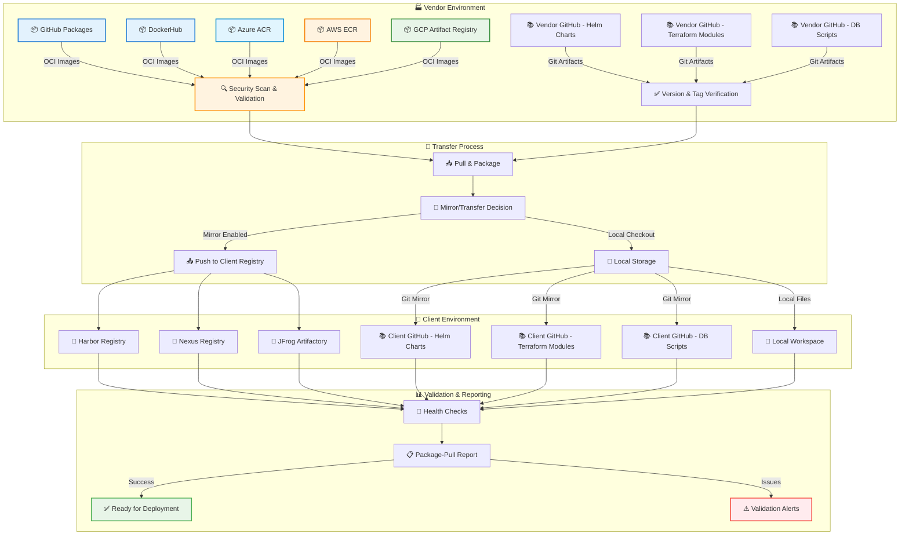
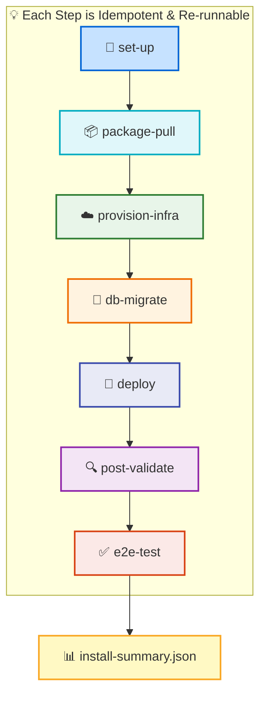
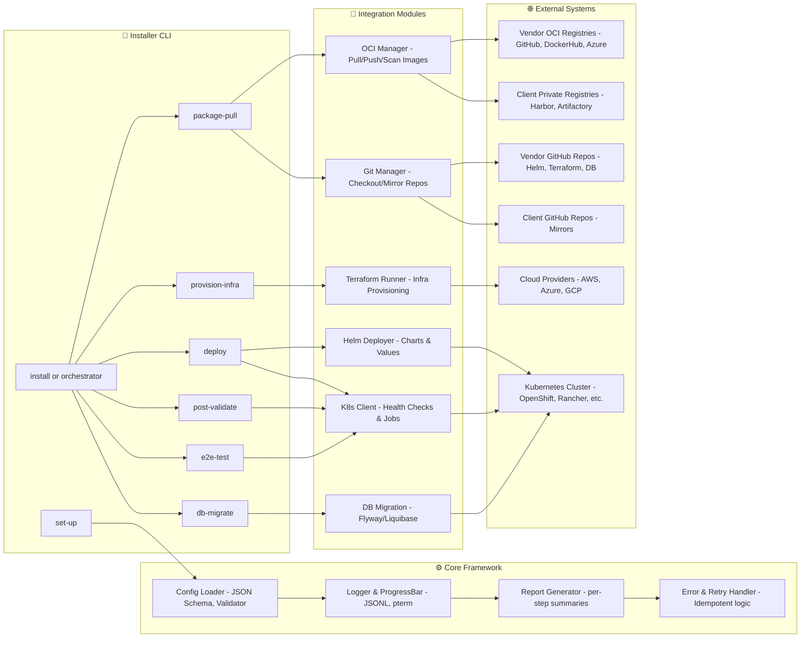
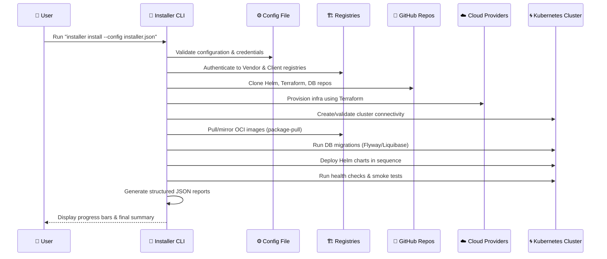

# Enterprise-Grade E2E Kubernetes Installer

A comprehensive, production-ready Go-based CLI tool for deploying and managing Kubernetes clusters across multiple cloud environments with enterprise-grade security, monitoring, and validation capabilities.

[](https://goreportcard.com/report/github.com/judebantony/e2e-k8s-installer)
[](https://github.com/judebantony/e2e-k8s-installer/releases/latest)
[](https://golang.org/)
[](LICENSE)

## 🎯 Overview

**Enterprise-grade Kubernetes installer** that automates the complete deployment lifecycle across AWS, Azure, GCP, and on-premises environments. Supports both connected and air-gapped deployments with multi-mode infrastructure provisioning.

Design and develop a unified, cross-platform, end-to-end (E2E) installer for deploying and managing a Kubernetes-based application across startup, mid-size, enterprise, and air-gapped environments.
The installer automates provisioning, configuration, deployment, validation, and lifecycle management across Azure, AWS, GCP, and on-premises (OpenShift, Rancher, etc.) infrastructures while ensuring compliance, security, and resilience.

### Key Features

- **🏗️ Multi-Mode Infrastructure**: Terraform, Makefile, and Hybrid provisioning modes
- **📦 Artifact Management**: OCI images, Helm charts, and Terraform modules synchronization
- **☁️ Multi-Cloud Ready**: AWS EKS, Azure AKS, GCP GKE, and on-premises support
- **🔒 Security-First**: Enterprise authentication, RBAC, and compliance scanning
- **📊 Enterprise Observability**: Structured logging, progress tracking, and comprehensive reporting
- **🔄 Air-gapped Support**: Complete offline installation capabilities

## 🎯 Core Objectives

- **Simplify Deployment**: Streamline application deployment and lifecycle management in Kubernetes clusters
- **Air-gapped Support**: Provide offline installation and upgrade capabilities for secure environments
- **Compliance & Auditability**: Ensure compliance, auditability, idempotency, and cross-cloud portability
- **Flexible Installation**: Offer both interactive and non-interactive (config-driven) installation modes
- **Self-contained Delivery**: Enable complete deployment without direct vendor package access

## 📋 Scope and Functional Requirements

### Artifact preparation & shipping into the client environment



**Detailed Artifact Flow:**

- **🖼️ OCI Container Images**: Transfer from vendor registries (GitHub Packages, DockerHub, Azure ACR, AWS ECR, GCP Artifact Registry) → client's private registry (Harbor, Nexus, JFrog Artifactory) with security scanning
- **📊 Helm Charts**: Migration from vendor GitHub → client GitHub (or maintain local checkout if mirroring is disabled). Charts are versioned and tagged in vendor repositories
- **🏗️ Terraform Modules**: Transfer from vendor GitHub → client GitHub (or local checkout), with version control and tagging
- **🗃️ Database Migration Scripts**: Transfer from vendor GitHub → client GitHub (or local checkout), including repair and migration scripts
- **🔍 Health Checks & Validation**: Comprehensive verification, scanning, and readiness validation with detailed JSON reporting

### Full E2E installation once artifacts are in client environment

- ✅ **Infrastructure Provisioning**: Terraform-based deployment (K8s clusters, managed DBs/services)
- ✅ **Database Migrations & Repair**: Flyway/Liquibase execution as Kubernetes Job/init container
- ✅ **Application Deployment**: Helm-based deployment in configured order with pod readiness + health URL checks
- ✅ **Post-installation Validation**: Ensure all components are correctly installed and configured
- ✅ **Configuration Drift Detection**: Monitor and report any changes to the deployed environment
- ✅ **Post-validation**: Comprehensive checks, housekeeping, and E2E smoke tests
- ✅ **Reporting & Audit Logs**: Detailed JSON reports and structured logs for every step

## 🚀 Current Status

| Component | Status | Description |
|-----------|---------|-------------|
| **🔧 setup Command** | ✅ Complete | Workspace initialization and prerequisite validation |
| **📦 package-pull Command** | ✅ Complete | Artifact synchronization (OCI/Helm/Terraform) |
| **☁️ provision-infra Command** | ✅ Complete | Multi-mode infrastructure provisioning |
| **🗄️ db-migrate Command** | 🚧 In Progress | Database migration framework |
| **🚀 deploy Command** | 🚧 In Progress | Helm-based application deployment |
| **✅ post-validate & e2e-test** | 🔄 Planned | Validation and testing framework |

## 🧭 Flow Diagram



## 🧱 Layered Architecture Diagram



## 🧱 Prerequisite & Dependency Flow



## 🏗️ Architecture

### Multi-Mode Infrastructure Provisioning

The installer supports three distinct infrastructure provisioning modes:

#### **Terraform Mode** 🏗️

Pure Terraform-based infrastructure provisioning for cloud-native deployments.

#### **Makefile Mode** ⚙️

Makefile-based workflows for custom provisioning scripts and legacy systems.

#### **Hybrid Mode** 🔄

Combined approach where Makefiles orchestrate Terraform modules internally.

### System Architecture

```plaintext
┌─────────────────────────────────────────────────────────────────────┐
│                      CLI Application (main.go)                      │
└─────────────────────────────────────────────────────────────────────┘
                                     │
┌─────────────────────────────────────────────────────────────────────┐
│                      Command Layer (cmd/)                          │
│  setup | package-pull | provision-infra | deploy | db-migrate      │
└─────────────────────────────────────────────────────────────────────┘
                                     │
┌─────────────────────────────────────────────────────────────────────┐
│                   Business Logic Layer (pkg/)                      │
│  ┌─────────────────┐ ┌─────────────────┐ ┌─────────────────┐       │
│  │ infrastructure/ │ │   artifacts/    │ │    config/      │       │
│  │ Multi-Mode Mgr  │ │ OCI/Helm/Git    │ │ JSON Validation │       │
│  └─────────────────┘ └─────────────────┘ └─────────────────┘       │
│  ┌─────────────────┐ ┌─────────────────┐ ┌─────────────────┐       │
│  │   terraform/    │ │   makefile/     │ │ logger/progress │       │
│  │   Operations    │ │   Execution     │ │ UI Components   │       │
│  └─────────────────┘ └─────────────────┘ └─────────────────┘       │
└─────────────────────────────────────────────────────────────────────┘
                                     │
┌─────────────────────────────────────────────────────────────────────┐
│              External Integrations                                  │
│  Cloud Providers | OCI Registries | Git Repositories               │
└─────────────────────────────────────────────────────────────────────┘
```

### Package Structure

```plaintext
e2e-k8s-installer/
├── main.go                         # Application entry point
├── cmd/                           # Command implementations
│   ├── setup.go                   # Workspace initialization
│   ├── package_pull.go            # Artifact synchronization
│   ├── provision_infra.go         # Multi-mode infrastructure
│   ├── deploy.go                  # Application deployment
│   └── install.go                 # Full workflow orchestration
├── pkg/                          # Business logic
│   ├── infrastructure/           # Multi-mode infrastructure manager
│   ├── terraform/               # Terraform operations
│   ├── makefile/                # Makefile execution
│   ├── artifacts/               # OCI/Helm/Git management
│   ├── config/                  # Configuration & validation
│   └── logger/                  # Structured logging & progress
└── configs/                     # Sample configurations
```

## ⚙️ Configuration

### Multi-Mode Infrastructure Examples

**Terraform Mode:**

```json
{
  "infrastructure": {
    "provisionMode": "terraform",
    "provider": "aws",
    "region": "us-west-2",
    "terraform": {
      "enabled": true,
      "workingDir": "./terraform",
      "varsFile": "terraform.tfvars"
    }
  }
}
```

**Makefile Mode:**

```json
{
  "infrastructure": {
    "provisionMode": "makefile",
    "makefile": {
      "enabled": true,
      "makefilePath": "./Makefile",
      "targets": ["init", "plan", "apply"],
      "timeout": "30m"
    }
  }
}
```

**Hybrid Mode:**

```json
{
  "infrastructure": {
    "provisionMode": "hybrid",
    "terraform": { "enabled": true },
    "makefile": { "enabled": true }
  }
}
```

## 🎮 Usage

### Quick Start

```bash
# 1. Initialize workspace
./e2e-k8s-installer setup --workspace ./my-k8s-project

# 2. Navigate and configure
cd my-k8s-project
vim installer-config.json

# 3. Synchronize artifacts
./e2e-k8s-installer package-pull --config installer-config.json

# 4. Provision infrastructure
./e2e-k8s-installer provision-infra --config installer-config.json

# 5. Deploy applications (coming soon)
# ./e2e-k8s-installer deploy --config installer-config.json
```

### Available Commands

| Command | Status | Description |
|---------|---------|-------------|
| `setup` | ✅ Ready | Initialize workspace and validate prerequisites |
| `package-pull` | ✅ Ready | Synchronize OCI images, Helm charts, Terraform modules |
| `provision-infra` | ✅ Ready | Deploy infrastructure (terraform/makefile/hybrid modes) |
| `deploy` | 🚧 In Progress | Deploy applications with Helm |
| `db-migrate` | 🚧 In Progress | Run database migrations |
| `install` | 🔄 Planned | Complete workflow orchestration |

### Command Examples

**Setup workspace:**

```bash
./e2e-k8s-installer setup --workspace ./project --config-file custom.json
```

**Pull artifacts:**

```bash
./e2e-k8s-installer package-pull --config config.json --images-only
```

**Provision infrastructure:**

```bash
# Terraform mode
./e2e-k8s-installer provision-infra --config terraform-config.json

# Makefile mode  
./e2e-k8s-installer provision-infra --config makefile-config.json

# Plan only (dry run)
./e2e-k8s-installer provision-infra --config config.json --plan-only
```

## 📋 Requirements

### System Prerequisites

| Component | Minimum | Recommended |
|-----------|---------|-------------|
| **OS** | Linux, macOS, Windows | Linux (Ubuntu 20.04+) |
| **CPU** | 2 cores | 4+ cores |
| **Memory** | 4GB RAM | 8GB+ RAM |
| **Storage** | 10GB free | 20GB+ free |

### Required Dependencies

```bash
# Essential tools (required)
kubectl 1.28+     # Kubernetes CLI
helm 3.8+         # Package manager  
terraform 1.5+    # Infrastructure as Code
git 2.30+         # Version control

# Cloud provider tools (choose based on target)
aws-cli 2.0+      # For AWS deployments
azure-cli 2.30+   # For Azure deployments
gcloud 400.0+     # For GCP deployments
```

## 🚀 Installation

### Option 1: Download Binary (Recommended)

```bash
# Download latest release
curl -L https://github.com/judebantony/e2e-k8s-installer/releases/latest/download/e2e-k8s-installer-$(uname -s)-$(uname -m) -o e2e-k8s-installer
chmod +x e2e-k8s-installer
sudo mv e2e-k8s-installer /usr/local/bin/
```

### Option 2: Build from Source

```bash
git clone https://github.com/judebantony/e2e-k8s-installer.git
cd e2e-k8s-installer
go build -o e2e-k8s-installer .
sudo mv e2e-k8s-installer /usr/local/bin/
```

### Verify Installation

```bash
e2e-k8s-installer --help
e2e-k8s-installer setup --help
```

## 🔒 Security & Enterprise Features

### Current Security Implementation

- **✅ Input Validation**: Comprehensive configuration validation
- **✅ Credential Security**: Secure handling of registry credentials and tokens
- **✅ Network Security**: TLS-enabled communications
- **✅ Audit Logging**: Complete audit trail with structured logging

### Planned Security Features

- **🔄 RBAC Integration**: Role-based access control for Kubernetes
- **🔄 Network Policies**: Pod-to-pod communication control
- **🔄 Security Scanning**: Container vulnerability detection
- **🔄 Compliance**: CIS Kubernetes benchmark validation

## 📊 Monitoring & Observability

### Built-in Features

- **Structured Logging**: High-performance JSON logging with zerolog
- **Progress Tracking**: Real-time progress bars with pterm
- **Command Auditing**: Complete audit trail of operations
- **Performance Metrics**: Command timing and resource usage

### Planned Monitoring Stack

- **Prometheus**: Metrics collection and alerting
- **Grafana**: Visualization dashboards
- **ELK Stack**: Centralized log management
- **Jaeger**: Distributed tracing

## 🔧 Troubleshooting

### Common Issues

**Prerequisites validation failed:**

```bash
# Check required tools
which kubectl helm terraform git

# Install missing tools
brew install kubectl helm terraform git  # macOS
```

**Registry authentication failed:**

```bash
# Test registry connectivity
curl -v https://your-registry.io/v2/

# Verify credentials in config
cat installer-config.json | jq .artifacts.images.vendor.auth
```

**Configuration validation errors:**

```bash
# Validate JSON syntax
jq . installer-config.json

# Dry run to check configuration
./e2e-k8s-installer provision-infra --config config.json --dry-run
```

### Debug Mode

```bash
# Enable verbose logging
./e2e-k8s-installer setup --workspace ./test --verbose

# Dry run mode
./e2e-k8s-installer package-pull --config config.json --dry-run
```

## 🤝 Contributing

### Development Setup

```bash
git clone https://github.com/judebantony/e2e-k8s-installer.git
cd e2e-k8s-installer
go mod tidy
go test ./...
go build -o bin/e2e-k8s-installer .
```

### Contribution Guidelines

1. Fork the repository and create a feature branch
2. Write tests for new functionality
3. Follow Go conventions and run `gofmt`
4. Update documentation for new features
5. Submit a pull request with detailed description

## 📚 Documentation & Support

- 🐛 **Issues**: [GitHub Issues](https://github.com/judebantony/e2e-k8s-installer/issues)
- 💬 **Discussions**: [GitHub Discussions](https://github.com/judebantony/e2e-k8s-installer/discussions)
- 📖 **Documentation**: [docs/](docs/)
- 🌟 **Roadmap**: [ROADMAP.md](ROADMAP.md)

## 📄 License

This project is licensed under the **MIT License** - see the [LICENSE](LICENSE) file for details.

---

## 🎯 Roadmap

- **✅ Phase 1 (v1.1.0)**: Multi-mode infrastructure provisioning - **COMPLETED**
- **🚧 Phase 2 (v1.2.0)**: Database migrations and application deployment - **IN PROGRESS**  
- **🔄 Phase 3 (v1.3.0)**: Validation and testing framework - **PLANNED**
- **🔄 Phase 4 (v1.4.0)**: Complete workflow orchestration - **PLANNED**

---

***Made with ❤️ by Jude Antony***
