# Enterprise-Grade E2E Kubernetes Installer

A comprehensive, production-ready Go-based CLI tool for deploying and managing Kubernetes clusters across multiple cloud environments with enterprise-grade security, monitoring, and validation capabilities.

[](https://goreportcard.com/report/github.com/judebantony/e2e-k8s-installer)
[](https://github.com/judebantony/e2e-k8s-installer/releases/latest)
[](https://golang.org/)
[](LICENSE)

## 🎯 Project Overview

Design and develop a unified, cross-platform, end-to-end (E2E) installer for deploying and managing a Kubernetes-based application across startup, mid-size, enterprise, and air-gapped environments.
The installer automates provisioning, configuration, deployment, validation, and lifecycle management across Azure, AWS, GCP, and on-premises (OpenShift, Rancher, etc.) infrastructures while ensuring compliance, security, and resilience.

This installer provides a unified approach to Kubernetes cluster deployment with:

- **CLI-First Design**: Built with Go and Cobra framework for robust command-line operations
- **Multi-Cloud Native**: Seamless deployment across AWS, Azure, GCP, and on-premises
- **Security-First**: Integrated security scanning, RBAC, and policy enforcement
- **Enterprise Ready**: Production-grade monitoring, logging, and operational tools
- **Validation-Driven**: Comprehensive pre-flight and post-deployment validation

## 🚀 Current Implementation Status

### ✅ **Completed Features**

| Component | Status | Description |
|-----------|---------|-------------|
| **🏗️ Core Architecture** | ✅ Complete | Go 1.21+ with enhanced enterprise libraries |
| **⚙️ Configuration System** | ✅ Complete | JSON-based configuration with comprehensive validation |
| **📊 Logging & Progress** | ✅ Complete | Structured logging (zerolog) + beautiful progress indicators (pterm) |
| **🔧 set-up Command** | ✅ Complete | Workspace initialization and prerequisite validation |
| **📦 package-pull Command** | ✅ Complete | OCI image sync, Helm chart management, Git repository handling |
| **🎨 CLI Experience** | ✅ Complete | Professional banner, color-coded output, comprehensive help |

### 🚧 **In Development**

| Component | Status | Priority |
|-----------|---------|----------|
| **☁️ provision-infra Command** | 🔜 Next | Terraform infrastructure deployment |
| **🗄️ db-migrate Command** | 🔜 Planned | Database initialization and migrations |
| **🚀 deploy Command** | 🔜 Planned | Helm chart deployment with health validation |
| **✅ post-validate Command** | 🔜 Planned | Comprehensive system validation |
| **🧪 e2e-test Command** | 🔜 Planned | End-to-end testing suite |
| **🎯 install Orchestrator** | 🔜 Planned | Complete workflow orchestration |

## 🎯 Core Objectives

- **Simplify Deployment**: Streamline application deployment and lifecycle management in Kubernetes clusters
- **Air-gapped Support**: Provide offline installation and upgrade capabilities for secure environments
- **Compliance & Auditability**: Ensure compliance, auditability, idempotency, and cross-cloud portability
- **Flexible Installation**: Offer both interactive and non-interactive (config-driven) installation modes
- **Self-contained Delivery**: Enable complete deployment without direct vendor package access

## 📋 Scope and Functional Requirements

The main fuctional 
1) Resolving and validating OCI images across vendor and client registries.
2) Pulling Helm charts and Terraform modules from vendor GitHub and (optionally) mirroring them into the client’s GitHub.
3) perating in air-gapped, semi-connected, and connected modes with idempotent retries and digest-based verification.


### 🏗️ Infrastructure Provisioning

- **Terraform Integration**: Use Terraform for cloud and cluster provisioning
- **Multi-Cloud Support**: Support Azure, AWS, GCP, and on-prem (OpenShift, Rancher) Kubernetes setups
- **Parameter Collection**: Collect customer parameters (credentials, regions, network settings, managed services options) interactively or via config files
- **Managed Services**: Provision cloud-managed services (databases, storage, queues) per provider specifications

### 🚀 Application Deployment

- **Helm Integration**: Use Helm for application component deployment
- **Repository Management**: Store Helm charts and Terraform modules in GitHub repository (private or public)
- **Container Registry Support**:
  - **Source Registries**: DockerHub, GitHub Packages, Azure ACR, AWS ECR, GCP Artifact Registry
  - **Destination Registries**: Customer's private registry (Harbor, Nexus, JFrog Artifactory)
- **Security Scanning**: Perform image scanning and vulnerability assessments prior to deployment
- **Configuration Management**: Support environment variables, secrets, and config map management
- **Deployment Modes**: Support dry-run, actual install, and post-install validation

### 🛡️ Security and Authentication

- **Modern Authentication**: Integrate OIDC 2.0 and OAuth 2.0 using Auth0 for secure access
- **Enterprise Integration**: Support enterprise authentication (LDAP, Active Directory)
- **Secret Management**: Integrate with HashiCorp Vault, Azure Key Vault, AWS Secrets Manager, or GCP Secret Manager
- **Compliance**: Ensure all operations are auditable and compliant with enterprise standards

### 🌐 Service and Network Components

- **Service Mesh**: Integrate Service Mesh (Istio) for traffic management and observability
- **API Gateway**: Include API Gateway for microservices routing and security
- **Network Plugins**: Support multiple CNI plugins - Istio, Calico, Flannel, Weave
- **Storage Solutions**: Support various storage options - NFS, GlusterFS, Ceph

### 📊 Observability and Reliability

- **Monitoring Stack**: Integrate ELK Stack, Prometheus, and Grafana for comprehensive monitoring and logging
- **Resilience Patterns**: Implement circuit breaker patterns for service resilience
- **Health Management**: Enable alerting, health checks, and post-deployment testing
- **Recovery Capabilities**: Provide rollback and recovery capabilities in case of deployment failures

### 💾 Data & Messaging Integration

- **Caching**: Support Redis for high-performance caching
- **Database Support**: Support MongoDB and PostgreSQL as primary databases
- **Streaming Platforms**: Implement data streaming capabilities via Apache Kafka, RabbitMQ, and Apache Flink
- **Database Migrations**: Provide database migration automation using Flyway or Liquibase (as init container or Kubernetes job)
- **Migration Safety**: Ensure migrations are idempotent and error-tolerant

### 🔄 CI/CD Integration

- **Pipeline Integration**: Integrate GitHub Actions for CI pipelines and ArgoCD for CD.
- **Source Code Validation**: Enable validation of source code from client's private Git repositories
- **Post-Deployment Housekeeping**: Support post-deployment housekeeping: log rotation, DB backup/restore, post-deploy scripts
- **Application Upgrades**: Support application upgrades in an idempotent and rollback-safe manner

## 🧭 Flow Diagram

```mermaid
flowchart TD
    A[🏁 set-up] --> B[📦 package-pull]
    B --> C[☁️ provision-infra]
    C --> D[🧩 db-migrate]
    D --> E[🚀 deploy]
    E --> F[🔍 post-validate]
    F --> G[✅ e2e-test]
    G --> H[📊 install-summary.json]

    subgraph "💡 Each Step is Idempotent & Re-runnable"
        A
        B
        C
        D
        E
        F
        G
    end

    style A fill:#C6E2FF,stroke:#0366d6,stroke-width:2px
    style B fill:#E0F7FA,stroke:#00ACC1,stroke-width:2px
    style C fill:#E8F5E9,stroke:#2E7D32,stroke-width:2px
    style D fill:#FFF3E0,stroke:#EF6C00,stroke-width:2px
    style E fill:#E8EAF6,stroke:#3949AB,stroke-width:2px
    style F fill:#F3E5F5,stroke:#8E24AA,stroke-width:2px
    style G fill:#FBE9E7,stroke:#D84315,stroke-width:2px
    style H fill:#FFF9C4,stroke:#F9A825,stroke-width:2px
```



## 🧱 Layered Architecture Diagram

```mermaid
graph LR
    subgraph CLI["🧰 Installer CLI"]
        A1[set-up]
        A2[package-pull]
        A3[provision-infra]
        A4[db-migrate]
        A5[deploy]
        A6[post-validate]
        A7[e2e-test]
        A8[install (orchestrator)]
    end

    subgraph Core["⚙️ Core Framework"]
        B1[Config Loader<br/>(JSON Schema, Validator)]
        B2[Logger & ProgressBar<br/>(JSONL, pterm)]
        B3[Report Generator<br/>(per-step summaries)]
        B4[Error & Retry Handler<br/>(Idempotent logic)]
    end

    subgraph Integration["🔗 Integration Modules"]
        C1[OCI Manager<br/>Pull/Push/Scan Images]
        C2[Git Manager<br/>Checkout/Mirror Repos]
        C3[Terraform Runner<br/>Infra Provisioning]
        C4[Helm Deployer<br/>Charts & Values]
        C5[K8s Client<br/>Health Checks & Jobs]
        C6[DB Migration<br/>Flyway/Liquibase]
    end

    subgraph External["🌐 External Systems"]
        D1[Vendor OCI Registries<br/>(GitHub, DockerHub, Azure)]
        D2[Client Private Registries<br/>(Harbor, Artifactory)]
        D3[Vendor GitHub Repos<br/>(Helm, Terraform, DB)]
        D4[Client GitHub Repos<br/>Mirrors]
        D5[Cloud Providers<br/>(AWS, Azure, GCP)]
        D6[Kubernetes Cluster<br/>(OpenShift, Rancher, etc.)]
    end

    %% connections
    A1 --> B1
    A2 --> C1
    A2 --> C2
    A3 --> C3
    A4 --> C6
    A5 --> C4
    A5 --> C5
    A6 --> C5
    A7 --> C5
    A8 --> A2
    A8 --> A3
    A8 --> A4
    A8 --> A5
    A8 --> A6
    A8 --> A7

    C1 --> D1
    C1 --> D2
    C2 --> D3
    C2 --> D4
    C3 --> D5
    C4 --> D6
    C5 --> D6
    C6 --> D6

    B1 --> B2
    B2 --> B3
    B3 --> B4
```

## Prerequisite & Dependency Flow

```mermaid
sequenceDiagram
    participant U as 👤 User
    participant CLI as 🧰 Installer CLI
    participant CFG as ⚙️ Config File
    participant REG as 🏗️ Registries
    participant GIT as 🧬 GitHub Repos
    participant CLOUD as ☁️ Cloud Providers
    participant K8S as 🌀 Kubernetes Cluster

    U->>CLI: Run "installer install --config installer.json"
    CLI->>CFG: Validate configuration & credentials
    CLI->>REG: Authenticate to Vendor & Client registries
    CLI->>GIT: Clone Helm, Terraform, DB repos
    CLI->>CLOUD: Provision infra using Terraform
    CLI->>K8S: Create/validate cluster connectivity
    CLI->>REG: Pull/mirror OCI images (package-pull)
    CLI->>K8S: Run DB migrations (Flyway/Liquibase)
    CLI->>K8S: Deploy Helm charts in sequence
    CLI->>K8S: Run health checks & smoke tests
    CLI->>CLI: Generate structured JSON reports
    CLI-->>U: Display progress bars & final summary
```



## 🛠️ Installer Features

### 🎮 Modes of Operation

- **Interactive Mode**: Guided, step-by-step installation with intelligent prompts and validation
- **Non-Interactive Mode**: Fully automated installation driven by configuration files
- **CLI-based Utility**: Cross-platform package management support (yum, brew, apt-get installation)

### 🖥️ Platform Compatibility

- **Operating Systems**: 
  - **Windows**: Full Windows 10/11 and Windows Server support
  - **Linux**: Ubuntu, RHEL, CentOS, SUSE, Amazon Linux distributions
  - **macOS**: Intel and Apple Silicon (M1/M2) compatibility
- **Kubernetes Versions**: Compatible with multiple K8s versions (1.25+) and major distributions
  - **Managed Services**: EKS, AKS, GKE integration
  - **Enterprise Distributions**: OpenShift, Rancher, VMware Tanzu support
  - **Vanilla Kubernetes**: Kubeadm-based installations

### 📊 Logging & Transparency

- **Detailed Logging**: Comprehensive logs of all actions for troubleshooting and compliance
- **Real-time Tracking**: Live progress tracking with detailed status updates and error feedback
- **Idempotent Operations**: All actions are idempotent and resume-capable after failure
- **Audit Trail**: Complete audit logging for enterprise compliance requirements
- **Debug Mode**: Verbose logging and diagnostic information for troubleshooting

### 📋 Reporting & Documentation

- **Installation Reports**: Generate comprehensive installation summary reports post-deployment
- **Error Documentation**: Include detailed error descriptions, rollback actions, and corrective guidance
- **Post-Install Guides**: Provide complete post-install documentation, access instructions, and maintenance guides
- **Compliance Reports**: Generate compliance and security assessment reports
- **Performance Metrics**: Installation time, resource utilization, and optimization recommendations

## 🚀 Features & Core Capabilities

### 🎛️ **Installation & Deployment**

| Feature | Description | Benefits |
|---------|-------------|----------|
| **Multi-Phase Installation** | Phased deployment with checkpoint validation | Reliable rollback, progress tracking |
| **Interactive Mode** | Guided setup with intelligent defaults | User-friendly, reduces configuration errors |
| **Dry-Run Support** | Preview changes before execution | Risk-free planning, validation |
| **Resume & Rollback** | Continue from failed phases or revert | Resilient deployments, quick recovery |
| **Configuration Templates** | Pre-built configs for common scenarios | Faster setup, best practices included |

### ☁️ **Multi-Cloud Support**

| Cloud Provider | Features | Supported Services |
|----------------|----------|-------------------|
| **AWS EKS** | ✅ Full automation, VPC setup, IAM roles | EKS, EC2, VPC, ALB, Route53 |
| **Azure AKS** | ✅ Resource group management, RBAC | AKS, Virtual Networks, Load Balancer |
| **Google GKE** | ✅ Project setup, service accounts | GKE, Compute Engine, Cloud Load Balancing |
| **On-Premises** | ✅ Kubeadm, custom networking | Bare metal, VMware, OpenStack |

### 🛡️ **Security Framework**

| Security Component | Capability | Implementation |
|-------------------|------------|----------------|
| **RBAC Management** | Role-based access control | Custom roles, service accounts |
| **Network Policies** | Pod-to-pod communication control | Calico, Cilium integration |
| **Security Scanning** | Vulnerability detection | Trivy, Aqua Security |
| **Runtime Security** | Real-time threat detection | Falco, Sysdig integration |
| **Policy Enforcement** | Admission controllers | OPA Gatekeeper policies |
| **Secret Management** | Encrypted secret storage | External Secrets, Sealed Secrets |

### 📊 **Monitoring & Observability**

| Component | Purpose | Features |
|-----------|---------|----------|
| **Prometheus** | Metrics collection & alerting | Custom metrics, alert rules, federation |
| **Grafana** | Visualization & dashboards | Pre-built dashboards, custom panels |
| **ELK Stack** | Centralized logging | Log aggregation, search, analysis |
| **Jaeger** | Distributed tracing | Request tracing, performance analysis |
| **Falco** | Security monitoring | Runtime security events, compliance |

### 🔧 **Operational Excellence**

| Feature | Description | Use Cases |
|---------|-------------|-----------|
| **Health Checks** | Comprehensive cluster validation | Post-deployment verification |
| **Backup & Recovery** | Automated state management | Disaster recovery, data protection |
| **Upgrade Management** | Rolling cluster upgrades | Zero-downtime updates |
| **Scaling Operations** | Auto & manual scaling | Load adaptation, cost optimization |
| **Certificate Management** | Automated TLS provisioning | Security compliance, cert rotation |

### 🌐 **Networking & Service Mesh**

| Technology | Integration | Benefits |
|------------|-------------|----------|
| **CNI Plugins** | Calico, Flannel, Cilium | Network isolation, policy enforcement |
| **Ingress Controllers** | NGINX, Traefik, Istio Gateway | Traffic routing, SSL termination |
| **Service Mesh** | Istio, Linkerd | Traffic management, security, observability |
| **Load Balancing** | Cloud-native LB integration | High availability, traffic distribution |

### 🔄 **CI/CD Integration**

| Platform | Support | Features |
|----------|---------|----------|
| **GitHub Actions** | ✅ Native workflows | Automated testing, deployment |
| **GitLab CI** | ✅ Pipeline integration | Container registry, deployment stages |
| **Jenkins** | ✅ Plugin support | Custom pipelines, artifact management |
| **ArgoCD** | ✅ GitOps workflows | Declarative deployments, sync policies |

### 📝 **Configuration Management**

| Feature | Capability | Benefits |
|---------|------------|----------|
| **YAML Configuration** | Declarative cluster definition | Version control, reproducibility |
| **Environment Profiles** | Dev/staging/prod templates | Consistent deployments across environments |
| **Variable Substitution** | Dynamic configuration values | Environment-specific customization |
| **Configuration Validation** | Schema-based validation | Early error detection, compliance |
| **Secret Management** | Encrypted sensitive data | Security best practices |

### 🧪 **Validation & Testing**

| Validation Type | Scope | Checks |
|----------------|-------|---------|
| **Pre-flight** | Environment readiness | Dependencies, permissions, connectivity |
| **Configuration** | YAML validation | Schema compliance, resource limits |
| **Post-deployment** | Cluster health | Service status, networking, security |
| **Compliance** | Security standards | CIS benchmarks, best practices |
| **Performance** | Resource utilization | CPU, memory, network performance |

### 🔌 **Extensibility**

| Extension Point | Capability | Examples |
|----------------|------------|----------|
| **Custom Providers** | Plugin architecture | Private cloud integrations |
| **Hook System** | Pre/post deployment scripts | Custom validations, notifications |
| **Template Engine** | Custom resource templates | Organization-specific resources |
| **API Integration** | REST API for automation | External tool integration |

### 📈 **Enterprise Features**

| Feature | Description | Enterprise Value |
|---------|-------------|------------------|
| **Multi-tenancy** | Namespace isolation & quotas | Resource governance, cost allocation |
| **Compliance Reporting** | Automated compliance checks | Audit trails, regulatory compliance |
| **Cost Management** | Resource usage tracking | Budget control, optimization insights |
| **Support Bundle** | Diagnostic data collection | Faster troubleshooting, support |
| **Air-gapped Support** | Offline installation capability | Secure environments, compliance |

## 🏗️ Architecture

### Current Implementation Architecture

```plaintext
┌─────────────────┐    ┌──────────────────┐    ┌─────────────────┐
│   CLI Layer     │    │  Configuration   │    │  Command        │
│   (Cobra)       │───▶│  Management      │───▶│  Execution      │
│   Beautiful UI  │    │  (JSON + Valid.) │    │  Engine         │
└─────────────────┘    └──────────────────┘    └─────────────────┘
         │                       │                       │
         ▼                       ▼                       ▼
┌─────────────────┐    ┌──────────────────┐    ┌─────────────────┐
│  Logging &      │    │   Workspace      │    │   Artifact      │
│  Progress UI    │    │  Management      │    │ Synchronization │
│  (zerolog+pterm)│    │  (set-up cmd)    │    │ (package-pull)  │
└─────────────────┘    └──────────────────┘    └─────────────────┘
         │                       │                       │
         ▼                       ▼                       ▼
┌─────────────────┐    ┌──────────────────┐    ┌─────────────────┐
│  Prerequisites │    │  OCI Registry    │    │  Git Repository │
│   Validation    │    │   Operations     │    │   Management    │
│ (kubectl/helm)  │    │(go-containerreg)│    │   (go-git)      │
└─────────────────┘    └──────────────────┘    └─────────────────┘
```

### Implementation Status & Features

| Layer | Component | Status | Description |
|-------|-----------|--------|-------------|
| **CLI** | Cobra Framework | ✅ Complete | Professional CLI with auto-completion |
| **CLI** | Beautiful UI | ✅ Complete | pterm-based progress bars and colors |
| **Config** | JSON Processing | ✅ Complete | go-playground/validator integration |
| **Config** | Environment Variables | ✅ Complete | Support for ENV var overrides |
| **Commands** | set-up Command | ✅ Complete | Workspace initialization & validation |
| **Commands** | package-pull Command | ✅ Complete | OCI/Helm/Terraform synchronization |
| **Artifacts** | OCI Image Management | ✅ Complete | Cross-registry synchronization |
| **Artifacts** | Helm Chart Management | ✅ Complete | Repository cloning and mirroring |
| **Artifacts** | Terraform Modules | ✅ Complete | Git-based module management |
| **Infrastructure** | Terraform Deployment | 🔄 Planned | Infrastructure provisioning |
| **Applications** | Helm Deployment | 🔄 Planned | Application deployment |
| **Validation** | Post-Deploy Testing | 🔄 Planned | End-to-end validation |

### Technology Architecture

#### **Core Technologies**
- **Go 1.21+**: Modern Go with enhanced performance
- **Cobra**: Enterprise CLI framework with auto-completion  
- **JSON Configuration**: Type-safe configuration with validation
- **Zerolog**: High-performance structured logging
- **Pterm**: Professional terminal UI with progress tracking

#### **Enterprise Libraries**
- **go-containerregistry**: OCI registry operations and authentication
- **go-git**: Git repository operations and version control
- **go-playground/validator**: Comprehensive input validation
- **viper**: Configuration management with environment variable support

### Data Flow Design

```plaintext
User Command Input
        │
        ▼
┌─────────────────┐
│  Command Parser │ (Cobra)
│  & Validation   │
└─────────────────┘
        │
        ▼
┌─────────────────┐
│  Configuration  │ (JSON + Validation)
│  Loading        │
└─────────────────┘
        │
        ▼
┌─────────────────┐
│  Business Logic │ (pkg/* modules)
│  Execution      │
└─────────────────┘
        │
        ▼
┌─────────────────┐
│  Progress UI &  │ (pterm + zerolog)
│  Logging        │
└─────────────────┘
        │
        ▼
┌─────────────────┐
│  External APIs  │ (OCI registries, Git)
│  Integration    │
└─────────────────┘
```

## 📋 Requirements

### System Prerequisites

| Component | Minimum | Recommended | Notes |
|-----------|---------|-------------|-------|
| **Operating System** | Linux, macOS, Windows | Linux (Ubuntu 20.04+) | Cross-platform Go binary |
| **CPU** | 2 cores | 4+ cores | For build and deployment operations |
| **Memory** | 4GB RAM | 8GB+ RAM | Depends on artifact processing |
| **Storage** | 10GB free | 20GB+ free | For OCI images, charts, and logs |
| **Network** | Internet access | High bandwidth | For downloading artifacts |

### Required Dependencies

#### **Essential Tools** (Required for current implementation)

```bash
# Core Dependencies (Must be installed)
kubectl 1.28+              # Kubernetes CLI - REQUIRED for set-up validation
helm 3.8+                  # Package manager - REQUIRED for set-up validation  
terraform 1.5+             # Infrastructure as Code - REQUIRED for set-up validation
git 2.30+                  # Version control - Used by package-pull command

# Go Development (Optional - only for building from source)
Go 1.21+                   # Language runtime
```

#### **Cloud Provider Tools** (Choose based on target environment)

```bash
# AWS (if targeting AWS)
aws-cli 2.0+               # AWS Command Line Interface
aws-iam-authenticator      # AWS IAM authentication

# Azure (if targeting Azure)  
azure-cli 2.30+            # Azure Command Line Interface

# Google Cloud (if targeting GCP)
gcloud 400.0+              # Google Cloud SDK
```

### Current Implementation Dependencies

The installer uses the following Go dependencies (automatically handled):

```go
// Core CLI and Configuration
github.com/spf13/cobra v1.8.0           // CLI framework
github.com/spf13/viper v1.17.0          // Configuration management
github.com/go-playground/validator/v10   // Configuration validation

// Enhanced User Experience  
github.com/rs/zerolog v1.31.0           // Structured logging
github.com/pterm/pterm v0.12.70         // Progress bars & beautiful output

// Artifact Management
github.com/google/go-containerregistry   // OCI image operations
github.com/go-git/go-git/v5 v5.9.0      // Git repository operations

// Configuration Processing
gopkg.in/yaml.v3 v3.0.1                 // YAML processing
```

## � Quick Start

### Installation Options

#### Option 1: Download Pre-built Binary (Recommended)

```bash
# Download latest release (when available)
curl -L https://github.com/judebantony/e2e-k8s-installer/releases/latest/download/e2e-k8s-installer-$(uname -s)-$(uname -m) -o e2e-k8s-installer
chmod +x e2e-k8s-installer
sudo mv e2e-k8s-installer /usr/local/bin/
```

#### Option 2: Build from Source (Current Method)

```bash
# Clone repository
git clone https://github.com/judebantony/e2e-k8s-installer.git
cd e2e-k8s-installer

# Build binary
go build -o e2e-k8s-installer .

# Optional: Install globally
sudo mv e2e-k8s-installer /usr/local/bin/
```

### Verify Installation

```bash
# Check installer version and help
./e2e-k8s-installer --help

# View available commands
./e2e-k8s-installer --help
```

### First Run - Available Commands

The installer currently provides these working commands:

```bash
# 1. Initialize workspace and validate prerequisites
./e2e-k8s-installer set-up --workspace ./my-k8s-project

# 2. Synchronize artifacts (requires configuration file)
./e2e-k8s-installer package-pull --config installer-config.json

# Check command-specific help
./e2e-k8s-installer set-up --help
./e2e-k8s-installer package-pull --help
```

### Quick Workflow Example

```bash
# Step 1: Create a workspace
./e2e-k8s-installer set-up --workspace ./test-deployment

# Step 2: Navigate to workspace (after successful setup)
cd test-deployment

# Step 3: Edit the generated configuration  
vim installer-config.json

# Step 4: Pull artifacts (future step - requires configuration)
# ./e2e-k8s-installer package-pull --config installer-config.json
```

> **Note**: The `set-up` command requires `kubectl`, `helm`, and `terraform` to be installed and available in PATH for prerequisite validation.

## ⚙️ Configuration

### Current Configuration System

The installer uses **JSON-based configuration** with comprehensive validation. The `set-up` command generates a sample configuration file that can be customized for your deployment needs.

#### Configuration File Structure

```json
{
  "installer": {
    "version": "1.0.0",
    "workspace": "./workspace",
    "verbose": false,
    "dryRun": false,
    "logLevel": "info",
    "logFormat": "json"
  },
  "artifacts": {
    "images": {
      "skipPull": false,
      "vendor": {
        "registry": "https://vendor-registry.io",
        "auth": {
          "token": "your-token-here"
        }
      },
      "client": {
        "registry": "https://your-registry.io",
        "auth": {
          "username": "your-username",
          "password": "your-password"
        }
      }
    },
    "helm": {
      "vendor": {
        "url": "https://github.com/vendor/helm-charts.git",
        "branch": "main",
        "auth": {
          "token": "your-git-token"
        }
      },
      "client": {
        "url": "https://github.com/your-org/helm-charts.git",
        "branch": "main"
      }
    },
    "terraform": {
      "vendor": {
        "url": "https://github.com/vendor/terraform-modules.git",
        "branch": "main"
      }
    }
  },
  "infrastructure": {
    "provider": "aws",
    "region": "us-west-2",
    "terraform": {
      "workingDir": "./terraform",
      "varsFile": "terraform.tfvars",
      "backend": {
        "type": "s3",
        "config": {
          "bucket": "my-terraform-state",
          "key": "k8s-installer/terraform.tfstate",
          "region": "us-west-2"
        }
      }
    }
  },
  "database": {
    "enabled": true,
    "type": "postgresql",
    "migration": {
      "enabled": true,
      "tool": "flyway",
      "scriptsPath": "./migrations",
      "initContainer": {
        "image": "flyway/flyway:latest",
        "namespace": "default"
      }
    }
  },
  "deployment": {
    "k8s": {
      "context": "default",
      "namespace": "default",
      "configPath": "~/.kube/config",
      "timeout": "10m",
      "waitTimeout": "5m"
    },
    "helm": {
      "charts": [
        {
          "name": "app",
          "path": "./charts/app",
          "namespace": "default",
          "values": "./values/production.yaml"
        }
      ]
    },
    "validation": {
      "podHealth": true,
      "serviceHealth": true,
      "timeout": "5m",
      "retryInterval": "30s"
    }
  },
  "validation": {
    "preInstall": {
      "enabled": true,
      "checks": ["prerequisites", "connectivity", "permissions"]
    },
    "postInstall": {
      "enabled": true,
      "healthChecks": [
        {
          "url": "http://localhost:8080/health",
          "method": "GET",
          "expectedStatus": 200,
          "timeout": "30s",
          "retries": 3,
          "interval": "10s"
        }
      ]
    }
  }
}
```

### Configuration Validation

The configuration system includes comprehensive validation:

- **Required Fields**: Validates all mandatory configuration fields
- **Format Validation**: Ensures URLs, durations, and other formats are correct
- **File Existence**: Validates file paths and directories exist
- **Semantic Validation**: Cross-field validation for logical consistency

### Generating Configuration

```bash
# Generate sample configuration with set-up command
./e2e-k8s-installer set-up --workspace ./my-project --config-file my-config.json

# This creates a workspace with:
# - Directory structure
# - Sample installer-config.json file
# - README with usage instructions
```

## 🎮 Usage Guide

### Currently Available Commands

The installer currently provides two core working commands:

```bash
# Core Working Commands
./e2e-k8s-installer set-up        # Initialize workspace and validate prerequisites  
./e2e-k8s-installer package-pull  # Synchronize OCI images, Helm charts, and Terraform modules

# Built-in Help System
./e2e-k8s-installer --help        # Show all available commands
./e2e-k8s-installer [command] --help  # Command-specific help
```

### Planned Commands (In Development)

```bash
# Infrastructure & Deployment (Coming Soon)
./e2e-k8s-installer provision-infra   # Deploy infrastructure with Terraform
./e2e-k8s-installer db-migrate        # Run database migrations
./e2e-k8s-installer deploy            # Deploy applications with Helm
./e2e-k8s-installer post-validate     # Post-deployment validation
./e2e-k8s-installer e2e-test          # End-to-end testing
./e2e-k8s-installer install           # Orchestrated full installation
```

### Command Usage Examples

#### 1. set-up Command

Initialize a workspace and validate prerequisites:

```bash
# Basic workspace setup
./e2e-k8s-installer set-up --workspace ./my-k8s-project

# Custom configuration file name
./e2e-k8s-installer set-up --workspace ./project --config-file custom-config.json

# Force overwrite existing files
./e2e-k8s-installer set-up --workspace ./project --force

# Dry run to see what would be created
./e2e-k8s-installer set-up --workspace ./project --dry-run
```

**What it does:**
- Creates workspace directory structure
- Validates prerequisites (kubectl, helm, terraform)
- Generates sample installer-config.json
- Creates subdirectories for artifacts, logs, charts, etc.
- Provides comprehensive README with usage instructions

#### 2. package-pull Command

Synchronize artifacts from vendor to client registries:

```bash
# Pull all artifacts (images, charts, terraform)
./e2e-k8s-installer package-pull --config installer-config.json

# Pull only OCI images  
./e2e-k8s-installer package-pull --config config.json --images-only

# Pull only Helm charts
./e2e-k8s-installer package-pull --config config.json --helm-only

# Pull only Terraform modules
./e2e-k8s-installer package-pull --config config.json --terraform-only

# Dry run to see what would be pulled
./e2e-k8s-installer package-pull --config config.json --dry-run

# Disable parallel processing
./e2e-k8s-installer package-pull --config config.json --parallel=false
```

**What it does:**
- Synchronizes OCI images between registries with authentication
- Clones and mirrors Helm chart repositories
- Manages Terraform module repositories
- Provides real-time progress tracking with beautiful UI
- Validates all artifacts after synchronization

### Current Workflow

```bash
# Step 1: Initialize workspace
./e2e-k8s-installer set-up --workspace ./my-deployment

# Step 2: Navigate to workspace
cd my-deployment

# Step 3: Edit configuration (customize for your environment)
vim installer-config.json

# Step 4: Synchronize artifacts
./e2e-k8s-installer package-pull --config installer-config.json

# Future steps (coming soon):
# Step 5: ./e2e-k8s-installer provision-infra --config installer-config.json  
# Step 6: ./e2e-k8s-installer deploy --config installer-config.json
# Step 7: ./e2e-k8s-installer post-validate --config installer-config.json
```

### Global Flags

Available across all commands:

```bash
--config string        # Config file (default: $HOME/.e2e-k8s-installer.yaml)
--config-path string   # Path to configuration directory  
--dry-run              # Show what would be done without executing
--verbose, -v          # Enable verbose output
--help, -h             # Show help information
```

## � Project Structure

```text
e2e-k8s-installer/
├── cmd/                    # CLI command implementations
│   ├── root.go            # Root command and global flags
│   ├── install.go         # Installation command logic
│   ├── validate.go        # Validation command logic
│   ├── status.go          # Status checking command
│   ├── upgrade.go         # Cluster upgrade command
│   ├── config.go          # Configuration management
│   └── version.go         # Version information
├── pkg/                   # Core business logic packages
│   ├── config/           # Configuration parsing and validation
│   ├── installer/        # Core installation orchestration
│   ├── validation/       # Environment and prerequisite validation
│   ├── cloud/           # Cloud provider implementations
│   │   ├── aws/         # AWS-specific operations
│   │   ├── azure/       # Azure-specific operations
│   │   ├── gcp/         # GCP-specific operations
│   │   └── onprem/      # On-premises deployment
│   ├── k8s/             # Kubernetes cluster management
│   ├── monitoring/      # Monitoring stack deployment
│   ├── security/        # Security framework and policies
│   └── utils/           # Shared utilities and helpers
├── terraform/            # Infrastructure as Code modules
│   ├── aws/             # AWS infrastructure templates
│   ├── azure/           # Azure infrastructure templates
│   └── gcp/             # GCP infrastructure templates
├── charts/              # Helm charts for applications
│   ├── monitoring/      # Prometheus, Grafana charts
│   ├── security/        # Security tool charts
│   └── logging/         # ELK stack charts
├── scripts/             # Utility and automation scripts
├── docs/               # Comprehensive documentation
├── examples/           # Sample configurations
├── tests/              # Test suites
├── .github/            # GitHub workflows and templates
└── bin/                # Built binaries (gitignored)
```

## 🔒 Security Features

### Current Security Implementation

The installer currently implements enterprise-grade security patterns:

#### **Input Validation & Configuration Security** ✅

```json
{
  "installer": {
    "logLevel": "info",        // Validated enum: debug, info, warn, error
    "workspace": "./workspace", // Path validation and sanitization
    "dryRun": false            // Boolean validation
  },
  "artifacts": {
    "images": {
      "vendor": {
        "registry": "https://vendor-registry.io", // URL validation
        "auth": {
          "token": "***"                          // Secure credential handling
        }
      }
    }
  }
}
```

**Current Security Features:**
- **Configuration Validation**: Comprehensive input validation using go-playground/validator
- **Credential Security**: Secure handling of registry credentials and tokens
- **Path Sanitization**: Safe file system operations with proper path validation
- **Network Security**: TLS-enabled communications with all external registries
- **Audit Logging**: Complete audit trail using structured logging (zerolog)

#### **Planned Security Framework** 🔄

The following security features are planned for future releases:

##### RBAC (Role-Based Access Control)
```yaml
# Future implementation
security:
  rbac:
    enabled: true
    custom_roles:
      - name: "developer"
        rules:
          - apiGroups: ["apps"]
            resources: ["deployments"]
            verbs: ["get", "list", "create", "update"]
```

##### Network Policies
```yaml
# Future implementation
security:
  network_policies:
    enabled: true
    default_deny: true
    policies:
      - name: "allow-ingress"
        spec:
          podSelector: {}
          policyTypes: ["Ingress"]
```

##### Security Scanning
- **Container Scanning**: Trivy integration for vulnerability detection (planned)
- **Runtime Security**: Falco for runtime threat detection (planned)
- **Policy Enforcement**: OPA Gatekeeper for admission control (planned)
- **Compliance**: CIS Kubernetes Benchmark validation (planned)

### Current Security Best Practices

1. **Secure Configuration**: JSON-based configuration with comprehensive validation
2. **Credential Management**: Secure token and password handling
3. **Network Security**: TLS-only communications with external services
4. **Audit Logging**: Structured logging with audit trail capabilities
5. **Input Sanitization**: All user inputs validated and sanitized

### Security Roadmap

| Feature | Current Status | Planned Release |
|---------|----------------|-----------------|
| Input Validation | ✅ Implemented | Current |
| Credential Security | ✅ Implemented | Current |
| Network Security | ✅ Implemented | Current |
| Audit Logging | ✅ Implemented | Current |
| RBAC Integration | 🔄 Planned | v2.0 |
| Network Policies | 🔄 Planned | v2.0 |
| Security Scanning | 🔄 Planned | v2.1 |
| Compliance Checks | 🔄 Planned | v2.1 |

## 📊 Monitoring & Observability

### Current Monitoring Implementation

The installer currently provides comprehensive logging and progress tracking:

#### **Built-in Monitoring Features** ✅

```bash
# Structured Logging (Current Implementation)
./e2e-k8s-installer package-pull --config config.json --verbose

# Sample log output (JSON structured):
{
  "level": "info",
  "time": "2024-01-20T10:30:15Z",
  "message": "Starting OCI image synchronization",
  "component": "package-pull",
  "source_registry": "vendor-registry.io",
  "target_registry": "client-registry.io"
}
```

**Current Capabilities:**
- **Structured Logging**: High-performance JSON logging with zerolog
- **Progress Tracking**: Beautiful progress bars and real-time status with pterm  
- **Command Auditing**: Complete audit trail of all operations
- **Error Tracking**: Detailed error reporting with context
- **Performance Metrics**: Command execution timing and resource usage

#### **Log Levels & Configuration**

```json
{
  "installer": {
    "logLevel": "info",     // debug, info, warn, error
    "logFormat": "json",    // json, text
    "verbose": true         // Enhanced output
  }
}
```

### Planned Monitoring Stack 🔄

The following monitoring components are planned for future Kubernetes deployments:

#### Prometheus Stack
- **Prometheus Server**: Metrics collection and storage (planned)
- **Alertmanager**: Alert routing and management (planned)
- **Node Exporter**: System metrics collection (planned)
- **kube-state-metrics**: Kubernetes object metrics (planned)

#### Grafana Dashboards
- **Cluster Overview**: High-level cluster health (planned)
- **Node Metrics**: System resource utilization (planned)
- **Pod Metrics**: Application performance (planned)
- **Security Dashboard**: Security event monitoring (planned)

#### Logging Infrastructure
- **Elasticsearch**: Log storage and indexing (planned)
- **Logstash**: Log processing and enrichment (planned)
- **Kibana**: Log visualization and analysis (planned)
- **Fluentd**: Log collection and forwarding (planned)

### Current vs Planned Features

| Feature | Current Status | Description |
|---------|----------------|-------------|
| **CLI Logging** | ✅ Implemented | Structured JSON/text logging with zerolog |
| **Progress UI** | ✅ Implemented | Real-time progress bars with pterm |
| **Command Auditing** | ✅ Implemented | Complete audit trail of operations |
| **Error Reporting** | ✅ Implemented | Detailed error context and stack traces |
| **Performance Tracking** | ✅ Implemented | Command timing and resource usage |
| **Prometheus Integration** | 🔄 Planned | Cluster metrics collection |
| **Grafana Dashboards** | 🔄 Planned | Visual monitoring interface |
| **ELK Stack** | 🔄 Planned | Centralized log management |
| **Alerting** | 🔄 Planned | Automated alert notifications |

### Custom Monitoring Configuration (Future)

```yaml
# Planned monitoring configuration
monitoring:
  prometheus:
    enabled: true
    retention: "30d"
    storage: "100Gi"
    resources:
      requests:
        cpu: "500m"
        memory: "1Gi"
    alerting:
      enabled: true
      rules:
        - alert: "HighCPUUsage"
          expr: "cpu_usage > 80"
          for: "5m"
  grafana:
    enabled: true
    admin_password: "secure_password"
    persistence:
      enabled: true
      size: "10Gi"
  logging:
    elasticsearch:
      enabled: true
      replicas: 3
      storage: "50Gi"
```

## 🚀 Cloud Provider Support

### AWS EKS Integration

```yaml
# AWS-specific configuration
cloud:
  aws:
    region: "us-west-2"
    vpc_cidr: "10.0.0.0/16"
    instance_types:
      - "t3.medium"    # General purpose
      - "c5.large"     # Compute optimized
    node_groups:
      - name: "general"
        instance_type: "t3.medium" 
        min_size: 1
        max_size: 10
        desired_size: 3
    addons:
      - "vpc-cni"
      - "coredns" 
      - "kube-proxy"
```

### Azure AKS Integration

```yaml
# Azure-specific configuration  
cloud:
  azure:
    location: "East US"
    resource_group: "k8s-cluster-rg"
    vm_size: "Standard_D2s_v3"
    node_pools:
      - name: "system"
        vm_size: "Standard_D2s_v3"
        node_count: 3
        mode: "System"
      - name: "user"  
        vm_size: "Standard_D4s_v3"
        node_count: 2
        mode: "User"
```

### GCP GKE Integration

```yaml
# GCP-specific configuration
cloud:
  gcp:
    project: "my-gcp-project"
    region: "us-central1"
    zone: "us-central1-a"
    machine_type: "e2-standard-4"
    node_pools:
      - name: "default-pool"
        machine_type: "e2-standard-4"
        disk_size: "100"
        node_count: 3
```

## 🔧 Troubleshooting & Support

### Current Command Debugging

#### Debug Mode for Current Commands

```bash
# Enable verbose logging for set-up command
./e2e-k8s-installer set-up --workspace ./test --verbose

# Enable verbose logging for package-pull command  
./e2e-k8s-installer package-pull --config config.json --verbose

# Dry run mode (see what would be done without executing)
./e2e-k8s-installer set-up --workspace ./test --dry-run
./e2e-k8s-installer package-pull --config config.json --dry-run

# Check command help
./e2e-k8s-installer set-up --help
./e2e-k8s-installer package-pull --help
```

### Common Issues & Solutions (Current Implementation)

#### Issue: set-up Command Prerequisites Failed

```bash
# Check if required tools are installed
which kubectl
which helm  
which terraform

# Install missing prerequisites:
# kubectl
curl -LO "https://dl.k8s.io/release/$(curl -L -s https://dl.k8s.io/release/stable.txt)/bin/darwin/amd64/kubectl"

# helm
brew install helm

# terraform  
brew install terraform
```

**Solution**: Ensure kubectl, helm, and terraform are installed and available in PATH.

#### Issue: package-pull Registry Authentication Failures

```bash
# Test registry connectivity
curl -v https://your-registry.io/v2/

# Verify authentication credentials in config
cat installer-config.json | grep -A5 "auth"

# Test Docker login (if using Docker-compatible registry)
echo "your-password" | docker login your-registry.io -u your-username --password-stdin
```

**Solution**: Verify registry URLs, credentials, and network connectivity.

#### Issue: Configuration File Validation Errors

```bash
# Validate JSON syntax
jq . installer-config.json

# Check for required fields
./e2e-k8s-installer package-pull --config installer-config.json --dry-run
```

**Common validation errors:**
- Invalid JSON syntax
- Missing required fields (`installer.workspace`, `artifacts.images.vendor.registry`)
- Invalid URL formats in registry configurations
- Missing authentication credentials

#### Issue: Workspace Permission Problems

```bash
# Check workspace directory permissions
ls -la ./workspace-directory/

# Fix permissions if needed
chmod 755 ./workspace-directory/
chown $USER:$USER ./workspace-directory/
```

**Solution**: Ensure the installer has read/write permissions to the workspace directory.

#### Issue: Git Repository Access Problems

```bash
# Test Git repository access
git clone https://github.com/vendor/helm-charts.git

# Check SSH key setup (for SSH URLs)
ssh -T git@github.com

# Verify Git credentials
git config --list | grep user
```

**Solution**: Ensure Git credentials are properly configured for repository access.

### Planned Troubleshooting Features 🔄

Future releases will include:

#### Issue: Cloud Authentication Failures
```bash
# AWS (planned)
aws configure list
aws sts get-caller-identity

# Azure (planned)
az account show
az ad signed-in-user show

# GCP (planned)
gcloud auth list
gcloud config list
```

#### Issue: Network Connectivity Problems
```bash
# Test connectivity (planned)
k8s-installer validate network

# Check DNS resolution (planned)
nslookup kubernetes.default.svc.cluster.local

# Verify firewall rules (planned)
kubectl get networkpolicies --all-namespaces
```

#### Issue: Resource Quota Exceeded
```bash
# Check resource usage (planned)
kubectl describe nodes
kubectl top nodes
kubectl top pods --all-namespaces

# Check quotas (planned)
kubectl describe quota --all-namespaces
```

### Support Bundle Collection (Planned)

```bash
# Generate comprehensive support bundle (planned)
e2e-k8s-installer support-bundle \
  --output support-$(date +%Y%m%d-%H%M%S).tar.gz \
  --include-logs \
  --include-config \
  --include-cluster-info
```

### Getting Help

For current implementation issues:

1. **Check Command Help**: Use `--help` flag for any command
2. **Enable Verbose Logging**: Use `--verbose` flag for detailed output
3. **Use Dry Run**: Test with `--dry-run` before actual execution
4. **Validate Configuration**: Ensure JSON syntax and required fields
5. **Check Prerequisites**: Verify kubectl, helm, terraform installation

## 🧪 Testing & Validation

### Test Suite

```bash
# Run all validation tests
k8s-installer test suite

# Run specific test categories
k8s-installer test --category security
k8s-installer test --category networking  
k8s-installer test --category monitoring

# Performance benchmarking
k8s-installer benchmark --duration 10m
```

### CI/CD Integration

```yaml
# GitHub Actions example
name: K8s Installer Test
on: [push, pull_request]
jobs:
  test:
    runs-on: ubuntu-latest
    steps:
      - uses: actions/checkout@v3
      - uses: actions/setup-go@v3
        with:
          go-version: '1.21'
      - name: Build installer
        run: go build -o k8s-installer .
      - name: Run validation
        run: ./k8s-installer validate system
```

## 📚 Documentation

### Additional Resources

- 📖 **[Installation Guide](docs/installation.md)**: Detailed installation instructions
- 🔧 **[Configuration Reference](docs/configuration.md)**: Complete configuration options  
- 🛡️ **[Security Guide](docs/security.md)**: Security best practices
- 📊 **[Monitoring Guide](docs/monitoring.md)**: Observability setup
- 🚀 **[Deployment Examples](docs/examples/)**: Real-world deployment scenarios
- 🐛 **[Troubleshooting](docs/troubleshooting.md)**: Common issues and solutions

### API Reference

```bash
# Generate API documentation
k8s-installer docs generate --format markdown --output docs/api/

# View configuration schema
k8s-installer config schema
```

## 🤝 Contributing

### Development Setup

```bash
# Clone repository
git clone https://github.com/judebantony/e2e-k8s-installer.git
cd e2e-k8s-installer

# Install dependencies
go mod tidy

# Run tests
go test ./...

# Build and test
go build -o bin/k8s-installer .
./bin/k8s-installer validate system
```

### Contribution Guidelines

1. **Fork the repository** and create a feature branch
2. **Write tests** for new functionality
3. **Follow Go conventions** and run `gofmt`
4. **Update documentation** for new features
5. **Submit a pull request** with detailed description

## 📄 License

This project is licensed under the **MIT License** - see the [LICENSE](LICENSE) file for details.

## 🆘 Support & Community

- 🐛 **Issues**: [GitHub Issues](https://github.com/judebantony/e2e-k8s-installer/issues)
- 💬 **Discussions**: [GitHub Discussions](https://github.com/judebantony/e2e-k8s-installer/discussions)
- 📧 **Email**: [support@k8s-installer.io](mailto:support@k8s-installer.io)
- 📖 **Documentation**: [docs/](docs/)
- 🌟 **Roadmap**: [ROADMAP.md](ROADMAP.md)

---

## 🎯 Roadmap & Future Features

- [ ] **Air-gapped Installation**: Complete offline deployment support
- [ ] **Service Mesh Integration**: Istio/Linkerd automatic setup
- [ ] **GitOps Integration**: ArgoCD/Flux deployment workflows
- [ ] **Multi-cluster Management**: Cross-cluster networking and policies
- [ ] **Backup & Recovery**: Automated backup and disaster recovery
- [ ] **Cost Optimization**: Resource usage optimization recommendations

---

**Made with ❤️ by Jude Antony**

*Star ⭐ this repository if you find it helpful!*
