# SDLC AI Context Store - High-Level Architecture

## 📋 Executive Summary

This document presents a **high-level architecture for building an intelligent Context Store for SDLC AI Platform**. The system unifies data from all your development tools, processes it intelligently, and makes it available for AI-powered code generation and automation—enabling developers to spend less time searching and more time building.

### What This System Does

- **🔗 Connects Everything**: Brings together data from 13+ SDLC tools (Jira, GitHub, Confluence, Jenkins, etc.)
- **🔍 Smart Search**: Finds relevant information using AI-powered semantic search
- **⚡ Real-Time Updates**: Changes in source systems appear instantly
- **📈 Enterprise Scale**: Handles millions of documents and queries efficiently
- **🧠 Context-Aware AI**: Provides AI with complete organizational context for better code generation

---

## 🎯 Problem Statement

### Current Challenges

- **Scattered Context**: SDLC information dispersed across multiple disconnected systems
- **Manual Context Gathering**: Developers spend significant time searching for relevant information
- **Stale Information**: Lack of real-time synchronization leads to outdated context
- **Inefficient Code Generation**: AI systems lack comprehensive organizational context
- **Knowledge Silos**: Team knowledge trapped in individual tools and systems
- **Poor AI Accuracy**: Limited context results in generic, less useful AI-generated outputs

### Business Impact

- **Developer Productivity Loss**: 30-40% of developer time spent on information gathering
- **Inconsistent AI Outputs**: Low-quality code generation due to missing context
- **Onboarding Delays**: New team members struggle to understand project context
- **Technical Debt**: Lack of historical context leads to repeated mistakes
- **Compliance Risks**: Incomplete audit trails and change tracking

---

## 🏗️ High-Level Architecture

### System Overview with Knowledge Graph

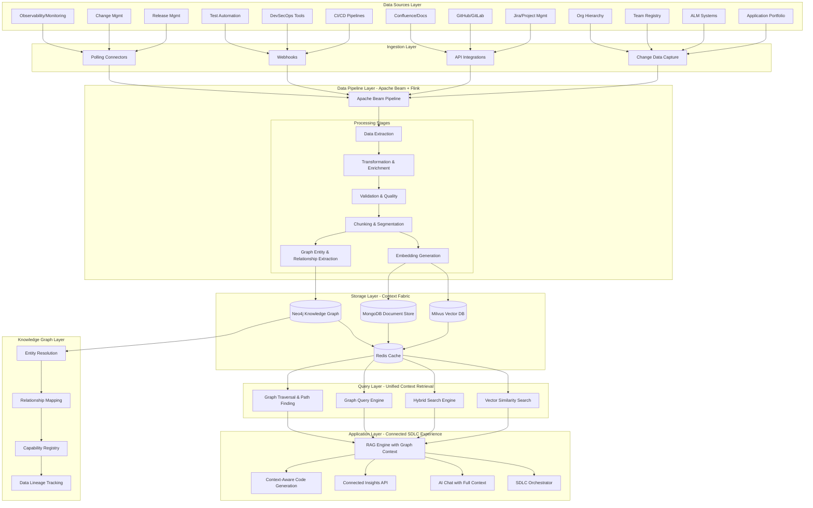

### Architecture Principles

The system is built on seven core principles:

1. **⚡ Event-Driven**: Captures changes instantly as they happen across your SDLC tools
2. **🔧 Loosely Coupled**: Components communicate through message queues for reliability
3. **🔄 Resilient Processing**: Handles failures gracefully with automatic retry
4. **🏢 Multi-Organization**: Supports multiple teams and projects with data isolation
5. **🔒 Security First**: Enterprise-grade security with encryption and access controls
6. **🕸️ Graph-Native**: Knowledge graph connects all SDLC entities and relationships
7. **🎯 Context Fabric**: Unified intelligent layer combining all storage types

---

## � Detailed Component Architecture

### 1. Data Sources & Ingestion

The platform ingests data from 13+ enterprise SDLC systems:

```mermaid
graph TB
    subgraph "Organizational Layer"
        ORG[Organization]
        BU[Business Unit]
        DEPT[Department]
        TEAM[Team]
        PERSON[Person]
        ROLE[Role]
    end

    subgraph "Capability Layer"
        CAPABILITY[Capability]
        SKILL[Skill]
        TOOL[Tool]
        TECHNOLOGY[Technology]
        STANDARD[Standard]
        PATTERN[Design Pattern]
    end

    subgraph "Product/Project Layer"
        PORTFOLIO[Portfolio]
        PRODUCT[Product]
        PROJECT[Project]
        COMPONENT[Component]
        FEATURE[Feature]
        EPIC[Epic]
        STORY[User Story]
        TASK[Task]
    end

    subgraph "Code Layer"
        REPO[Repository]
        BRANCH[Branch]
        COMMIT[Commit]
        PR[Pull Request]
        FILE[File]
        PACKAGE[Package]
        CLASS[Class]
        FUNCTION[Function]
        DEPENDENCY[Dependency]
    end

    subgraph "Documentation Layer"
        DOC[Documentation]
        WIKI[Wiki Page]
        API_SPEC[API Specification]
        ARCHITECTURE[Architecture Doc]
        RUNBOOK[Runbook]
        DECISION[Decision Record]
    end

    subgraph "Infrastructure Layer"
        ENVIRONMENT[Environment]
        CLUSTER[Cluster]
        SERVICE[Service]
        DATABASE[Database]
        QUEUE[Message Queue]
        CACHE[Cache]
    end

    subgraph "Pipeline Layer"
        PIPELINE[CI/CD Pipeline]
        BUILD[Build]
        TEST[Test Suite]
        DEPLOYMENT[Deployment]
        RELEASE[Release]
        ARTIFACT[Artifact]
    end

    subgraph "Quality Layer"
        ISSUE[Issue/Bug]
        VULN[Vulnerability]
        DEBT[Technical Debt]
        METRIC[Quality Metric]
        TEST_CASE[Test Case]
        COVERAGE[Code Coverage]
    end

    subgraph "Operations Layer"
        INCIDENT[Incident]
        ALERT[Alert]
        CHANGE[Change Request]
        MONITOR[Monitor]
        LOG[Log Stream]
        TRACE[Trace]
    end

    %% Organizational Relationships
    ORG -->|contains| BU
    BU -->|contains| DEPT
    DEPT -->|contains| TEAM
    TEAM -->|has_member| PERSON
    PERSON -->|has_role| ROLE
    PERSON -->|has_skill| SKILL

    %% Capability Relationships
    TEAM -->|has_capability| CAPABILITY
    CAPABILITY -->|requires_skill| SKILL
    CAPABILITY -->|uses_tool| TOOL
    CAPABILITY -->|uses_technology| TECHNOLOGY
    TEAM -->|follows_standard| STANDARD

    %% Project Relationships
    PORTFOLIO -->|contains| PRODUCT
    PRODUCT -->|has_project| PROJECT
    TEAM -->|owns| PROJECT
    PROJECT -->|has_component| COMPONENT
    PROJECT -->|has_epic| EPIC
    EPIC -->|has_story| STORY
    STORY -->|has_task| TASK
    PERSON -->|assigned_to| TASK

    %% Code Relationships
    PROJECT -->|has_repository| REPO
    REPO -->|has_branch| BRANCH
    BRANCH -->|has_commit| COMMIT
    COMMIT -->|authored_by| PERSON
    COMMIT -->|modifies| FILE
    COMMIT -->|closes| ISSUE
    PR -->|reviewed_by| PERSON
    FILE -->|part_of| COMPONENT
    CLASS -->|depends_on| DEPENDENCY

    %% Documentation Relationships
    PROJECT -->|documented_by| DOC
    COMPONENT -->|documented_by| API_SPEC
    ARCHITECTURE -->|documents| COMPONENT
    DECISION -->|affects| COMPONENT
    PERSON -->|authored| DOC

    %% Infrastructure Relationships
    PROJECT -->|deployed_to| ENVIRONMENT
    ENVIRONMENT -->|has_cluster| CLUSTER
    CLUSTER -->|runs| SERVICE
    SERVICE -->|uses| DATABASE
    SERVICE -->|uses| QUEUE
    COMPONENT -->|deployed_as| SERVICE

    %% Pipeline Relationships
    REPO -->|has_pipeline| PIPELINE
    PIPELINE -->|produces| BUILD
    BUILD -->|runs| TEST
    BUILD -->|creates| ARTIFACT
    DEPLOYMENT -->|deploys| ARTIFACT
    DEPLOYMENT -->|to| ENVIRONMENT
    RELEASE -->|contains| DEPLOYMENT

    %% Quality Relationships
    FILE -->|has_issue| ISSUE
    ISSUE -->|found_by| TEST_CASE
    VULN -->|affects| DEPENDENCY
    DEBT -->|in| COMPONENT
    METRIC -->|measures| COMPONENT
    COVERAGE -->|covers| FILE

    %% Operations Relationships
    SERVICE -->|has_incident| INCIDENT
    INCIDENT -->|triggered_by| ALERT
    MONITOR -->|watches| SERVICE
    ALERT -->|based_on| METRIC
    CHANGE -->|impacts| SERVICE
    INCIDENT -->|resolved_by| PERSON
```

### Knowledge Graph - Understanding Connections

The Knowledge Graph captures all entities and their relationships across your SDLC landscape.

#### Entity Categories

**Organizational Entities**

- Organizations, Business Units, Teams, People, Roles

**Product & Project Entities**

- Products, Projects, Components, Features, Epics, Stories, Tasks

**Code Entities**

- Repositories, Branches, Commits, Pull Requests, Files, Packages, Classes, Functions

**Documentation Entities**

- Documentation Pages, API Specs, Architecture Diagrams, Decision Records

**Infrastructure Entities**

- Cloud Accounts, Kubernetes Clusters, Namespaces, Services, Deployments, Pods

**CI/CD Entities**

- Pipelines, Builds, Tests, Deployments, Releases, Environments

**Quality & Security Entities**

- Code Quality Reports, Test Results, Vulnerabilities, Security Scans, Compliance Checks

**Operations Entities**

- Metrics, Alerts, Incidents, Changes, Service Status, SLOs

#### Key Relationships

The Knowledge Graph models rich relationships between entities:

- **Organizational**: Teams → own → Projects, People → member of → Teams
- **Code**: Commits → part of → Pull Requests → merged into → Branches
- **Development**: Stories → implemented by → Commits → built by → Pipelines
- **Quality**: Tests → run on → Builds → deploy to → Environments
- **Operations**: Services → monitored by → Metrics → trigger → Alerts
- **Incidents**: Incidents → caused by → Changes → fixed by → Commits
- **Ownership**: Teams → own → Components → deployed on → Infrastructure
- **Dependencies**: Components → depend on → Components, Services → call → Services

---

### Relationship Types & Semantics

```yaml
relationship_types:
  # Organizational Relationships
  MEMBER_OF:
    cardinality: many-to-one
    properties:
      - start_date: DateTime
      - end_date: DateTime
      - role: String
      
  OWNS:
    cardinality: one-to-many
    properties:
      - ownership_percentage: Float
      - start_date: DateTime
      
  HAS_CAPABILITY:
    cardinality: many-to-many
    properties:
      - maturity_level: Integer [1-5]
      - last_assessed: DateTime
      - evidence: String
      
  # Technical Relationships
  DEPENDS_ON:
    cardinality: many-to-many
    properties:
      - dependency_type: Enum[build, runtime, test]
      - version_constraint: String
      - criticality: Enum[low, medium, high]
      
  DEPLOYED_AS:
    cardinality: one-to-many
    properties:
      - deployment_type: Enum[container, vm, serverless]
      - replicas: Integer
      - resources: Object
      
  IMPLEMENTS:
    cardinality: many-to-one
    properties:
      - implementation_pattern: String
      - completeness: Float [0-1]
      
  # Temporal Relationships
  CAUSED_BY:
    cardinality: many-to-one
    properties:
      - confidence_score: Float [0-1]
      - evidence: Array[String]
      - verified: Boolean
      
  FIXED_BY:
    cardinality: many-to-many
    properties:
      - fix_type: Enum[hotfix, patch, refactor]
      - verification_status: Enum[pending, verified, failed]
      
  # Traceability Relationships
  TRACES_TO:
    cardinality: many-to-many
    properties:
      - trace_type: Enum[requirement, design, implementation, test]
      - bidirectional: Boolean
```

### Knowledge Graph Storage - Neo4j

#### Neo4j Configuration

```yaml
neo4j_configuration:
  deployment:
    mode: cluster
    core_servers: 3
    read_replicas: 2
    
  performance:
    heap_size: 16GB
    page_cache_size: 8GB
    transaction_log_size: 2GB
    
  indexes:
    # Node indexes
    - label: Person
      properties: [person_id, email]
      type: BTREE
      
    - label: Repository
      properties: [repo_id, name]
      type: BTREE
      
    - label: Service
      properties: [service_id, name]
      type: BTREE
      
    - label: Component
      properties: [component_id, name, criticality]
      type: BTREE
      
    # Relationship indexes
    - type: DEPENDS_ON
      properties: [version_constraint, criticality]
      
    - type: CAUSED_BY
      properties: [confidence_score, timestamp]
      
  constraints:
    # Uniqueness constraints
    - label: Organization
      property: org_id
      type: UNIQUE
      
    - label: Person
      property: email
      type: UNIQUE
      
    - label: Repository
      property: repo_id
      type: UNIQUE
      
    # Existence constraints
    - label: Incident
      properties: [severity, started_at]
      type: REQUIRED
      
  full_text_search:
    - index_name: entity_search
      labels: [Person, Team, Project, Component]
      properties: [name, description]
```

### Graph Construction Pipeline

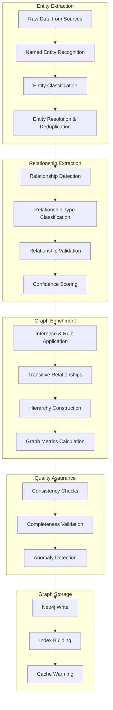

### Capability Registry - Organization-Specific

Each organization can define and track capabilities that get injected into the context fabric:

```yaml
capability_registry_schema:
  # Technical Capabilities
  technical_capabilities:
    - id: "cap-backend-development"
      name: "Backend Development"
      category: "Development"
      maturity_level: 4  # 1=Initial, 5=Optimizing
      owned_by: ["team-platform", "team-product-a"]
      required_skills:
        - "Java/Spring Boot"
        - "Microservices Architecture"
        - "RESTful API Design"
        - "PostgreSQL"
      tools_used:
        - "IntelliJ IDEA"
        - "Maven"
        - "Docker"
        - "Kubernetes"
      technologies:
        - name: "Java"
          version: "17"
          lifecycle: "adopt"
        - name: "Spring Boot"
          version: "3.x"
          lifecycle: "adopt"
      standards_followed:
        - "REST API Standards v2.0"
        - "Security Best Practices"
        - "Code Review Process"
      evidence:
        - repositories: ["backend-service-*"]
        - successful_projects: 15
        - certified_engineers: 8
      last_assessed: "2025-09-15"
      
    - id: "cap-devops-automation"
      name: "DevOps Automation"
      category: "DevOps"
      maturity_level: 5
      owned_by: ["team-platform"]
      required_skills:
        - "Kubernetes Administration"
        - "CI/CD Pipeline Development"
        - "Infrastructure as Code"
        - "Observability"
      tools_used:
        - "GitHub Actions"
        - "Terraform"
        - "ArgoCD"
        - "Prometheus/Grafana"
      
  # Process Capabilities
  process_capabilities:
    - id: "cap-agile-delivery"
      name: "Agile Delivery"
      category: "Process"
      maturity_level: 4
      practices:
        - "2-week sprints"
        - "Daily standups"
        - "Sprint planning & retrospectives"
        - "Continuous integration"
      metrics:
        velocity_avg: 45
        cycle_time_days: 3.5
        deployment_frequency: "multiple per day"
        
  # Domain Capabilities
  domain_capabilities:
    - id: "cap-payment-processing"
      name: "Payment Processing"
      category: "Domain Knowledge"
      maturity_level: 3
      domain_expertise:
        - "PCI DSS Compliance"
        - "Payment Gateway Integration"
        - "Fraud Detection"
      owned_by: ["team-payments"]
```

### Connected SDLC Experience - Use Cases

#### Use Case 1: Context-Aware Code Generation

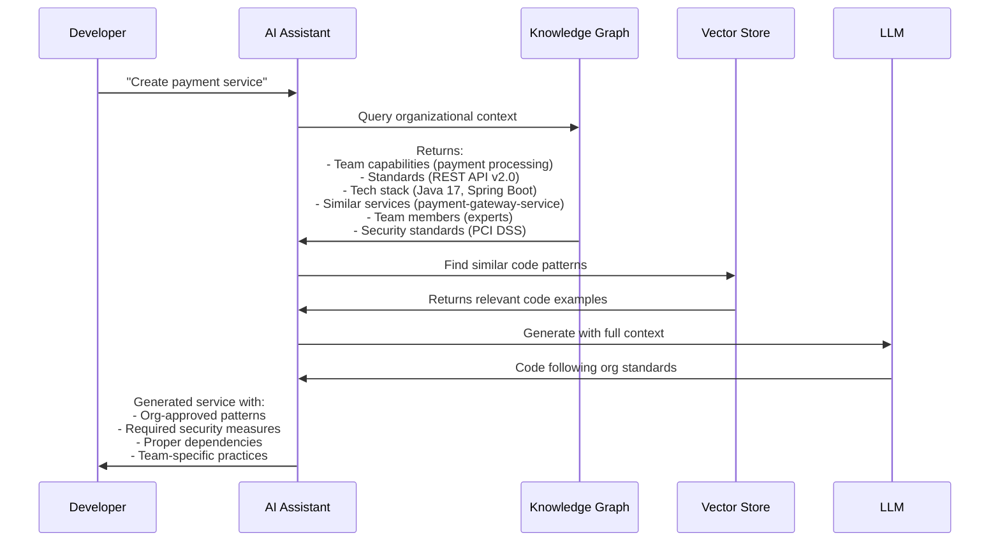

#### Use Case 2: Impact Analysis

```cypher
// Cypher Query: Find all components affected by a dependency upgrade
MATCH path = (d:Dependency {name: 'log4j'})-[:USED_BY*1..5]->(c:Component)
WHERE d.version < '2.17.0'
WITH c, d, path
MATCH (c)-[:DEPLOYED_AS]->(s:Service)-[:RUNS_IN]->(e:Environment)
MATCH (c)-[:OWNED_BY]->(t:Team)-[:HAS_MEMBER]->(p:Person)
RETURN 
  c.name AS component,
  s.name AS service,
  e.name AS environment,
  t.name AS owner_team,
  collect(DISTINCT p.name) AS team_members,
  length(path) AS dependency_depth,
  c.criticality AS criticality
ORDER BY c.criticality DESC, dependency_depth ASC
```

**Output**: Complete impact analysis showing:
- All affected components
- Services and environments impacted
- Teams and people to notify
- Dependency chain depth
- Criticality prioritization

#### Use Case 3: Root Cause Analysis

```cypher
// Cypher Query: Trace incident to root cause
MATCH path = (i:Incident {incident_id: 'INC-2025-001'})
  -[:AFFECTS]->(s:Service)
  -[:CAUSED_BY*1..5]->(cause)
WITH i, s, path, cause
MATCH (cause)<-[:DEPLOYED]-(d:Deployment)
  <-[:PRODUCED]-(b:Build)
  <-[:PART_OF]-(c:Commit)
  -[:AUTHORED_BY]->(p:Person)
MATCH (c)-[:MODIFIES]->(f:File)
OPTIONAL MATCH (c)-[:CLOSES]->(bug:Issue)
RETURN 
  i.title AS incident,
  s.name AS affected_service,
  cause,
  d.version AS deployment_version,
  c.commit_sha AS commit,
  p.name AS author,
  collect(DISTINCT f.file_path) AS changed_files,
  collect(DISTINCT bug.issue_id) AS related_issues,
  length(path) AS causal_chain_length
```

**Output**: Complete root cause trace showing:
- Incident → Service → Deployment → Build → Commit → Author
- All files changed in problematic commit
- Related issues/bugs closed by that commit
- Full causal chain visualization

#### Use Case 4: Capability Discovery & Team Matching

```cypher
// Cypher Query: Find teams with specific capabilities for a new project
MATCH (t:Team)-[:HAS_CAPABILITY]->(cap:Capability)
WHERE cap.category IN ['Backend Development', 'Cloud Infrastructure']
  AND cap.maturity_level >= 4
WITH t, collect(cap) AS capabilities
MATCH (t)-[:HAS_MEMBER]->(p:Person)-[:HAS_SKILL]->(s:Skill)
WHERE s.name IN ['Kubernetes', 'Microservices', 'Python']
WITH t, capabilities, collect(DISTINCT s) AS skills, collect(DISTINCT p) AS experts
MATCH (t)-[:OWNS]->(proj:Project)-[:HAS_REPOSITORY]->(r:Repository)
WITH t, capabilities, skills, experts, 
     avg(r.activity_score) AS avg_activity,
     count(proj) AS completed_projects
WHERE completed_projects > 5
RETURN 
  t.name AS team,
  t.size AS team_size,
  [cap IN capabilities | cap.name] AS capabilities,
  [skill IN skills | skill.name] AS technical_skills,
  [expert IN experts | expert.name] AS team_experts,
  completed_projects,
  avg_activity AS code_activity_score
ORDER BY size(capabilities) DESC, completed_projects DESC
LIMIT 5
```

**Output**: Ranked list of teams best suited for the project based on:
- Capability maturity levels
- Required technical skills
- Team experience
- Past project success
- Team capacity and activity

#### Use Case 5: Compliance & Audit Trail

```cypher
// Cypher Query: Generate complete audit trail for a release
MATCH path = (rel:Release {version: 'v2.5.0'})
  -[:CONTAINS]->(dep:Deployment)
  -[:DEPLOYS]->(art:Artifact)
  -[:CREATED_BY]->(b:Build)
  -[:FROM]->(c:Commit)
WITH rel, dep, art, b, c, path
MATCH (c)-[:AUTHORED_BY]->(author:Person)
MATCH (pr:PullRequest)-[:CONTAINS]->(c)
MATCH (pr)-[:REVIEWED_BY]->(reviewer:Person)
MATCH (c)-[:CLOSES]->(issue:Issue)
OPTIONAL MATCH (b)-[:RAN]->(test:TestSuite)
OPTIONAL MATCH (dep)-[:APPROVED_BY]->(approver:Person)
OPTIONAL MATCH (art)-[:HAS_VULNERABILITY]->(vuln:Vulnerability)
RETURN 
  rel.version AS release_version,
  dep.environment AS deployed_to,
  dep.timestamp AS deployment_time,
  collect(DISTINCT {
    commit: c.commit_sha,
    author: author.name,
    message: c.message,
    timestamp: c.timestamp
  }) AS commits,
  collect(DISTINCT {
    reviewer: reviewer.name,
    approved: pr.approved
  }) AS code_reviews,
  collect(DISTINCT {
    issue_id: issue.issue_id,
    title: issue.title
  }) AS resolved_issues,
  collect(DISTINCT {
    test_suite: test.name,
    passed: test.passed,
    failed: test.failed
  }) AS test_results,
  collect(DISTINCT {
    vuln_id: vuln.cve_id,
    severity: vuln.severity
  }) AS vulnerabilities,
  approver.name AS deployment_approver
```

**Output**: Complete audit trail including:
- All commits in the release
- Code review approvals
- Issues resolved
- Test results
- Security scan results
- Deployment approvals
- Full traceability chain

### Graph-Enhanced RAG Pipeline

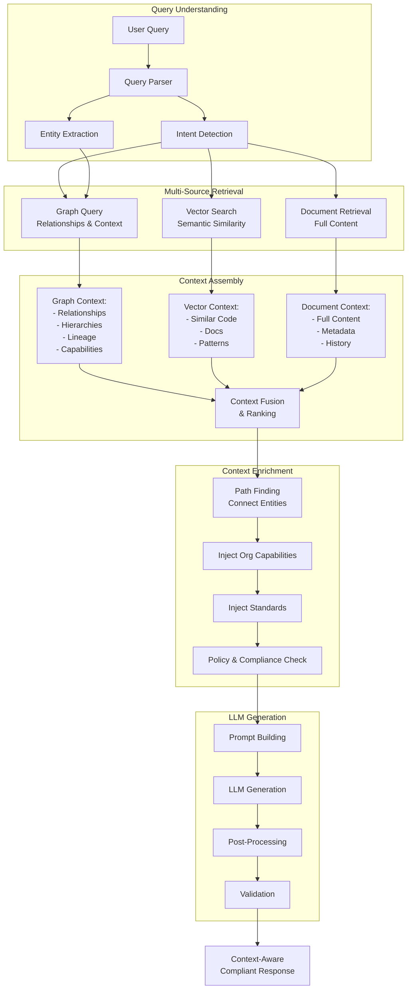

### Graph Query Patterns for Common SDLC Scenarios

```cypher
# Pattern 1: Find all dependencies of a service across environments
MATCH (s:Service {name: $service_name})
  -[:IMPLEMENTS]->(c:Component)
  -[:DEPENDS_ON*1..3]->(dep:Component)
  -[:DEPLOYED_AS]->(dep_service:Service)
  -[:RUNS_IN]->(e:Environment)
RETURN s.name, dep.name, dep_service.name, e.name, e.type

# Pattern 2: Find experts for a specific technology
MATCH (p:Person)-[:HAS_SKILL]->(s:Skill {name: $technology})
WHERE s.proficiency_level >= 'advanced'
WITH p, s
MATCH (p)-[:MEMBER_OF]->(t:Team)-[:OWNS]->(proj:Project)
  -[:USES_TECHNOLOGY]->(tech:Technology {name: $technology})
WITH p, count(DISTINCT proj) AS project_count
ORDER BY project_count DESC
RETURN p.name, p.email, project_count

# Pattern 3: Find similar components for reuse
MATCH (c1:Component {name: $component_name})
  -[:USES_TECHNOLOGY]->(t:Technology)
WITH c1, collect(t) AS tech_stack
MATCH (c2:Component)-[:USES_TECHNOLOGY]->(t2:Technology)
WHERE c2 <> c1 AND t2 IN tech_stack
WITH c1, c2, count(t2) AS common_tech_count
WHERE common_tech_count >= 3
MATCH (c2)-[:OWNED_BY]->(team:Team)
MATCH (c2)-[:DOCUMENTED_BY]->(doc:Documentation)
RETURN c2.name, team.name, common_tech_count, doc.url
ORDER BY common_tech_count DESC

# Pattern 4: Deployment blast radius analysis
MATCH (d:Deployment {deployment_id: $deployment_id})
  -[:DEPLOYS]->(art:Artifact)
  -[:CREATED_FROM]->(repo:Repository)
  -[:CONTAINS]->(comp:Component)
WITH d, comp
MATCH (comp)-[:DEPLOYED_AS]->(s:Service)
  -[:RUNS_IN]->(e:Environment)
MATCH (s)<-[:DEPENDS_ON]-(dependent_service:Service)
MATCH (dependent_service)-[:RUNS_IN]->(dep_env:Environment)
RETURN 
  d.version,
  comp.name AS component,
  s.name AS service,
  e.name AS environment,
  collect(DISTINCT {
    service: dependent_service.name,
    environment: dep_env.name
  }) AS impacted_services

# Pattern 5: Knowledge path between two entities
MATCH path = shortestPath(
  (start {name: $start_entity})
  -[*1..6]->
  (end {name: $end_entity})
)
RETURN 
  [node IN nodes(path) | labels(node)[0] + ': ' + node.name] AS path_nodes,
  [rel IN relationships(path) | type(rel)] AS relationship_types,
  length(path) AS hop_count
```

---

## 🔗 Context Fabric Integration

### Unified Context Query API

```yaml
context_fabric_api:
  # Multi-modal context query
  POST /api/v1/context/unified-query:
    description: "Query across vector, document, and graph stores"
    request:
      query: "string - natural language query"
      context_types: 
        - "vector"      # Semantic similarity
        - "graph"       # Relationships & paths
        - "document"    # Full content
      entity_filters:
        teams: ["team-backend"]
        projects: ["payment-service"]
        technologies: ["Java", "Spring Boot"]
      capability_filter:
        required_capabilities: ["backend-development"]
        min_maturity_level: 3
      graph_options:
        max_depth: 3
        include_relationships: ["DEPENDS_ON", "OWNED_BY", "USES"]
      vector_options:
        top_k: 20
        similarity_threshold: 0.7
      response_format: "connected_context"
    
    response:
      query_id: "uuid"
      execution_time_ms: 350
      context_graph:
        nodes: [
          {
            id: "node-1"
            type: "Component"
            properties: {}
            embedding_id: "vec-123"
            document_id: "doc-456"
          }
        ]
        edges: [
          {
            source: "node-1"
            target: "node-2"
            type: "DEPENDS_ON"
            properties: {}
          }
        ]
      vector_results: [
        {
          content: "..."
          similarity_score: 0.92
          metadata: {}
          connected_entities: ["entity-1", "entity-2"]
        }
      ]
      document_results: [
        {
          content: "..."
          metadata: {}
          graph_connections: [...]
        }
      ]
      organizational_context:
        capabilities: [...]
        standards: [...]
        team_expertise: [...]
        similar_solutions: [...]
      
  # Capability-aware context injection
  POST /api/v1/context/capability-injection:
    description: "Inject organizational capabilities into context"
    request:
      query_intent: "create_service"
      team_id: "team-backend"
      required_capabilities: ["backend-development", "cloud-deployment"]
    
    response:
      injected_context:
        team_capabilities:
          - capability: "Backend Development"
            maturity: 4
            standards: [...]
            patterns: [...]
            examples: [...]
        organization_standards:
          - standard: "REST API Guidelines v2.0"
            document: "..."
            examples: [...]
        tech_stack:
          approved: [...]
          lifecycle_stage: [...]
          versions: [...]
        team_patterns:
          common_patterns: [...]
          anti_patterns: [...]
        expert_knowledge:
          experts: [...]
          documented_solutions: [...]
```

### Context Fabric Architecture

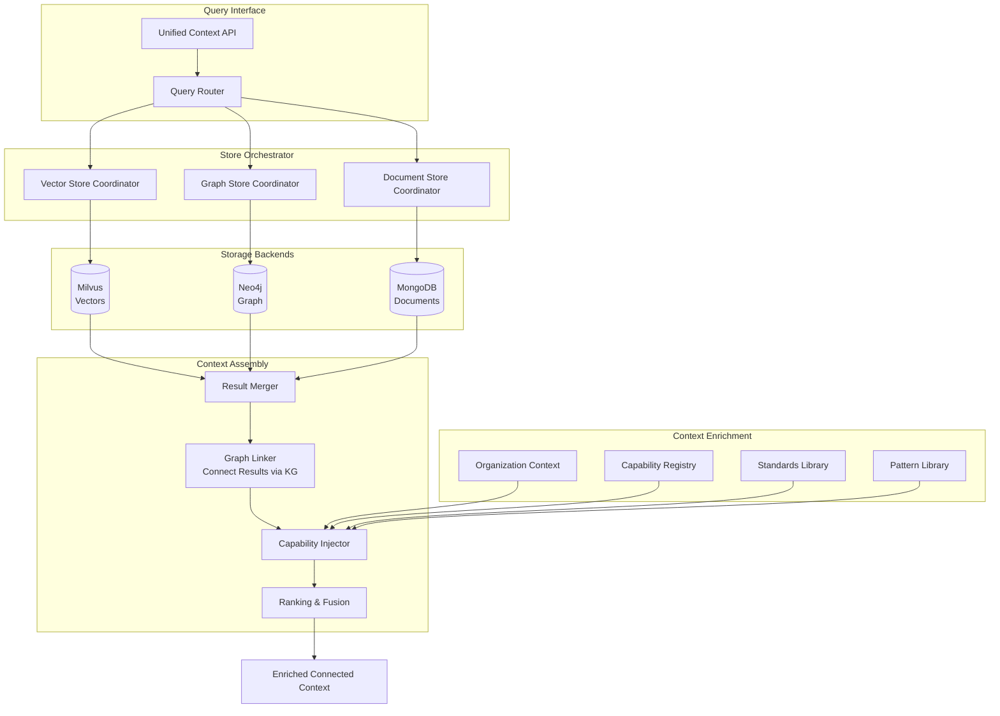

---

---

## 🔧 Detailed Component Architecture

### 1. Data Sources Layer

#### Source Categories & Characteristics

| Data Source | Type | Update Frequency | Data Volume | Access Method |
|-------------|------|------------------|-------------|---------------|
| **Application Portfolio** | Structured | Daily | Medium | REST API |
| **ALM Systems** | Structured | Hourly | Medium | REST API / CDC |
| **Team Registry** | Structured | Weekly | Low | REST API |
| **Org Hierarchy** | Structured | Monthly | Low | REST API |
| **Jira/Project Mgmt** | Semi-Structured | Real-time | High | Webhook + REST API |
| **GitHub/GitLab** | Structured + Unstructured | Real-time | Very High | Webhook + GraphQL |
| **Confluence/Docs** | Unstructured | Hourly | High | REST API |
| **CI/CD Pipelines** | Time-Series | Real-time | High | Webhook + API |
| **DevSecOps Tools** | Structured | Real-time | Medium | API / Webhook |
| **Test Automation** | Structured | Per Build | High | API |
| **Release Management** | Structured | Daily | Medium | API |
| **Change Management** | Structured | Daily | Medium | API |
| **Observability** | Time-Series | Real-time | Very High | Metrics API |

### 2. Data Ingestion Architecture

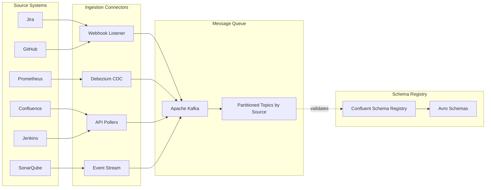

### 3. Data Pipeline - Apache Beam on Flink

#### Why Apache Beam + Flink?

**Apache Beam Benefits:**
- Unified batch and streaming model
- Portable across multiple runners (Flink, Spark, Dataflow)
- Rich windowing and state management
- Built-in data quality and monitoring

**Apache Flink as Runner:**
- True streaming with low latency (< 100ms)
- Exactly-once processing semantics
- Advanced state management
- High throughput and scalability

**Alternative Considerations:**
- **Apache Spark Structured Streaming**: Good for batch-heavy workloads, but higher latency
- **Apache Kafka Streams**: Simpler but less portable and limited to Kafka
- **Recommendation**: Stick with **Apache Beam + Flink** for best balance of features and performance

#### Pipeline Architecture

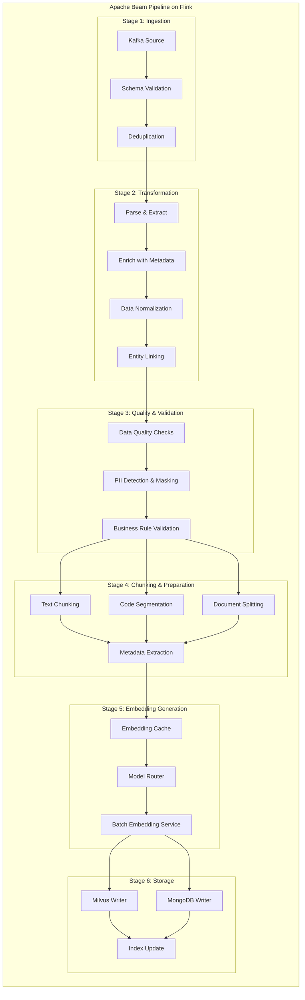

### 4. Embedding Strategy

#### Recommended Embedding Models

| Use Case | Model | Dimensions | Performance | Cost |
|----------|-------|------------|-------------|------|
| **Code Embeddings** | CodeBERT / StarCoder | 768 | High | Medium |
| **Text/Documentation** | text-embedding-3-large (OpenAI) | 3072 | Very High | Low |
| **Semantic Search** | bge-large-en-v1.5 | 1024 | High | Low (Self-hosted) |
| **Multi-lingual** | multilingual-e5-large | 1024 | High | Low (Self-hosted) |
| **Domain-Specific** | Fine-tuned BERT | 768 | Custom | Medium |

#### Recommended: **Hybrid Approach**

```yaml
embedding_strategy:
  code_content:
    primary: "microsoft/codebert-base"
    fallback: "codegen-350M-multi"
    dimensions: 768
    
  documentation:
    primary: "BAAI/bge-large-en-v1.5"
    fallback: "text-embedding-3-small"
    dimensions: 1024
    
  structured_data:
    primary: "sentence-transformers/all-mpnet-base-v2"
    dimensions: 768
    
  multi_modal:
    primary: "openai/clip-vit-large-patch14"
    dimensions: 768
```

#### Embedding Pipeline

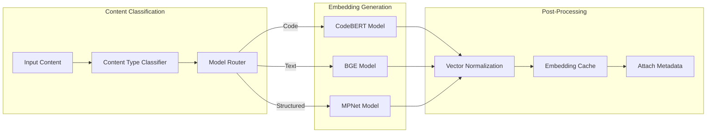

### 5. Storage Layer Architecture

#### Milvus Vector Database Configuration

```yaml
milvus_configuration:
  deployment:
    mode: cluster
    replicas: 3
    shards: 8
    
  collections:
    code_context:
      dimension: 768
      index_type: IVF_FLAT
      metric_type: IP  # Inner Product for cosine similarity
      nlist: 2048
      
    documentation:
      dimension: 1024
      index_type: HNSW
      metric_type: IP
      M: 16
      efConstruction: 200
      
    structured_metadata:
      dimension: 768
      index_type: IVF_SQ8
      metric_type: L2
      nlist: 1024
      
  performance:
    search_params:
      nprobe: 32
      ef: 128
    batch_size: 1000
    cache_size: 4GB
```

#### MongoDB Document Store Schema

```javascript
// Collections Structure
collections = {
  // Source code and repositories
  source_code: {
    _id: ObjectId,
    repo_id: String,
    file_path: String,
    content: String,
    language: String,
    vector_id: String,  // Reference to Milvus
    metadata: {
      author: String,
      commit_sha: String,
      last_modified: Date,
      dependencies: [String],
      complexity_metrics: Object
    },
    embeddings_metadata: {
      model: String,
      version: String,
      generated_at: Date
    }
  },
  
  // Documentation and wiki
  documentation: {
    _id: ObjectId,
    source: String,  // confluence, github-wiki, etc.
    title: String,
    content: String,
    content_type: String,
    vector_id: String,
    metadata: {
      space: String,
      authors: [String],
      tags: [String],
      version: Number,
      last_updated: Date
    }
  },
  
  // Project and product context
  projects: {
    _id: ObjectId,
    project_key: String,
    name: String,
    description: String,
    team: {
      team_id: String,
      members: [Object],
      hierarchy: Object
    },
    tech_stack: [String],
    repositories: [String],
    jira_projects: [String],
    ci_cd_pipelines: [Object],
    vector_id: String
  },
  
  // SDLC artifacts
  sdlc_artifacts: {
    _id: ObjectId,
    artifact_type: String,  // build, test, deployment, release
    artifact_id: String,
    project_id: String,
    data: Object,
    timestamp: Date,
    vector_id: String
  },
  
  // Organizational context
  organization: {
    _id: ObjectId,
    org_unit: String,
    hierarchy: Object,
    teams: [Object],
    policies: Object,
    standards: Object
  }
}
```

#### Storage Decision Matrix

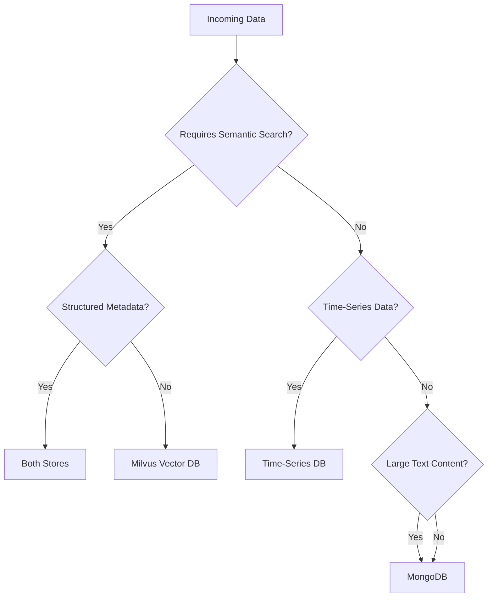

---

## 🔍 Query & Retrieval Architecture

### Hybrid Search Strategy

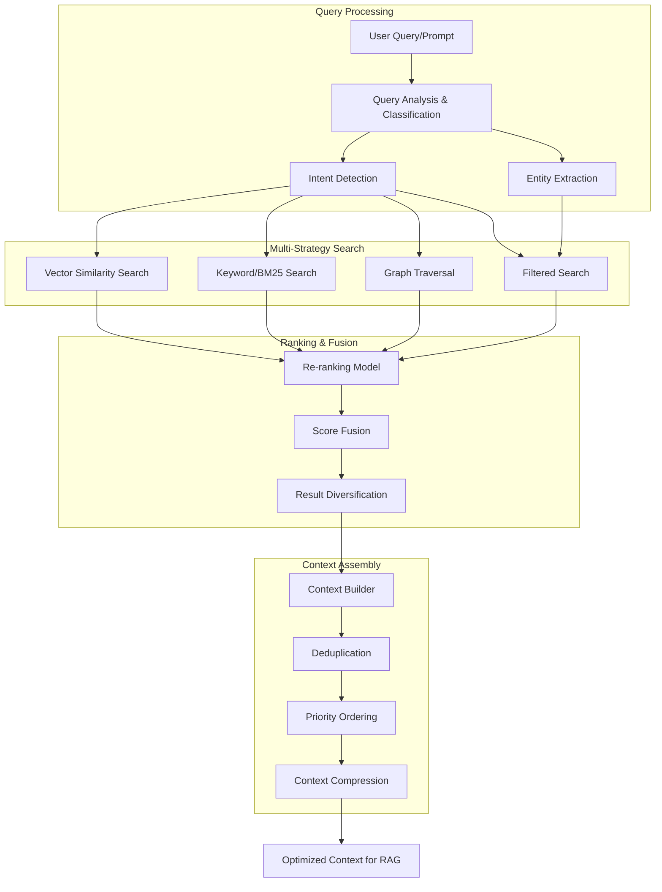

### Query Optimization Techniques

1. **Vector Search Optimization**
   - ANN (Approximate Nearest Neighbor) with HNSW index
   - Query vector caching for repeated queries
   - Pre-filtering based on metadata
   - Multi-vector search for complex queries

2. **Hybrid Scoring**
   ```python
   final_score = (
       alpha * vector_similarity_score +
       beta * bm25_score +
       gamma * recency_score +
       delta * relevance_score
   )
   ```

3. **Context Ranking Factors**
   - Semantic similarity to query
   - Recency of information
   - Source authority/trust score
   - User access permissions
   - Historical usage patterns

---

## 🚀 RAG Implementation Architecture

### RAG Pipeline

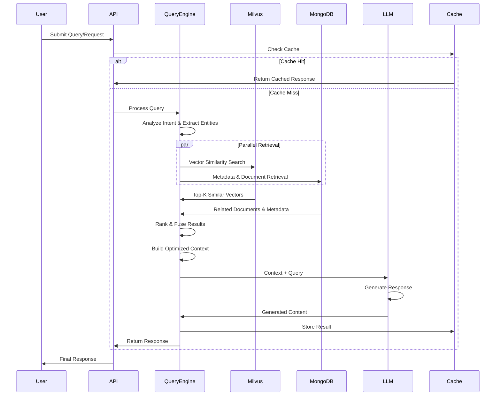

### Context Assembly Strategy

```python
# Context Assembly Algorithm
context_structure = {
    "organizational_context": {
        "team": "...",
        "org_hierarchy": "...",
        "policies": "..."
    },
    "project_context": {
        "project_info": "...",
        "tech_stack": "...",
        "architecture": "..."
    },
    "code_context": {
        "related_files": [...],
        "dependencies": [...],
        "recent_changes": [...]
    },
    "documentation_context": {
        "relevant_docs": [...],
        "api_specs": [...],
        "design_docs": [...]
    },
    "operational_context": {
        "ci_cd_status": "...",
        "deployment_info": "...",
        "monitoring_alerts": [...]
    },
    "historical_context": {
        "similar_issues": [...],
        "past_solutions": [...],
        "lessons_learned": [...]
    }
}
```

---

## ⚙️ Data Pipeline - How It Works

### The Processing Journey

Data moves through a sophisticated 6-stage pipeline powered by Apache Beam running on Apache Flink:

1. **📥 Ingestion & Validation** → Read from Kafka, validate data schemas, deduplicate events
2. **🔄 Transformation & Enrichment** → Normalize data formats, enrich with metadata, link related entities
3. **✅ Quality & Compliance Checks** → Apply data quality rules, check compliance, filter out invalid data
4. **📄 Chunking & Segmentation** → Break large documents into manageable chunks for better AI processing
5. **🧠 Embedding Generation** → Convert text to vector embeddings using state-of-the-art AI models
6. **💾 Multi-Store Writing** → Save to Vector DB (Milvus), Document Store (MongoDB), and Knowledge Graph (Neo4j)

### Processing Capabilities

**Performance:**

- **Throughput**: 50,000+ events per second
- **Latency**: < 100ms end-to-end processing time
- **Scalability**: Horizontal scaling with 20+ parallel workers
- **Reliability**: Exactly-once processing semantics, automatic checkpointing and recovery

---

## 🔐 Security & Compliance

### Security Architecture

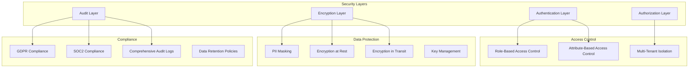

### Security Features

1. **Authentication & Authorization**
   - OAuth 2.0 / OIDC integration
   - JWT-based token management
   - Fine-grained RBAC for all operations
   - Service-to-service mTLS

2. **Data Protection**
   - PII detection and automatic masking
   - Field-level encryption for sensitive data
   - Encryption at rest (AES-256)
   - TLS 1.3 for data in transit

3. **Audit & Compliance**
   - Complete audit trail for all operations
   - GDPR right-to-delete implementation
   - Data lineage tracking
   - Compliance reporting dashboard

---

## 📈 Scalability & Performance

### Performance Targets

| Metric | Target | Notes |
|--------|--------|-------|
| **Data Ingestion Throughput** | 100K events/sec | Across all sources |
| **Pipeline Latency** | < 5 seconds | End-to-end processing |
| **Vector Search Latency** | < 100ms | P95 for top-100 results |
| **Document Retrieval** | < 50ms | P95 for metadata queries |
| **RAG Response Time** | < 3 seconds | Including LLM generation |
| **System Availability** | 99.9% | With automated failover |
| **Data Freshness** | < 1 minute | For real-time sources |

### Scaling Strategy

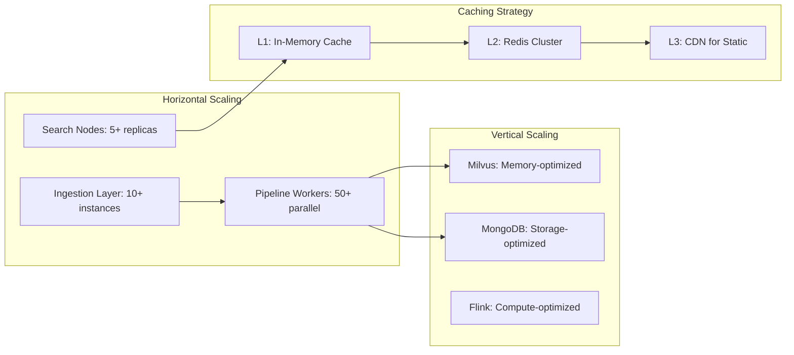

---

## 🛠️ Implementation Roadmap

### Phase 1: Foundation (Weeks 1-4)

**Objectives**: Set up core infrastructure and basic data pipeline

- ✅ Set up Kafka cluster for event streaming
- ✅ Deploy Milvus vector database cluster
- ✅ Deploy MongoDB document store
- ✅ **Deploy Neo4j knowledge graph cluster (3-node)**
- ✅ Implement basic Apache Beam pipeline
- ✅ Deploy Flink cluster
- ✅ Create first 3 data source connectors (GitHub, Jira, Confluence)
- ✅ **Define initial graph schema (core entities & relationships)**

**Deliverables**:

- Working data pipeline for 3 sources
- Basic vector storage and retrieval
- Initial graph schema deployed
- Initial API endpoints

### Phase 2: Data Pipeline Enhancement (Weeks 5-8)

**Objectives**: Complete all data source integrations and optimize pipeline

- ✅ Implement remaining 10 data source connectors
- ✅ Add data quality and validation layers
- ✅ Implement embedding generation pipeline
- ✅ Add deduplication and entity linking
- ✅ **Build graph construction pipeline (entity extraction → relationship mapping)**
- ✅ **Implement entity resolution across data sources**
- ✅ Performance optimization and tuning

**Deliverables**:

- All 13 data sources integrated
- Production-ready pipeline with monitoring
- Comprehensive data quality checks
- Graph populated with initial entities and relationships

### Phase 3: Search & Retrieval (Weeks 9-12)

**Objectives**: Build advanced search and retrieval capabilities

- ✅ Implement hybrid search (vector + keyword)
- ✅ Add re-ranking and score fusion
- ✅ Build context assembly engine
- ✅ **Implement graph traversal queries for context enrichment**
- ✅ **Add capability-aware context injection**
- ✅ Implement caching layer (graph query results + vector results)
- ✅ Optimize query performance

**Deliverables**:

- Advanced search API
- Graph-enhanced context retrieval engine
- Unified context query API (vector + document + graph)
- Performance benchmarks

### Phase 4: RAG Integration (Weeks 13-16)

**Objectives**: Integrate with LLM and build RAG capabilities

- ✅ LLM integration (OpenAI, Anthropic, etc.)
- ✅ RAG pipeline implementation
- ✅ **Graph-enhanced RAG with relationship-aware context**
- ✅ Prompt engineering and optimization
- ✅ **Organizational capability injection into prompts**
- ✅ Response quality evaluation
- ✅ User feedback loop

**Deliverables**:

- Working graph-enhanced RAG system
- Context-aware code generation with org standards
- Connected SDLC experience
- AI-powered SDLC assistance

### Phase 5: Production Hardening (Weeks 17-20)

**Objectives**: Security, monitoring, and production readiness

- ✅ Implement security features (auth, encryption, RBAC)
- ✅ **Graph-based access control and data lineage**
- ✅ Set up comprehensive monitoring (all 3 stores)
- ✅ Add alerting and incident response
- ✅ Performance optimization (graph query caching, index tuning)
- ✅ **Capability registry management UI**
- ✅ Documentation and training

**Deliverables**:

- Production-ready system with full graph integration
- Security audit passed
- Complete documentation (including graph query patterns)
- Team training completed (including graph query language)
- Capability management portal

### Phase 6 (Optional): Advanced Graph Features (Weeks 21-24)

**Objectives**: Advanced graph analytics and ML on graph

- 🔄 Graph ML for anomaly detection
- 🔄 Predictive impact analysis using graph neural networks
- 🔄 Automated capability discovery from code patterns
- 🔄 Advanced lineage tracking and compliance reporting
- 🔄 Graph-based recommendations for team matching and expertise finding

**Deliverables**:

- ML-powered graph insights
- Automated organizational capability mapping
- Advanced compliance and audit features

---

---

## 🎯 Knowledge Graph: Key Benefits Summary

### 1. **Connected SDLC Experience**

Instead of isolated data silos, the Knowledge Graph creates a **unified fabric** connecting:

- Code → Teams → Capabilities → Standards → Projects → Deployments
- Issues → Commits → Pull Requests → Releases → Services → Incidents
- People → Skills → Technologies → Components → Documentation

**Result**: AI can understand the **full context** of any SDLC entity and its relationships, enabling truly intelligent recommendations.

### 2. **Organizational Context Injection**

Each organization defines its unique:

- **Capabilities**: What can our teams do? (Backend development, DevOps automation, etc.)
- **Standards**: What are our approved patterns? (REST API guidelines, security standards)
- **Technology Stack**: What do we use and approve? (Java 17, Spring Boot 3.x, etc.)
- **Team Expertise**: Who knows what? (Payment processing experts, Kubernetes admins)

**Result**: AI generates code that **automatically follows your organization's specific practices and standards**.

### 3. **Impact Analysis in Seconds**

Graph queries answer complex questions instantly:

- "Which services are affected if I upgrade this dependency?"
- "Show me all deployment blast radius for this change"
- "Find all components using vulnerable libraries"
- "Which teams need to be notified about this infrastructure change?"

**Result**: **Proactive risk management** instead of reactive firefighting.

### 4. **Root Cause Analysis**

Trace incidents back through the entire chain:

Incident → Service → Deployment → Build → Commit → Author → Changed Files → Related Issues

**Result**: **Resolve incidents 10x faster** with complete causal understanding.

### 5. **Expertise Discovery**

Find the right people instantly:

- "Who are the experts in Kubernetes and has worked on payment services?"
- "Which team has capability maturity level 4+ in cloud infrastructure?"
- "Show me engineers who've contributed to similar components"

**Result**: **Faster problem resolution** and better team collaboration.

### 6. **Context-Aware Code Generation**

When a developer asks AI to create a service, the system:

1. **Queries the graph** to understand org context
2. **Retrieves organizational capabilities** and standards
3. **Finds similar implementations** from your codebase
4. **Identifies team-specific patterns** and preferences
5. **Generates code** that fits seamlessly into your architecture

**Result**: **AI that understands YOUR organization**, not generic best practices.

### 7. **Compliance & Audit Trail**

Complete traceability for any release:

- Every commit, author, and code review
- All test results and security scans
- Deployment approvals and timelines
- Related issues and documentation
- Full lineage from code to production

**Result**: **One-click audit reports** and complete regulatory compliance.

### 8. **Intelligent Recommendations**

Graph traversal enables smart suggestions:

- "Consider these reusable components instead of building from scratch"
- "This technology is deprecated in your organization, use X instead"
- "These 3 teams have solved similar problems, here's what they did"
- "This change may impact 15 downstream services, here's the analysis"

**Result**: **Proactive guidance** that leverages organizational knowledge.

### 9. **Cross-Team Knowledge Sharing**

Break down silos by connecting:

- Similar components across teams
- Common patterns and solutions
- Shared dependencies and infrastructure
- Related projects and initiatives

**Result**: **Accelerated learning** and reduced duplication of effort.

### 10. **Future-Ready Architecture**

The Knowledge Graph enables future capabilities:

- **Graph ML**: Predict deployment risks using graph neural networks
- **Anomaly Detection**: Identify unusual patterns in SDLC workflows
- **Automated Capability Mapping**: Discover organizational capabilities from code patterns
- **Intelligent Team Matching**: ML-powered team formation for new projects

**Result**: **Scalable AI platform** that grows with your organization.

---

## � Conclusion

This **SDLC AI Context Store with Knowledge Graph** proposal delivers a comprehensive platform that:

✅ **Ingests** data from 13+ SDLC tools in real-time  
✅ **Stores** context using a hybrid approach (vectors + documents + graph)  
✅ **Connects** all SDLC entities through a rich knowledge graph  
✅ **Injects** organizational capabilities and standards into AI context  
✅ **Retrieves** relevant, relationship-aware context for AI  
✅ **Generates** organization-specific, compliant code and solutions  
✅ **Enables** impact analysis, root cause tracing, and expertise discovery  
✅ **Provides** a connected SDLC experience across the entire organization

### Investment Summary

- **Timeline**: 20-24 weeks (5-6 months)
- **Infrastructure Cost**: ~$22,400/month (~$269K/year)
- **Development Cost**: ~$120K (3 FTE for 6 months)
- **Total Year 1**: ~$389K
- **Ongoing Annual**: ~$329K (infrastructure + 1 FTE maintenance)

### Expected ROI

- **10x faster** incident resolution (graph-based root cause analysis)
- **50% reduction** in code generation time (context-aware AI)
- **80% improvement** in code quality (organization-specific patterns)
- **5x faster** impact analysis (graph traversal vs. manual investigation)
- **30% reduction** in duplicate work (cross-team knowledge sharing)
- **Compliance ready** with complete audit trails

### Next Steps

1. **Week 1-2**: Architecture review and infrastructure planning
2. **Week 3-4**: Set up development environment and deploy initial clusters
3. **Week 5-8**: Build data pipeline with first 3 data sources
4. **Week 9-12**: Complete all integrations and populate knowledge graph
5. **Week 13-16**: Deploy graph-enhanced RAG system
6. **Week 17-20**: Production hardening and launch

---

## 📚 References & Further Reading

1. Apache Beam Documentation: <https://beam.apache.org/>
2. Apache Flink Documentation: <https://flink.apache.org/>
3. Milvus Documentation: <https://milvus.io/docs>
4. Neo4j Graph Database: <https://neo4j.com/docs/>
5. Sentence Transformers: <https://www.sbert.net/>
6. LangChain RAG Guide: <https://python.langchain.com/docs/use_cases/question_answering/>
7. Neo4j Graph Data Science: <https://neo4j.com/docs/graph-data-science/>
8. Knowledge Graphs for AI: <https://arxiv.org/abs/2003.02320>

---

**Document Version**: 2.0  
**Last Updated**: 2025-01-14  
**Status**: Extended with Knowledge Graph Architecture  
**Author**: SDLC AI Platform Team

### Monthly Infrastructure Costs (AWS-based)

| Component | Configuration | Monthly Cost | Notes |
|-----------|--------------|--------------|-------|
| **Kafka Cluster** | 3 nodes (r5.2xlarge) | $2,400 | Event streaming |
| **Flink on EKS** | 10 nodes (c5.4xlarge) | $4,800 | Pipeline processing |
| **Milvus Cluster** | 5 nodes (r5.4xlarge) | $6,000 | Vector database |
| **MongoDB Atlas** | M60 cluster | $3,500 | Document store |
| **Neo4j Graph DB** | 3-node cluster (r5.2xlarge) | $2,190 | Knowledge graph |
| **Neo4j Storage (EBS)** | 1 TB SSD | $100 | Graph persistence |
| **Redis Cluster** | 3 nodes (r5.xlarge) | $1,200 | Caching layer |
| **Load Balancers** | ALB + NLB | $200 | Traffic distribution |
| **S3 Storage** | 10TB | $230 | Backups and artifacts |
| **Data Transfer** | 5TB/month | $450 | Network egress |
| **CloudWatch** | Logs + Metrics | $300 | Monitoring |
| **Embedding APIs** | OpenAI/Cohere | $1,000 | If using external APIs |
| **Total** | | **~$22,370** | Enterprise scale with KG |

**Cost Optimization Options**:

- Self-hosted embedding models: Save $1,000/month
- Reserved instances: Save 30-40% (~$6,700/month)
- Spot instances for non-critical workers: Save 60-70% (~$2,000/month)
- Regional optimization: Vary by location
- Graph query caching: Reduce Neo4j load by 60%, potentially downsize cluster
- Vector quantization: Reduce Milvus storage by 50%

---

## 📊 Monitoring & Observability

### Monitoring Architecture

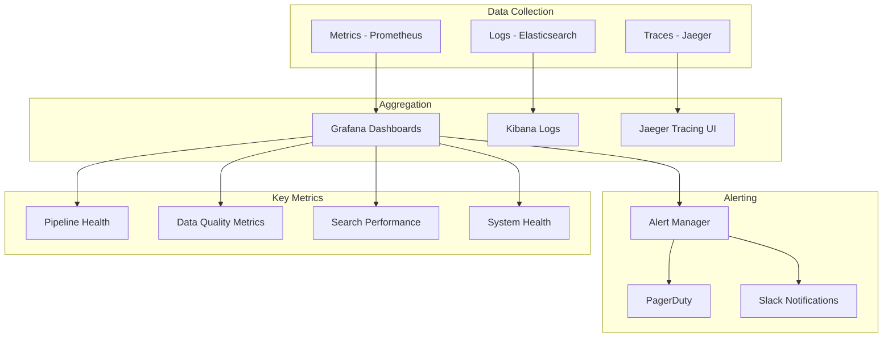

### Key Performance Indicators (KPIs)

1. **Data Pipeline KPIs**
   - Events processed per second
   - Pipeline lag (time behind real-time)
   - Error rate and retry count
   - Data quality score

2. **Storage KPIs**
   - Vector insertion rate
   - Storage utilization
   - Index build time
   - Query response time

3. **Search & Retrieval KPIs**
   - Search latency (P50, P95, P99)
   - Search relevance score
   - Cache hit rate
   - Query throughput

4. **RAG & AI KPIs**
   - Response generation time
   - Context relevance score
   - User satisfaction rating
   - AI hallucination rate

---

## 🔄 Data Lifecycle Management

### Data Retention Policies

```yaml
retention_policies:
  hot_storage:
    vector_embeddings:
      duration: 90_days
      storage: "Milvus in-memory"
    
    documents:
      duration: 180_days
      storage: "MongoDB SSD"
    
  warm_storage:
    vector_embeddings:
      duration: 365_days
      storage: "Milvus disk-based"
    
    documents:
      duration: 730_days
      storage: "MongoDB HDD"
    
  cold_storage:
    archives:
      duration: 7_years
      storage: "S3 Glacier"
      compression: true
    
  deletion:
    pii_data:
      on_request: true
      auto_deletion: 30_days_after_employee_exit
    
    temp_data:
      duration: 7_days
```

---

## 🚨 Disaster Recovery & Business Continuity

### Backup Strategy

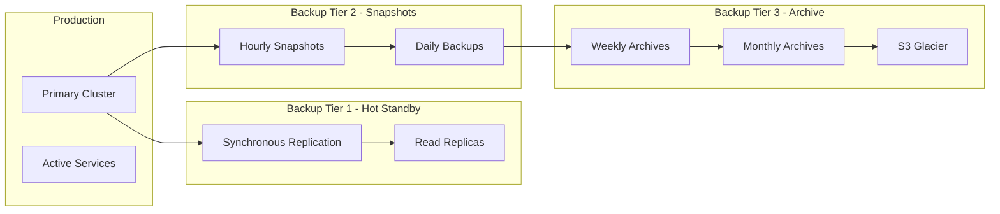

### Recovery Time Objectives (RTO) & Recovery Point Objectives (RPO)

| Scenario | RTO | RPO | Recovery Strategy |
|----------|-----|-----|-------------------|
| **Single Node Failure** | < 5 minutes | 0 | Automatic failover to replica |
| **AZ Failure** | < 15 minutes | < 1 minute | Multi-AZ deployment |
| **Region Failure** | < 2 hours | < 5 minutes | Cross-region replication |
| **Data Corruption** | < 4 hours | < 1 hour | Point-in-time recovery |
| **Complete Disaster** | < 24 hours | < 1 day | Full backup restoration |

---

## � System Integration

### Core API Capabilities

The system exposes a comprehensive REST API for integration:

**Context Query API**

- Semantic search across all SDLC data
- Filter by source, date range, teams, projects
- Returns ranked results with metadata and confidence scores

**AI Generation API**

- Context-aware code and documentation generation
- Retrieval-Augmented Generation (RAG) with full SDLC context
- Configurable AI models and parameters

**Data Ingestion API**

- Custom event ingestion from any SDLC tool
- Real-time and batch ingestion support
- Schema validation and transformation

**Monitoring & Health API**

- System health checks and status
- Real-time metrics and performance indicators
- Audit logs and usage analytics

---

## ✅ Design Principles & Best Practices

The system follows industry best practices for enterprise data platforms:

**Reliability**

- Fault-tolerant processing with automatic recovery
- Data validation at every stage
- Comprehensive error handling and dead letter queues

**Performance**

- Optimized indexing strategies for fast retrieval
- Batch processing for efficiency
- Intelligent caching and memory management

**Quality**

- Continuous monitoring and alerting
- Automated testing at all levels
- User feedback loops for continuous improvement

**Security**

- Multi-tenant data isolation
- Encryption at rest and in transit
- Comprehensive audit logging

---

## 🔮 Future Enhancements

### Phase 2 Enhancements (6-12 months)

1. **Advanced AI Capabilities**
   - Multi-agent systems for complex tasks
   - Automated code review and suggestions
   - Predictive analytics for SDLC bottlenecks
   - Automated test generation

2. **Enhanced Context Understanding**
   - Graph neural networks for relationship extraction
   - Temporal context tracking (how things change over time)
   - Cross-project learning and pattern recognition
   - Automated documentation generation

3. **Integration Expansion**
   - Additional data sources (Slack, Teams, etc.)
   - Third-party AI model integrations
   - Custom plugin architecture
   - Mobile and IDE integrations

4. **Performance Optimization**
   - GPU-accelerated embedding generation
   - Distributed vector search
   - Adaptive caching strategies
   - Edge computing for low-latency regions

---

## 📚 Technology Stack

### Core Technologies

The platform leverages best-in-class open-source and commercial technologies:

**Data Pipeline**

- Apache Beam + Apache Flink for unified batch/streaming processing
- Apache Kafka for reliable message queuing
- Debezium CDC for real-time database change capture

**Storage Layer**

- **Vector Database**: Milvus for high-performance semantic search
- **Document Store**: MongoDB for flexible document storage  
- **Knowledge Graph**: Neo4j for relationship mapping
- **Cache**: Redis for real-time operations
- **Time-Series**: InfluxDB for metrics and logs

**AI & Machine Learning**

- State-of-the-art embedding models (CodeBERT for code, BGE for text)
- Leading LLMs (GPT-4, Claude 3, Llama 2)
- Hybrid search combining semantic and keyword approaches

**Infrastructure**

- Kubernetes for orchestration and scaling
- Multi-cloud support (AWS, Azure, GCP)
- Infrastructure as Code with Terraform
- Comprehensive monitoring (Prometheus, Grafana, Datadog)

### Key Terminology

- **RAG**: Retrieval-Augmented Generation - combines search with AI generation
- **Vector Database**: Specialized database for AI-powered similarity search
- **Knowledge Graph**: Connected data structure representing entity relationships
- **Semantic Search**: Search based on meaning rather than just keywords
- **CDC**: Change Data Capture - tracks changes in source systems in real-time
- **Embedding**: Vector representation of data that captures semantic meaning

---

## 🤝 Next Steps & Iteration Plan

### Immediate Actions Required

1. **Review & Feedback**
   - Review this proposal with stakeholders
   - Identify any missing data sources
   - Confirm technology choices
   - Define success criteria

2. **Deep-Dive Sessions**
   - Data source access and authentication
   - Embedding model selection and testing
   - LLM selection and API access
   - Infrastructure provisioning

3. **POC Planning**
   - Select 3 data sources for POC
   - Define POC success metrics
   - Set up development environment
   - Create POC timeline (2-3 weeks)

### Questions for Next Iteration

1. **Data Sources**
   - Are there additional data sources we need to include?
   - What are the authentication mechanisms for each source?
   - What is the expected data volume from each source?

2. **Performance Requirements**
   - What are the expected query loads?
   - What is the acceptable latency for different operations?
   - How many concurrent users will the system support?

3. **Integration Requirements**
   - Which systems need to integrate with the context store?
   - What API formats are preferred?
   - Are there existing authentication systems to integrate with?

4. **Compliance & Security**
   - What compliance requirements must we meet?
   - Are there data residency requirements?
   - What is the data retention policy?

---

**Document Version**: 1.0  
**Last Updated**: October 20, 2025  
**Author**: AI Architecture Team  
**Status**: Draft for Review

---

*This is a living document and will be updated iteratively based on feedback and implementation progress.*
