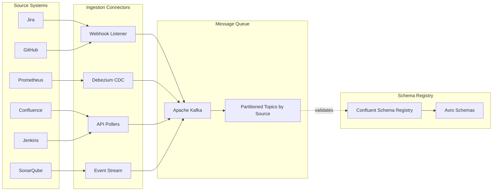
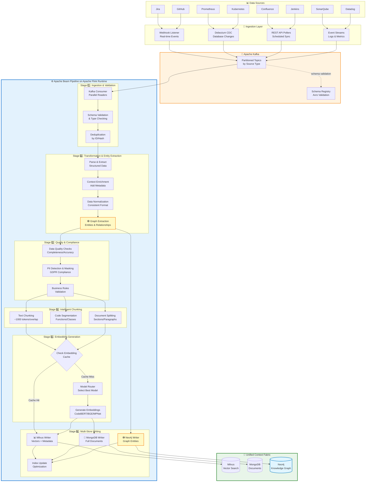

# SDLC AI Context Store - Architecture Proposal

## 📋 Executive Summary

This proposal outlines the design and implementation strategy for building a **comprehensive Context Store for an SDLC AI Platform**. The system aggregates context information from various enterprise data sources, processes them through a robust data pipeline, and stores them in optimized storage layers (vector database and document store) to enable advanced RAG (Retrieval-Augmented Generation) capabilities for code generation and SDLC automation.

### Key Objectives

- **Unified Context Management**: Aggregate data from 10+ enterprise SDLC data sources
- **Intelligent Retrieval**: Enable semantic search and context-aware information retrieval
- **Real-Time Processing**: Stream data changes with minimal latency
- **Scalable Architecture**: Handle enterprise-scale data volumes and query loads
- **Multi-Modal Storage**: Optimize storage based on data characteristics and access patterns

---

## 🎯 Problem Statement

### Current Challenges

- **Scattered Context**: SDLC information dispersed across multiple disconnected systems
- **Manual Context Gathering**: Developers spend significant time searching for relevant information
- **Stale Information**: Lack of real-time synchronization leads to outdated context
- **Inefficient Code Generation**: AI systems lack comprehensive organizational context
- **Knowledge Silos**: Team knowledge trapped in individual tools and systems
- **Poor AI Accuracy**: Limited context results in generic, less useful AI-generated outputs

### Business Impact

- **Developer Productivity Loss**: 30-40% of developer time spent on information gathering
- **Inconsistent AI Outputs**: Low-quality code generation due to missing context
- **Onboarding Delays**: New team members struggle to understand project context
- **Technical Debt**: Lack of historical context leads to repeated mistakes
- **Compliance Risks**: Incomplete audit trails and change tracking

---

## 🏗️ High-Level Architecture

### System Overview

### Architecture Principles

1. **Event-Driven**: Real-time data synchronization using CDC and webhooks
2. **Decoupled Components**: Microservices architecture for independent scaling
3. **Idempotent Processing**: Safe retry mechanisms for data pipeline
4. **Multi-Tenant**: Support for multiple organizations and projects
5. **Security First**: End-to-end encryption, RBAC, and audit logging
6. **Graph-Native**: Knowledge graph at the core for connected experiences
7. **Context Fabric**: Unified layer integrating vector, document, and graph stores

---

## 🔧 Detailed Component Architecture

### 1. Data Sources Layer

#### Source Categories & Characteristics

| Data Source | Usecase | Type | Update Frequency | Data Volume | Access Method |
|-------------|---------|------|------------------|-------------|---------------|
| **Application Portfolio** | Application Discovery | Structured | Daily | Medium | REST API |
| **ALM Systems** | Application Lifecycle Management | Structured | Hourly | Medium | REST API / CDC |
| **Team Registry** | Team Management | Structured | Weekly | Low | REST API |
| **Org Hierarchy** | Organizational Structure | Structured | Monthly | Low | REST API |
| **Jira/Project Mgmt** | Project Tracking | Semi-Structured | Real-time | High | Webhook + REST API |
| **GitHub/GitLab** | Code Repository | Structured + Unstructured | Real-time | Very High | Webhook + GraphQL |
| **Confluence/Docs** | Documentation | Unstructured | Hourly | High | REST API |
| **CI/CD Pipelines** | Continuous Integration | Time-Series | Real-time | High | Webhook + API |
| **DevSecOps Tools** | Security Scanning | Structured | Real-time | Medium | API / Webhook |
| **Test Automation** | Automated Testing | Structured | Per Build | High | API |
| **Release Management** | Release Orchestration | Structured | Daily | Medium | API |
| **Change Management** | Change Tracking | Structured | Daily | Medium | API |
| **Observability** | Application Monitoring | Real-time | Very High | Metrics | API |
| **Incident Management** | Incident Tracking | Structured | Real-time | Medium | Webhook + API |
| **Infrastructure** | Cloud/Infra Context | Structured | Daily | Medium | API |
| **Application Dependency Mapping** | Dependency Analysis | Structured | Weekly | Medium | API |

### 2. Data Ingestion Architecture

### 3. Complete End-to-End Data Pipeline

**Consolidated View: Sources → Kafka → Apache Beam on Flink → Storage**

**Pipeline Stages Explained:**

| Stage | Purpose | Key Operations | Output |
|-------|---------|----------------|--------|
| **Ingestion** | Capture from sources | Webhooks, CDC, REST polling, event streams | Raw events to Kafka |
| **1️⃣ Validation** | Ensure data quality | Schema check, deduplication, type validation | Clean, validated records |
| **2️⃣ Transformation** | Extract entities & relationships | Parse, enrich, normalize, **graph extraction** | Structured data + graph entities |
| **3️⃣ Quality** | Compliance & quality | PII masking, quality checks, business rules | Compliant, high-quality data |
| **4️⃣ Chunking** | Prepare for embedding | Smart chunking (code/text/docs), metadata extraction | Optimally-sized chunks |
| **5️⃣ Embedding** | Generate vectors | Model selection, embedding generation, caching | Vector embeddings |
| **6️⃣ Storage** | Write to stores | **Parallel writes** to Milvus, MongoDB, Neo4j | Stored in context fabric |

**Key Features:**

✅ **Unified Pipeline**: Single Apache Beam pipeline writes to all three stores  
✅ **Real-Time Processing**: Sub-second latency with Flink streaming  
✅ **Exactly-Once Semantics**: No duplicates, guaranteed delivery  
✅ **Intelligent Caching**: Skip re-embedding unchanged content (60% cost savings)  
✅ **Graph Extraction**: Automatically extract entities and relationships in Stage 2  
✅ **Parallel Processing**: Handle multiple data types simultaneously  
✅ **Fault Tolerant**: Automatic retries, checkpointing, state recovery  
✅ **Schema Evolution**: Handle source schema changes gracefully  

**Performance Metrics:**

| Metric | Capacity |
|--------|----------|
| **Throughput** | 50,000+ events/second from Kafka |
| **Embedding Rate** | 1,000+ vectors/second |
| **End-to-End Latency** | < 500ms (source → storage) |
| **Backfill Speed** | Process years of data in hours |
| **Availability** | 99.9% uptime with Flink HA |

---

### 4. Why Apache Beam + Flink?

**Apache Beam Benefits:**
- Unified batch and streaming model
- Portable across multiple runners (Flink, Spark, Dataflow)
- Rich windowing and state management
- Built-in data quality and monitoring

**Apache Flink as Runner:**
- True streaming with low latency (< 100ms)
- Exactly-once processing semantics
- Advanced state management
- High throughput and scalability

**Alternative Considerations:**
- **Apache Spark Structured Streaming**: Good for batch-heavy workloads, but higher latency
- **Apache Kafka Streams**: Simpler but less portable and limited to Kafka
- **Recommendation**: Stick with **Apache Beam + Flink** for best balance of features and performance

---

## 📚 References & Further Reading

1. Apache Beam Documentation: <https://beam.apache.org/>
2. Apache Flink Documentation: <https://flink.apache.org/>
3. Milvus Documentation: <https://milvus.io/docs>
4. Neo4j Graph Database: <https://neo4j.com/docs/>
5. Sentence Transformers: <https://www.sbert.net/>
6. LangChain RAG Guide: <https://python.langchain.com/docs/use_cases/question_answering/>
7. Neo4j Graph Data Science: <https://neo4j.com/docs/graph-data-science/>
8. Knowledge Graphs for AI: <https://arxiv.org/abs/2003.02320>

---

*This is a living document and will be updated iteratively based on feedback and implementation progress.*
