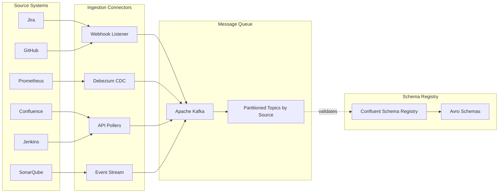

# SDLC AI Context Store - Architecture Proposal

## 📋 Executive Summary

This proposal outlines the design and implementation strategy for building a **comprehensive Context Store for an SDLC AI Platform**. The system aggregates context information from various enterprise data sources, processes them through a robust data pipeline, and stores them in optimized storage layers (vector database and document store) to enable advanced RAG (Retrieval-Augmented Generation) capabilities for code generation and SDLC automation.

### Key Objectives

- **Unified Context Management**: Aggregate data from 10+ enterprise SDLC data sources
- **Intelligent Retrieval**: Enable semantic search and context-aware information retrieval
- **Real-Time Processing**: Stream data changes with minimal latency
- **Scalable Architecture**: Handle enterprise-scale data volumes and query loads
- **Multi-Modal Storage**: Optimize storage based on data characteristics and access patterns

---

## 🎯 Problem Statement

### Current Challenges

- **Scattered Context**: SDLC information dispersed across multiple disconnected systems
- **Manual Context Gathering**: Developers spend significant time searching for relevant information
- **Stale Information**: Lack of real-time synchronization leads to outdated context
- **Inefficient Code Generation**: AI systems lack comprehensive organizational context
- **Knowledge Silos**: Team knowledge trapped in individual tools and systems
- **Poor AI Accuracy**: Limited context results in generic, less useful AI-generated outputs

### Business Impact

- **Developer Productivity Loss**: 30-40% of developer time spent on information gathering
- **Inconsistent AI Outputs**: Low-quality code generation due to missing context
- **Onboarding Delays**: New team members struggle to understand project context
- **Technical Debt**: Lack of historical context leads to repeated mistakes
- **Compliance Risks**: Incomplete audit trails and change tracking

---

## 🏗️ High-Level Architecture

### System Overview


### Architecture Principles

1. **Event-Driven**: Real-time data synchronization using CDC and webhooks
2. **Decoupled Components**: Microservices architecture for independent scaling
3. **Idempotent Processing**: Safe retry mechanisms for data pipeline
4. **Multi-Tenant**: Support for multiple organizations and projects
5. **Security First**: End-to-end encryption, RBAC, and audit logging
6. **Graph-Native**: Knowledge graph at the core for connected experiences
7. **Context Fabric**: Unified layer integrating vector, document, and graph stores

---

## 🔧 Detailed Component Architecture

### 1. Data Sources Layer

#### Source Categories & Characteristics

| Data Source | Usecase | Type | Update Frequency | Data Volume | Access Method |
|-------------|---------|------|------------------|-------------|---------------|
| **Application Portfolio** | Application Discovery | Structured | Daily | Medium | REST API |
| **ALM Systems** | Application Lifecycle Management | Structured | Hourly | Medium | REST API / CDC |
| **Team Registry** | Team Management | Structured | Weekly | Low | REST API |
| **Org Hierarchy** | Organizational Structure | Structured | Monthly | Low | REST API |
| **Jira/Project Mgmt** | Project Tracking | Semi-Structured | Real-time | High | Webhook + REST API |
| **GitHub/GitLab** | Code Repository | Structured + Unstructured | Real-time | Very High | Webhook + GraphQL |
| **Confluence/Docs** | Documentation | Unstructured | Hourly | High | REST API |
| **CI/CD Pipelines** | Continuous Integration | Time-Series | Real-time | High | Webhook + API |
| **DevSecOps Tools** | Security Scanning | Structured | Real-time | Medium | API / Webhook |
| **Test Automation** | Automated Testing | Structured | Per Build | High | API |
| **Release Management** | Release Orchestration | Structured | Daily | Medium | API |
| **Change Management** | Change Tracking | Structured | Daily | Medium | API |
| **Observability** | Application Monitoring | Real-time | Very High | Metrics | API |
| **Incident Management** | Incident Tracking | Structured | Real-time | Medium | Webhook + API |
| **Infrastructure** | Cloud/Infra Context | Structured | Daily | Medium | API |
| **Application Dependency Mapping** | Dependency Analysis | Structured | Weekly | Medium | API |

### 2. Data Ingestion Architecture

**High-Level Flow**: Data from 13+ SDLC sources flows through ingestion connectors into Apache Kafka, which acts as the event backbone. Apache Beam pipelines (running on Apache Flink runtime) consume events from Kafka, process them through 6 stages (validation, transformation, quality checks, chunking, embedding, storage), and write to the tri-store (Milvus + MongoDB + Neo4j).

**Ingestion Layer Components:**



**What Happens Here:**

1. **Source Systems** → Various SDLC tools (Jira, GitHub, Confluence, Jenkins, etc.)
2. **Ingestion Connectors** → Capture data via webhooks (real-time), CDC (database changes), REST APIs (polling), or event streams
3. **Apache Kafka** → Buffers events in partitioned topics, provides backpressure handling and replay capability
4. **Schema Registry** → Validates data schemas using Avro, ensures data consistency
5. **Next Stage** → Events flow to Apache Beam pipeline on Flink (detailed below) →

### 3. Complete End-to-End Data Pipeline

**Consolidated View: Sources → Kafka → Apache Beam on Flink → Storage**

```mermaid
title Data Ingestion and Processing Flow
direction right

// Groups and nodes
Data Sources [icon: database, color: lightblue] {
  Jira [icon: globe, color: lightblue]
  GitHub [icon: github, color: lightblue]
  Confluence [icon: file-text, color: lightblue]
  Jenkins [icon: settings, color: lightblue]
  SonarQube [icon: activity, color: lightblue]
  Prometheus [icon: bar-chart, color: lightblue]
  Datadog [icon: bar-chart-2, color: lightblue]
  Kubernetes [icon: server, color: lightblue]
}

Ingestion Layer [icon: plug, color: lightyellow] {
  Webhook Listener [icon: radio, color: lightyellow]
  Debezium CDC [icon: refresh-cw, color: lightyellow]
  REST API Pollers [icon: cloud, color: lightyellow]
  Event Streams [icon: log-in, color: lightyellow]
}

Apache Kafka [icon: message-square, color: orange] {
  Partitioned Topics [icon: layers, color: orange]
  Schema Registry [icon: check-circle, color: orange]
}

Apache Beam Pipeline [icon: workflow, color: lightblue] {
  // Stage 1: Ingestion & Validation
  Kafka Consumer [icon: download, color: lightblue]
  Schema Validation [icon: check-square, color: lightblue]
  Deduplication [icon: hash, color: lightblue]
  // Stage 2: Transformation & Entity Extraction
  Parse and Extract [icon: file-text, color: lightblue]
  Context Enrichment [icon: plus-circle, color: lightblue]
  Data Normalization [icon: repeat, color: lightblue]
  Graph Extraction [icon: share-2, color: yellow]
  // Stage 3: Quality & Compliance
  Data Quality Checks [icon: check, color: lightblue]
  PII Detection and Masking [icon: eye-off, color: lightblue]
  Business Rules Validation [icon: check-circle, color: lightblue]
  // Stage 4: Intelligent Chunking
  Text Chunking [icon: file-text, color: lightblue]
  Code Segmentation [icon: code, color: lightblue]
  Document Splitting [icon: file, color: lightblue]
  // Stage 5: Embedding Generation
  Check Embedding Cache [icon: database, color: lightblue]
  Model Router [icon: shuffle, color: lightblue]
  Generate Embeddings [icon: cpu, color: lightblue]
  // Stage 6: Multi-Store Writing
  Milvus Writer [icon: database, color: yellow]
  MongoDB Writer [icon: file, color: lightblue]
  Neo4j Writer [icon: share-2, color: yellow]
  Index Update [icon: refresh-cw, color: lightblue]
}

Unified Context Fabric [icon: database, color: lightgreen] {
  Milvus [icon: database, color: lightgreen]
  MongoDB [icon: file, color: lightgreen]
  Neo4j [icon: share-2, color: lightblue]
}

// Relationships
Jira > Webhook Listener
GitHub > Webhook Listener
Confluence > REST API Pollers
Jenkins > REST API Pollers
SonarQube > Event Streams
Datadog > Event Streams
Prometheus > Debezium CDC
Kubernetes > Debezium CDC

Webhook Listener > Partitioned Topics
Debezium CDC > Partitioned Topics
REST API Pollers > Partitioned Topics
Event Streams > Partitioned Topics

Partitioned Topics > Schema Registry
Partitioned Topics > Kafka Consumer

Kafka Consumer > Schema Validation
Schema Validation > Deduplication
Deduplication > Parse and Extract
Parse and Extract > Context Enrichment
Context Enrichment > Data Normalization
Data Normalization > Graph Extraction

Graph Extraction > Data Quality Checks
Data Quality Checks > PII Detection and Masking
PII Detection and Masking > Business Rules Validation

Business Rules Validation > Text Chunking
Business Rules Validation > Code Segmentation
Business Rules Validation > Document Splitting

Text Chunking > Check Embedding Cache
Code Segmentation > Check Embedding Cache
Document Splitting > Check Embedding Cache

Check Embedding Cache > Model Router: Cache Miss
Model Router > Generate Embeddings
Generate Embeddings > Milvus Writer
Generate Embeddings > MongoDB Writer

Check Embedding Cache > Milvus Writer: Cache Hit

Graph Extraction > Neo4j Writer

Milvus Writer > Index Update
MongoDB Writer > Index Update
Neo4j Writer > Index Update

Milvus Writer > Milvus
MongoDB Writer > MongoDB
Neo4j Writer > Neo4j
```

**Pipeline Stages Explained:**

| Stage | Purpose | Key Operations | Output |
|-------|---------|----------------|--------|
| **Ingestion** | Capture from sources | Webhooks, CDC, REST polling, event streams | Raw events to Kafka |
| **1️⃣ Validation** | Ensure data quality | Schema check, deduplication, type validation | Clean, validated records |
| **2️⃣ Transformation** | Extract entities & relationships | Parse, enrich, normalize, **graph extraction** | Structured data + graph entities |
| **3️⃣ Quality** | Compliance & quality | PII masking, quality checks, business rules | Compliant, high-quality data |
| **4️⃣ Chunking** | Prepare for embedding | Smart chunking (code/text/docs), metadata extraction | Optimally-sized chunks |
| **5️⃣ Embedding** | Generate vectors | Model selection, embedding generation, caching | Vector embeddings |
| **6️⃣ Storage** | Write to stores | **Parallel writes** to Milvus, MongoDB, Neo4j | Stored in context fabric |

**Key Features:**

✅ **Unified Pipeline**: Single Apache Beam pipeline writes to all three stores  
✅ **Real-Time Processing**: Sub-second latency with Flink streaming  
✅ **Exactly-Once Semantics**: No duplicates, guaranteed delivery  
✅ **Intelligent Caching**: Skip re-embedding unchanged content (60% cost savings)  
✅ **Graph Extraction**: Automatically extract entities and relationships in Stage 2  
✅ **Parallel Processing**: Handle multiple data types simultaneously  
✅ **Fault Tolerant**: Automatic retries, checkpointing, state recovery  
✅ **Schema Evolution**: Handle source schema changes gracefully  

**Performance Metrics:**

| Metric | Capacity |
|--------|----------|
| **Throughput** | 50,000+ events/second from Kafka |
| **Embedding Rate** | 1,000+ vectors/second |
| **End-to-End Latency** | < 500ms (source → storage) |
| **Backfill Speed** | Process years of data in hours |
| **Availability** | 99.9% uptime with Flink HA |

---

### 4. Why Apache Beam + Flink?

**Apache Beam Benefits:**
- Unified batch and streaming model
- Portable across multiple runners (Flink, Spark, Dataflow)
- Rich windowing and state management
- Built-in data quality and monitoring

**Apache Flink as Runner:**
- True streaming with low latency (< 100ms)
- Exactly-once processing semantics
- Advanced state management
- High throughput and scalability

**Alternative Considerations:**
- **Apache Spark Structured Streaming**: Good for batch-heavy workloads, but higher latency
- **Apache Kafka Streams**: Simpler but less portable and limited to Kafka
- **Recommendation**: Stick with **Apache Beam + Flink** for best balance of features and performance

---

## 📚 References & Further Reading

1. Apache Beam Documentation: <https://beam.apache.org/>
2. Apache Flink Documentation: <https://flink.apache.org/>
3. Milvus Documentation: <https://milvus.io/docs>
4. Neo4j Graph Database: <https://neo4j.com/docs/>
5. Sentence Transformers: <https://www.sbert.net/>
6. LangChain RAG Guide: <https://python.langchain.com/docs/use_cases/question_answering/>
7. Neo4j Graph Data Science: <https://neo4j.com/docs/graph-data-science/>
8. Knowledge Graphs for AI: <https://arxiv.org/abs/2003.02320>

---

*This is a living document and will be updated iteratively based on feedback and implementation progress.*
