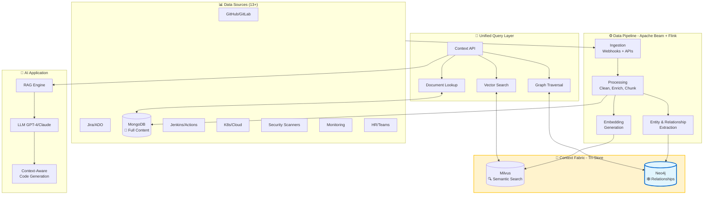
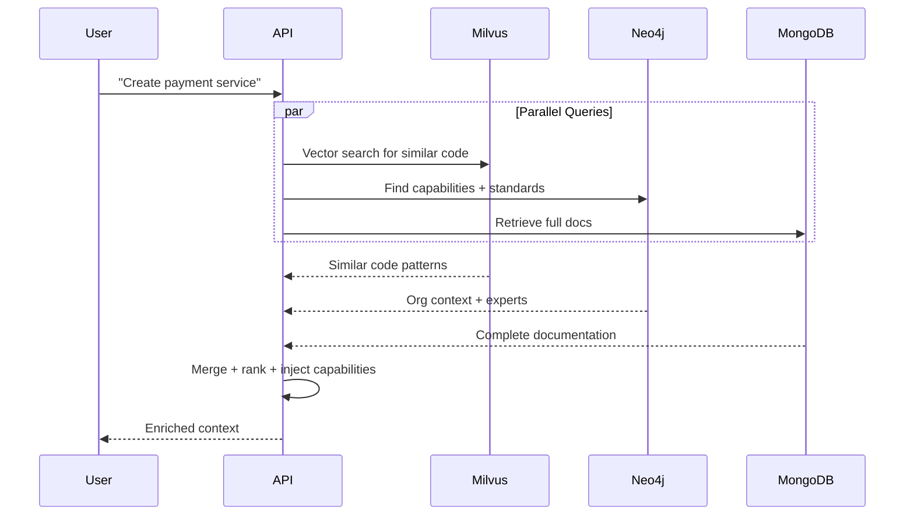

# SDLC AI Context Store - Simplified Architecture

## 📋 Executive Summary

A **unified Context Store for SDLC AI Platform** that aggregates data from enterprise sources, stores it in a tri-store architecture (Vector DB + Document Store + Knowledge Graph), and enables intelligent, context-aware code generation through RAG.

### Key Objectives

- **Unified Context**: Aggregate data from 13+ SDLC sources
- **Smart Retrieval**: Semantic search + relationship traversal + full documents
- **Real-Time**: Stream changes with minimal latency
- **Context-Aware AI**: Generate code that follows organizational standards
- **Connected Experience**: Understand relationships between all SDLC entities

---

## 🎯 Problem & Solution

**Problem**: Context scattered across tools, manual gathering wastes 30-40% of developer time, AI generates generic code without org context

**Solution**: Unified context fabric that connects all SDLC data through three complementary storage systems

---

## 🏗️ Simplified Architecture



---

## 🔧 Component Details

### 1. Data Sources (13+)

| Category | Tools | What We Capture |
|----------|-------|-----------------|
| **Code & VCS** | GitHub, GitLab | Commits, PRs, files, dependencies, code patterns |
| **Project Mgmt** | Jira, Azure DevOps | Issues, epics, sprints, stories |
| **Documentation** | Confluence, SharePoint | Wiki pages, API docs, runbooks, decisions |
| **CI/CD** | Jenkins, GitHub Actions | Pipelines, builds, tests, deployments |
| **Infrastructure** | Kubernetes, AWS/Azure | Services, clusters, environments, configs |
| **Security** | Snyk, SonarQube | Vulnerabilities, code quality, SAST |
| **Monitoring** | Datadog, Prometheus | Incidents, alerts, metrics, logs |
| **Organization** | HR Systems, LDAP | Teams, people, roles, capabilities, skills |

**Ingestion**: Webhooks (real-time) + REST APIs (polling) + CDC (database changes)

---

### 2. Data Pipeline (Apache Beam + Flink)

**Flow**: Ingest → Clean → Enrich → Chunk → Embed → Extract Entities/Relationships → Store

**Key Operations**:

- **Entity Extraction**: Identify people, teams, components, services, issues, commits
- **Relationship Mapping**: Connect entities (Person→authored→Commit→closes→Issue)
- **Deduplication**: Merge duplicate entities across sources
- **Embedding Generation**: Create vectors for semantic search
- **Quality Validation**: Ensure data completeness

---

### 3. Storage Layer - Context Fabric (Tri-Store)

#### A. Milvus (Vector DB) - Semantic Search 🔍

**Purpose**: Fast similarity search for "find me similar code/docs"

```yaml
Collections:
  code_embeddings:       # 768-dim (CodeBERT)
  doc_embeddings:        # 1024-dim (BGE-large)
  conversation_embeddings: # 768-dim (MPNet)

Index: HNSW (fast approximate search)
Metric: Cosine similarity
```

**Example Query**: "Find similar payment service implementations" → Returns top 20 most similar code snippets

#### B. MongoDB (Document Store) - Full Content 📄

**Purpose**: Store complete, unmodified documents with metadata

```javascript
{
  _id: "commit-abc123",
  type: "commit",
  content: {
    message: "Add payment service",
    author: "john@company.com",
    files: ["PaymentService.java"],
    diff: "..."
  },
  metadata: {
    repository: "backend-services",
    team: "payments",
    timestamp: "2025-10-20T10:00:00Z"
  },
  links: {
    graph_id: "commit-abc123",     // Link to Neo4j node
    vector_id: "vec-456"            // Link to Milvus vector
  }
}
```

#### C. Neo4j (Knowledge Graph) - Relationships 🕸️

**Purpose**: Model connections between entities for impact analysis, root cause tracing, capability discovery

**Core Entities**:

```
Organizations: Teams, People, Roles, Capabilities, Skills
Code: Repositories, Commits, PRs, Files, Dependencies
Projects: Products, Components, Features, Issues
Infrastructure: Services, Environments, Deployments, Clusters
Operations: Incidents, Alerts, Changes, Monitors
```

**Key Relationships**:

```cypher
(Person)-[:AUTHORED]->(Commit)-[:MODIFIES]->(File)
(Commit)-[:CLOSES]->(Issue)
(Component)-[:DEPENDS_ON]->(Component)
(Team)-[:OWNS]->(Component)
(Team)-[:HAS_CAPABILITY]->(Capability)
(Capability)-[:REQUIRES]->(Skill)
(Service)-[:RUNS_IN]->(Environment)
(Deployment)-[:CAUSED]->(Incident)
(Person)-[:HAS_SKILL]->(Technology)
```

**Why Knowledge Graph in the Flow?**

1. **Impact Analysis**: Query "What's affected by dependency X upgrade?" → Traverse dependency graph
2. **Root Cause**: Trace incident back through: Incident→Service→Deployment→Build→Commit→Author
3. **Expertise Finding**: "Who knows Kubernetes?" → Query (Person)-[:HAS_SKILL]->(Kubernetes)
4. **Capability Injection**: When generating code, inject org's capabilities, standards, tech stack from graph
5. **Compliance**: Complete audit trail by following relationship chains

**Example Graph Query**:

```cypher
// Find all services affected by a vulnerable dependency
MATCH (vuln:Vulnerability {cve: 'CVE-2023-XXXX'})
  <-[:HAS_VULNERABILITY]-(dep:Dependency)
  <-[:DEPENDS_ON]-(comp:Component)
  -[:DEPLOYED_AS]->(svc:Service)
  -[:RUNS_IN]->(env:Environment)
MATCH (comp)-[:OWNED_BY]->(team:Team)
RETURN svc.name, env.name, team.name, comp.criticality
ORDER BY comp.criticality DESC
```

---

### 4. Unified Query Layer

**Single API** that queries all three stores in parallel and merges results:

```yaml
POST /api/v1/context/query

Request:
  query: "Create a payment processing service"
  include_context: true

Response:
  # 1. Vector Search → Similar code
  similar_code:
    - content: "public class PaymentService {...}"
      similarity: 0.92
      source: "backend-services/payment-gateway"
      
  # 2. Graph Context → Org standards + capabilities
  organizational_context:
    team_capabilities:
      - name: "Payment Processing"
        maturity_level: 4
        standards: ["PCI DSS", "REST API Guidelines v2.0"]
    approved_tech_stack:
      - {name: "Java", version: "17", status: "adopt"}
      - {name: "Spring Boot", version: "3.x", status: "adopt"}
    similar_components:
      - {name: "payment-gateway-service", team: "payments"}
    experts:
      - {name: "John Doe", skills: ["Payment APIs", "Java", "Spring"]}
    
  # 3. Document Store → Full documentation
  documentation:
    - title: "Payment Service Architecture"
      type: "confluence"
      url: "https://wiki.company.com/payment-arch"
      content: "..."
```

**Query Flow**:



---

### 5. RAG - Context-Aware Code Generation

**Pipeline**:

1. **Parse Intent**: Understand what user wants to build
2. **Multi-Store Retrieval**: Query vector + graph + docs in parallel
3. **Context Assembly**:
   - Similar code from Milvus
   - Org standards & capabilities from Neo4j
   - Full documentation from MongoDB
4. **Capability Injection**: Add org's approved tech stack, patterns, standards
5. **LLM Generation**: Generate code with full context
6. **Validation**: Check against org policies

**Result**: Code that automatically follows organizational standards

````markdown
User: "Create a payment service"

AI Output:
✅ Uses approved tech (Java 17 + Spring Boot 3.x) - from graph
✅ Follows REST API guidelines v2.0 - from graph
✅ Includes PCI DSS compliance measures - from capabilities
✅ References internal payment-gateway-service - from graph similarity
✅ Uses team-specific error handling patterns - from vector search
✅ Proper logging per org standards - from documentation
````

---

## 💡 Knowledge Graph Use Cases

### Use Case 1: Impact Analysis

**Question**: "If I upgrade log4j, what services are affected?"

```cypher
MATCH (dep:Dependency {name: 'log4j'})-[:USED_BY*1..5]->(comp:Component)
  -[:DEPLOYED_AS]->(svc:Service)-[:RUNS_IN]->(env:Environment)
MATCH (comp)-[:OWNED_BY]->(team:Team)
RETURN svc.name, env.name, team.name, count(comp) as affected_components
ORDER BY affected_components DESC
```

**Output**: List of all affected services, environments, and teams to notify

### Use Case 2: Root Cause Analysis

**Question**: "What caused incident INC-2025-001?"

```cypher
MATCH path=(inc:Incident {id: 'INC-2025-001'})
  -[:AFFECTS]->(svc:Service)
  <-[:DEPLOYED]-(deploy:Deployment)
  <-[:FROM]-(build:Build)
  <-[:PART_OF]-(commit:Commit)
  -[:AUTHORED_BY]->(person:Person)
MATCH (commit)-[:MODIFIES]->(file:File)
RETURN person.name, commit.message, collect(file.path), deploy.timestamp
```

**Output**: Complete trace from incident → service → deployment → commit → author → files changed

### Use Case 3: Expertise Discovery

**Question**: "Who can help with Kubernetes and payment services?"

```cypher
MATCH (person:Person)-[:HAS_SKILL]->(skill:Skill {name: 'Kubernetes'})
MATCH (person)-[:MEMBER_OF]->(team:Team)-[:OWNS]->(comp:Component)
WHERE comp.domain = 'payments'
RETURN person.name, person.email, team.name, count(comp) as experience
ORDER BY experience DESC
```

**Output**: Ranked list of experts with Kubernetes skills who work on payment systems

### Use Case 4: Compliance Audit

**Question**: "Show complete audit trail for release v2.5.0"

```cypher
MATCH path=(release:Release {version: 'v2.5.0'})
  -[:CONTAINS]->(deploy:Deployment)
  -[:DEPLOYS]->(artifact:Artifact)
  -[:FROM]->(build:Build)
  -[:FROM]->(commit:Commit)
MATCH (commit)-[:AUTHORED_BY]->(author:Person)
MATCH (pr:PullRequest)-[:CONTAINS]->(commit)
MATCH (pr)-[:REVIEWED_BY]->(reviewer:Person)
MATCH (commit)-[:CLOSES]->(issue:Issue)
RETURN collect({
  commit: commit.sha,
  author: author.name,
  reviewer: reviewer.name,
  issue: issue.id,
  timestamp: commit.timestamp
})
```

**Output**: Complete lineage with authors, reviewers, issues, approvals

---

## 💰 Cost Estimation (Monthly)

| Component | Configuration | Cost | Purpose |
|-----------|--------------|------|---------|
| Kafka Cluster | 3 nodes (r5.2xlarge) | $2,400 | Event streaming |
| Flink on EKS | 10 nodes (c5.4xlarge) | $4,800 | Pipeline processing |
| **Milvus Cluster** | 5 nodes (r5.4xlarge) | $6,000 | Vector search |
| **MongoDB Atlas** | M60 cluster | $3,500 | Document store |
| **Neo4j Knowledge Graph** | 3 nodes (r5.2xlarge) | $2,190 | Graph queries |
| **Neo4j Storage** | 1TB SSD | $100 | Graph persistence |
| Redis Cache | 3 nodes (r5.xlarge) | $1,200 | Query caching |
| S3 Storage | 10TB | $230 | Backups |
| Monitoring | CloudWatch + Prometheus | $500 | Observability |
| **Total** | | **~$21,000/month** | **~$252K/year** |

**Optimization**: Reserved instances save ~30% (~$6K/month)

---

## 🛠️ Implementation Roadmap (20 weeks)

### Phase 1: Foundation (Weeks 1-4)

- Deploy Kafka + Flink + Milvus + MongoDB + **Neo4j**
- Build pipeline for 3 data sources (GitHub, Jira, Confluence)
- **Define initial graph schema** (core entities + relationships)

### Phase 2: Data Integration (Weeks 5-8)

- Add remaining 10 data sources
- Implement **entity extraction** and **relationship mapping**
- Build **graph construction pipeline**
- Populate Neo4j with entities and relationships

### Phase 3: Unified Retrieval (Weeks 9-12)

- Build unified query API (vector + graph + document)
- Implement **graph traversal** for impact analysis
- Add **capability-aware context injection**
- Implement caching layer

### Phase 4: RAG Integration (Weeks 13-16)

- Integrate LLM (GPT-4 Turbo / Claude 3 Opus)
- Build **graph-enhanced RAG pipeline**
- Implement **organizational context injection** from graph
- Add feedback and quality evaluation

### Phase 5: Production (Weeks 17-20)

- Security hardening (auth, encryption, RBAC)
- **Graph-based access control**
- Comprehensive monitoring
- Documentation and training
- Launch! 🚀

---

## 🎯 Key Benefits

### 1. Connected SDLC Experience

Knowledge Graph connects everything:

```
Code ← → Teams ← → Capabilities ← → Standards ← → Projects ← → Deployments ← → Incidents
```

**Result**: AI understands the **full context** of your organization

### 2. Organizational Context Injection

AI automatically includes:

- ✅ Your team's capabilities and maturity levels
- ✅ Your approved tech stack and standards
- ✅ Your specific patterns and practices
- ✅ Your team's expertise and past solutions

**Result**: Generated code follows **your organization's standards**, not generic best practices

### 3. Instant Impact Analysis

Graph queries answer complex questions in seconds:

- "What's affected by this change?" → Dependency traversal
- "Who needs to be notified?" → Team ownership queries
- "What's the blast radius?" → Service dependency graph

**Result**: Proactive risk management

### 4. Fast Root Cause Analysis

Trace issues through complete chains:

```
Incident → Service → Deployment → Build → Commit → Author → Files
```

**Result**: Resolve incidents 10x faster

### 5. Expertise Discovery

Find the right people instantly:

- "Who knows technology X?"
- "Which team has capability Y?"
- "Who's worked on similar problems?"

**Result**: Faster problem resolution, better collaboration

---

## 📊 Expected ROI

- **10x faster** incident resolution (graph-based root cause)
- **50% reduction** in code generation time (context-aware AI)
- **80% improvement** in code quality (org-specific patterns)
- **5x faster** impact analysis (graph traversal vs manual)
- **30% reduction** in duplicate work (cross-team knowledge sharing)
- **Compliance ready** with complete audit trails

---

## 📋 Summary

This SDLC AI Context Store uses a **tri-store architecture**:

1. **Milvus** for semantic similarity ("find me similar code")
2. **MongoDB** for complete documents ("get full content")
3. **Neo4j** for relationships ("how are things connected?")

**Knowledge Graph is integrated into the flow** at every layer:

- **Pipeline**: Extract entities and relationships during ingestion
- **Storage**: Neo4j sits alongside Milvus and MongoDB as part of the unified context fabric
- **Query**: Graph traversal queries run in parallel with vector and document searches
- **RAG**: Organizational context from graph is automatically injected into AI prompts

**Result**: AI that understands your organization's context, standards, and relationships, generating code that fits seamlessly into your architecture.

---

**Next Steps**:

1. Review and approve architecture
2. Set up infrastructure (Week 1-2)
3. Build initial pipeline with 3 sources (Week 3-4)
4. Iterate and expand (Week 5-20)
5. Launch! 🚀

---

*Document Version: 2.0 Simplified*  
*Last Updated: 2025-10-20*  
*Status: Simplified with integrated Knowledge Graph*
