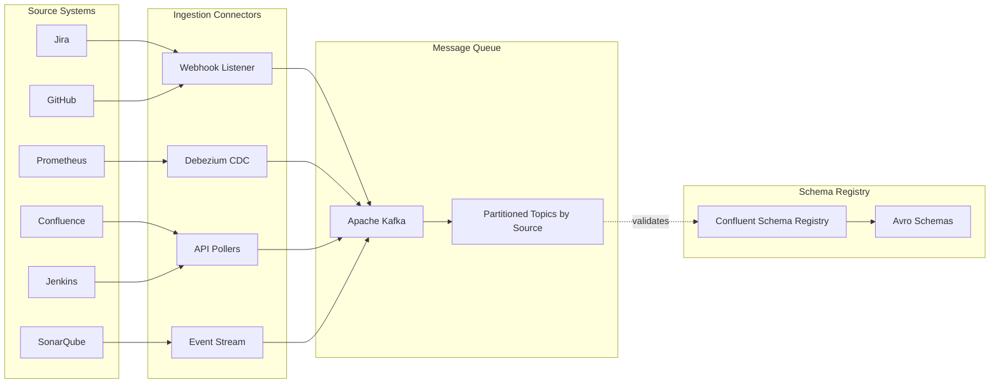
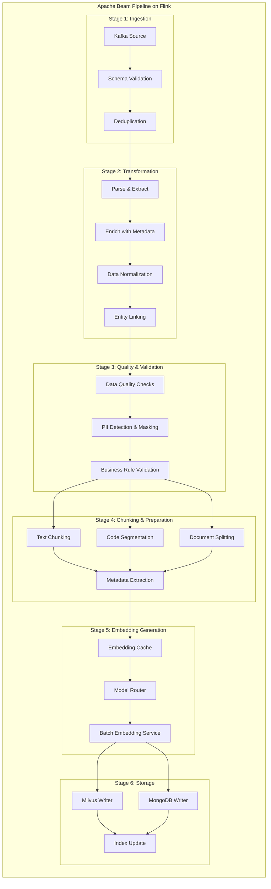
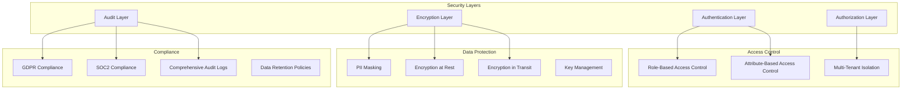
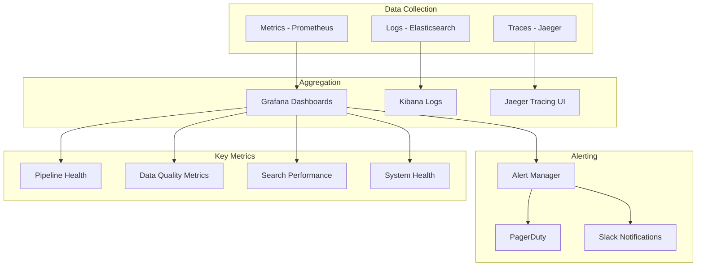
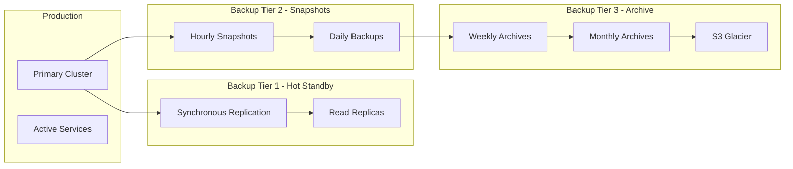

# SDLC AI Context Store - Architecture Proposal

## 📋 Executive Summary

This proposal outlines the design and implementation strategy for building a **comprehensive Context Store for an SDLC AI Platform**. The system aggregates context information from various enterprise data sources, processes them through a robust data pipeline, and stores them in optimized storage layers (vector database and document store) to enable advanced RAG (Retrieval-Augmented Generation) capabilities for code generation and SDLC automation.

### Key Objectives

- **Unified Context Management**: Aggregate data from 10+ enterprise SDLC data sources
- **Intelligent Retrieval**: Enable semantic search and context-aware information retrieval
- **Real-Time Processing**: Stream data changes with minimal latency
- **Scalable Architecture**: Handle enterprise-scale data volumes and query loads
- **Multi-Modal Storage**: Optimize storage based on data characteristics and access patterns

---

## 🎯 Problem Statement

### Current Challenges

- **Scattered Context**: SDLC information dispersed across multiple disconnected systems
- **Manual Context Gathering**: Developers spend significant time searching for relevant information
- **Stale Information**: Lack of real-time synchronization leads to outdated context
- **Inefficient Code Generation**: AI systems lack comprehensive organizational context
- **Knowledge Silos**: Team knowledge trapped in individual tools and systems
- **Poor AI Accuracy**: Limited context results in generic, less useful AI-generated outputs

### Business Impact

- **Developer Productivity Loss**: 30-40% of developer time spent on information gathering
- **Inconsistent AI Outputs**: Low-quality code generation due to missing context
- **Onboarding Delays**: New team members struggle to understand project context
- **Technical Debt**: Lack of historical context leads to repeated mistakes
- **Compliance Risks**: Incomplete audit trails and change tracking

---

## 🏗️ High-Level Architecture

### System Overview with Knowledge Graph


### Architecture Principles

1. **Event-Driven**: Real-time data synchronization using CDC and webhooks
2. **Decoupled Components**: Microservices architecture for independent scaling
3. **Idempotent Processing**: Safe retry mechanisms for data pipeline
4. **Multi-Tenant**: Support for multiple organizations and projects
5. **Security First**: End-to-end encryption, RBAC, and audit logging
6. **Graph-Native**: Knowledge graph at the core for connected experiences
7. **Context Fabric**: Unified layer integrating vector, document, and graph stores

---

## 🔧 Detailed Component Architecture

### 1. Data Sources Layer

#### Source Categories & Characteristics

| Data Source | Usecase | Type | Update Frequency | Data Volume | Access Method |
|-------------|---------|------|------------------|-------------|---------------|
| **Application Portfolio** | Application Discovery | Structured | Daily | Medium | REST API |
| **ALM Systems** | Application Lifecycle Management | Structured | Hourly | Medium | REST API / CDC |
| **Team Registry** | Team Management | Structured | Weekly | Low | REST API |
| **Org Hierarchy** | Organizational Structure | Structured | Monthly | Low | REST API |
| **Jira/Project Mgmt** | Project Tracking | Semi-Structured | Real-time | High | Webhook + REST API |
| **GitHub/GitLab** | Code Repository | Structured + Unstructured | Real-time | Very High | Webhook + GraphQL |
| **Confluence/Docs** | Documentation | Unstructured | Hourly | High | REST API |
| **CI/CD Pipelines** | Continuous Integration | Time-Series | Real-time | High | Webhook + API |
| **DevSecOps Tools** | Security Scanning | Structured | Real-time | Medium | API / Webhook |
| **Test Automation** | Automated Testing | Structured | Per Build | High | API |
| **Release Management** | Release Orchestration | Structured | Daily | Medium | API |
| **Change Management** | Change Tracking | Structured | Daily | Medium | API |
| **Observability** | Application Monitoring | Real-time | Very High | Metrics | API |
| **Incident Management** | Incident Tracking | Structured | Real-time | Medium | Webhook + API |
| **Infrastructure** | Cloud/Infra Context | Structured | Daily | Medium | API |
| **Application Dependency Mapping** | Dependency Analysis | Structured | Weekly | Medium | API |

### 2. Data Ingestion Architecture



### 3. Data Pipeline - Apache Beam on Flink

#### Why Apache Beam + Flink?

**Apache Beam Benefits:**
- Unified batch and streaming model
- Portable across multiple runners (Flink, Spark, Dataflow)
- Rich windowing and state management
- Built-in data quality and monitoring

**Apache Flink as Runner:**
- True streaming with low latency (< 100ms)
- Exactly-once processing semantics
- Advanced state management
- High throughput and scalability

**Alternative Considerations:**
- **Apache Spark Structured Streaming**: Good for batch-heavy workloads, but higher latency
- **Apache Kafka Streams**: Simpler but less portable and limited to Kafka
- **Recommendation**: Stick with **Apache Beam + Flink** for best balance of features and performance

#### Pipeline Architecture


---

## 📊 Data Pipeline Implementation Details

### Apache Beam Pipeline Code Structure

```python
# High-level Pipeline Structure
import apache_beam as beam
from apache_beam.options.pipeline_options import PipelineOptions

class ContextStorePipeline:
    """Main pipeline for processing SDLC data"""
    
    def __init__(self, options: PipelineOptions):
        self.options = options
        self.pipeline = beam.Pipeline(options=options)
    
    def build(self):
        """Build the complete pipeline"""
        
        # Stage 1: Read from Kafka
        raw_data = (
            self.pipeline
            | 'Read from Kafka' >> beam.io.ReadFromKafka(
                consumer_config={'bootstrap.servers': 'kafka:9092'},
                topics=['sdlc-events'],
                with_metadata=True
            )
        )
        
        # Stage 2: Parse and Validate
        validated_data = (
            raw_data
            | 'Parse Messages' >> beam.ParDo(ParseMessage())
            | 'Validate Schema' >> beam.ParDo(ValidateSchema())
            | 'Filter Invalid' >> beam.Filter(lambda x: x.is_valid)
        )
        
        # Stage 3: Enrich and Transform
        enriched_data = (
            validated_data
            | 'Enrich Metadata' >> beam.ParDo(EnrichMetadata())
            | 'Normalize Data' >> beam.ParDo(NormalizeData())
            | 'Link Entities' >> beam.ParDo(EntityLinker())
        )
        
        # Stage 4: Chunk and Prepare
        chunked_data = (
            enriched_data
            | 'Chunk Content' >> beam.ParDo(ChunkContent())
            | 'Extract Metadata' >> beam.ParDo(ExtractMetadata())
        )
        
        # Stage 5: Generate Embeddings
        embedded_data = (
            chunked_data
            | 'Batch for Embedding' >> beam.BatchElements(
                min_batch_size=32, max_batch_size=256
            )
            | 'Generate Embeddings' >> beam.ParDo(GenerateEmbeddings())
        )
        
        # Stage 6: Write to Storage
        _ = (
            embedded_data
            | 'Prepare Vector Data' >> beam.ParDo(PrepareVectorData())
            | 'Write to Milvus' >> beam.ParDo(MilvusWriter())
        )
        
        _ = (
            embedded_data
            | 'Prepare Document Data' >> beam.ParDo(PrepareDocumentData())
            | 'Write to MongoDB' >> beam.io.WriteToMongoDB(
                uri='mongodb://mongo:27017',
                db='sdlc_context',
                coll='artifacts'
            )
        )
        
        return self.pipeline
```

### Flink Configuration for Production

```yaml
# Flink Job Configuration
flink_config:
  jobmanager:
    memory: "2048m"
    cpu: 2
    
  taskmanager:
    memory: "4096m"
    cpu: 4
    slots: 4
    replicas: 5
    
  parallelism:
    default: 20
    max: 100
    
  checkpointing:
    enabled: true
    interval: 60000  # 1 minute
    mode: EXACTLY_ONCE
    timeout: 600000
    
  state:
    backend: rocksdb
    checkpoints_dir: "s3://checkpoints/sdlc-pipeline"
    savepoints_dir: "s3://savepoints/sdlc-pipeline"
    
  restart_strategy:
    type: fixed-delay
    attempts: 3
    delay: 10000
```

---

## 🔐 Security & Compliance

### Security Architecture



## 📚 References & Further Reading

1. Apache Beam Documentation: <https://beam.apache.org/>
2. Apache Flink Documentation: <https://flink.apache.org/>
3. Milvus Documentation: <https://milvus.io/docs>
4. Neo4j Graph Database: <https://neo4j.com/docs/>
5. Sentence Transformers: <https://www.sbert.net/>
6. LangChain RAG Guide: <https://python.langchain.com/docs/use_cases/question_answering/>
7. Neo4j Graph Data Science: <https://neo4j.com/docs/graph-data-science/>
8. Knowledge Graphs for AI: <https://arxiv.org/abs/2003.02320>

---

**Document Version**: 2.0  
**Last Updated**: 2025-01-14  
**Status**: Extended with Knowledge Graph Architecture  
**Author**: SDLC AI Platform Team

### Monthly Infrastructure Costs (AWS-based)

| Component | Configuration | Monthly Cost | Notes |
|-----------|--------------|--------------|-------|
| **Kafka Cluster** | 3 nodes (r5.2xlarge) | $2,400 | Event streaming |
| **Flink on EKS** | 10 nodes (c5.4xlarge) | $4,800 | Pipeline processing |
| **Milvus Cluster** | 5 nodes (r5.4xlarge) | $6,000 | Vector database |
| **MongoDB Atlas** | M60 cluster | $3,500 | Document store |
| **Neo4j Graph DB** | 3-node cluster (r5.2xlarge) | $2,190 | Knowledge graph |
| **Neo4j Storage (EBS)** | 1 TB SSD | $100 | Graph persistence |
| **Redis Cluster** | 3 nodes (r5.xlarge) | $1,200 | Caching layer |
| **Load Balancers** | ALB + NLB | $200 | Traffic distribution |
| **S3 Storage** | 10TB | $230 | Backups and artifacts |
| **Data Transfer** | 5TB/month | $450 | Network egress |
| **CloudWatch** | Logs + Metrics | $300 | Monitoring |
| **Embedding APIs** | OpenAI/Cohere | $1,000 | If using external APIs |
| **Total** | | **~$22,370** | Enterprise scale with KG |

**Cost Optimization Options**:

- Self-hosted embedding models: Save $1,000/month
- Reserved instances: Save 30-40% (~$6,700/month)
- Spot instances for non-critical workers: Save 60-70% (~$2,000/month)
- Regional optimization: Vary by location
- Graph query caching: Reduce Neo4j load by 60%, potentially downsize cluster
- Vector quantization: Reduce Milvus storage by 50%

---

## 📊 Monitoring & Observability

### Monitoring Architecture



### Key Performance Indicators (KPIs)

1. **Data Pipeline KPIs**
   - Events processed per second
   - Pipeline lag (time behind real-time)
   - Error rate and retry count
   - Data quality score

2. **Storage KPIs**
   - Vector insertion rate
   - Storage utilization
   - Index build time
   - Query response time

3. **Search & Retrieval KPIs**
   - Search latency (P50, P95, P99)
   - Search relevance score
   - Cache hit rate
   - Query throughput

4. **RAG & AI KPIs**
   - Response generation time
   - Context relevance score
   - User satisfaction rating
   - AI hallucination rate

---

## 🔄 Data Lifecycle Management

### Data Retention Policies

```yaml
retention_policies:
  hot_storage:
    vector_embeddings:
      duration: 90_days
      storage: "Milvus in-memory"
    
    documents:
      duration: 180_days
      storage: "MongoDB SSD"
    
  warm_storage:
    vector_embeddings:
      duration: 365_days
      storage: "Milvus disk-based"
    
    documents:
      duration: 730_days
      storage: "MongoDB HDD"
    
  cold_storage:
    archives:
      duration: 7_years
      storage: "S3 Glacier"
      compression: true
    
  deletion:
    pii_data:
      on_request: true
      auto_deletion: 30_days_after_employee_exit
    
    temp_data:
      duration: 7_days
```

---

## 🚨 Disaster Recovery & Business Continuity

### Backup Strategy



### Recovery Time Objectives (RTO) & Recovery Point Objectives (RPO)

| Scenario | RTO | RPO | Recovery Strategy |
|----------|-----|-----|-------------------|
| **Single Node Failure** | < 5 minutes | 0 | Automatic failover to replica |
| **AZ Failure** | < 15 minutes | < 1 minute | Multi-AZ deployment |
| **Region Failure** | < 2 hours | < 5 minutes | Cross-region replication |
| **Data Corruption** | < 4 hours | < 1 hour | Point-in-time recovery |
| **Complete Disaster** | < 24 hours | < 1 day | Full backup restoration |

---

## 📝 API Documentation

### Core API Endpoints

```yaml
api_endpoints:
  # Context Query API
  POST /api/v1/context/query:
    description: "Query context store with semantic search"
    request:
      query: string
      filters: object
      top_k: integer
      include_metadata: boolean
    response:
      results: array
      metadata: object
      execution_time_ms: integer
  
  # RAG Generation API
  POST /api/v1/rag/generate:
    description: "Generate response using RAG"
    request:
      prompt: string
      context_filters: object
      model: string
      max_tokens: integer
    response:
      generated_text: string
      context_used: array
      confidence_score: float
  
  # Data Ingestion API
  POST /api/v1/ingest/event:
    description: "Ingest custom SDLC events"
    request:
      source: string
      event_type: string
      data: object
      timestamp: datetime
    response:
      event_id: string
      status: string
  
  # Health & Metrics API
  GET /api/v1/health:
    description: "System health check"
    response:
      status: string
      components: object
      version: string
  
  GET /api/v1/metrics:
    description: "System metrics"
    response:
      pipeline_metrics: object
      storage_metrics: object
      search_metrics: object
```

---

## 🎓 Best Practices & Recommendations

### Data Pipeline Best Practices

1. **Idempotency**: Ensure all pipeline operations are idempotent
2. **Incremental Processing**: Use watermarks and windowing for efficiency
3. **Error Handling**: Implement dead letter queues for failed messages
4. **Monitoring**: Add comprehensive metrics at every stage
5. **Testing**: Unit test transformations, integration test full pipeline

### Vector Database Best Practices

1. **Index Selection**: Choose appropriate index type based on data size and query patterns
2. **Batch Operations**: Use batch inserts for better performance
3. **Partition Strategy**: Partition by tenant/project for isolation
4. **Memory Management**: Monitor memory usage and adjust cache sizes
5. **Regular Maintenance**: Schedule index optimization and compaction

### RAG Best Practices

1. **Context Relevance**: Always validate retrieved context relevance
2. **Prompt Engineering**: Continuously refine prompts based on feedback
3. **Fallback Strategies**: Have fallback for when context is insufficient
4. **Response Validation**: Implement response quality checks
5. **User Feedback**: Collect and act on user feedback

---

## 🔮 Future Enhancements

### Phase 2 Enhancements (6-12 months)

1. **Advanced AI Capabilities**
   - Multi-agent systems for complex tasks
   - Automated code review and suggestions
   - Predictive analytics for SDLC bottlenecks
   - Automated test generation

2. **Enhanced Context Understanding**
   - Graph neural networks for relationship extraction
   - Temporal context tracking (how things change over time)
   - Cross-project learning and pattern recognition
   - Automated documentation generation

3. **Integration Expansion**
   - Additional data sources (Slack, Teams, etc.)
   - Third-party AI model integrations
   - Custom plugin architecture
   - Mobile and IDE integrations

4. **Performance Optimization**
   - GPU-accelerated embedding generation
   - Distributed vector search
   - Adaptive caching strategies
   - Edge computing for low-latency regions

---

## 📚 Appendix

### A. Technology Stack Summary

```yaml
technology_stack:
  data_ingestion:
    - Apache Kafka
    - Debezium CDC
    - Custom API connectors
    
  data_processing:
    - Apache Beam 2.52+
    - Apache Flink 1.18+
    - Python 3.11+
    
  storage:
    vector_db: Milvus 2.3+
    document_db: MongoDB 7.0+
    cache: Redis 7.2+
    time_series: InfluxDB 2.7+
    
  embedding_models:
    code: microsoft/codebert-base
    text: BAAI/bge-large-en-v1.5
    multimodal: openai/clip-vit-large-patch14
    
  search:
    - Milvus vector search
    - Elasticsearch (BM25)
    - Custom re-ranking
    
  ai_models:
    - GPT-4 Turbo
    - Claude 3 Opus
    - Llama 2 70B (self-hosted option)
    
  infrastructure:
    orchestration: Kubernetes 1.28+
    cloud: AWS / Azure / GCP
    iac: Terraform
    ci_cd: GitHub Actions
    
  monitoring:
    metrics: Prometheus + Grafana
    logs: Elasticsearch + Kibana
    traces: Jaeger
    apm: Datadog
```

### B. Glossary

- **RAG**: Retrieval-Augmented Generation - AI technique combining retrieval and generation
- **CDC**: Change Data Capture - Method to track database changes
- **ANN**: Approximate Nearest Neighbor - Efficient similarity search algorithm
- **HNSW**: Hierarchical Navigable Small World - Graph-based ANN algorithm
- **BM25**: Best Match 25 - Ranking function for keyword search
- **Embedding**: Dense vector representation of data
- **Vector Database**: Database optimized for similarity search on vectors
- **Semantic Search**: Search based on meaning rather than keywords

### C. References

1. Apache Beam Documentation: https://beam.apache.org/
2. Apache Flink Documentation: https://flink.apache.org/
3. Milvus Documentation: https://milvus.io/docs
4. Sentence Transformers: https://www.sbert.net/
5. LangChain RAG Guide: https://python.langchain.com/docs/use_cases/question_answering/

---

## 🤝 Next Steps & Iteration Plan

### Immediate Actions Required

1. **Review & Feedback**
   - Review this proposal with stakeholders
   - Identify any missing data sources
   - Confirm technology choices
   - Define success criteria

2. **Deep-Dive Sessions**
   - Data source access and authentication
   - Embedding model selection and testing
   - LLM selection and API access
   - Infrastructure provisioning

3. **POC Planning**
   - Select 3 data sources for POC
   - Define POC success metrics
   - Set up development environment
   - Create POC timeline (2-3 weeks)

### Questions for Next Iteration

1. **Data Sources**
   - Are there additional data sources we need to include?
   - What are the authentication mechanisms for each source?
   - What is the expected data volume from each source?

2. **Performance Requirements**
   - What are the expected query loads?
   - What is the acceptable latency for different operations?
   - How many concurrent users will the system support?

3. **Integration Requirements**
   - Which systems need to integrate with the context store?
   - What API formats are preferred?
   - Are there existing authentication systems to integrate with?

4. **Compliance & Security**
   - What compliance requirements must we meet?
   - Are there data residency requirements?
   - What is the data retention policy?

---

**Document Version**: 1.0  
**Last Updated**: October 20, 2025  
**Author**: AI Architecture Team  
**Status**: Draft for Review

---

*This is a living document and will be updated iteratively based on feedback and implementation progress.*
