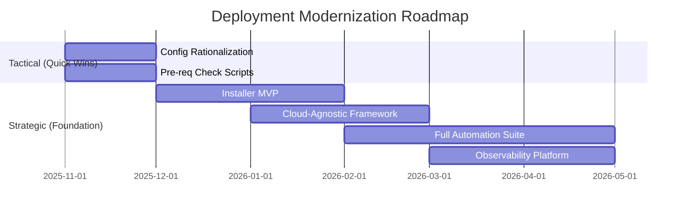
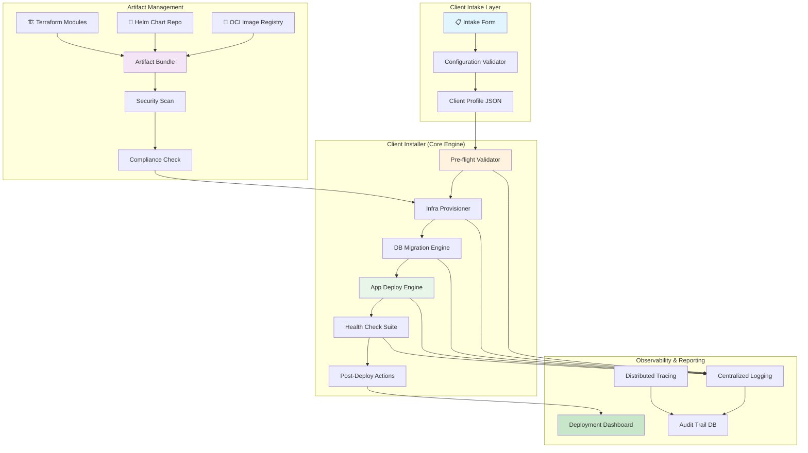
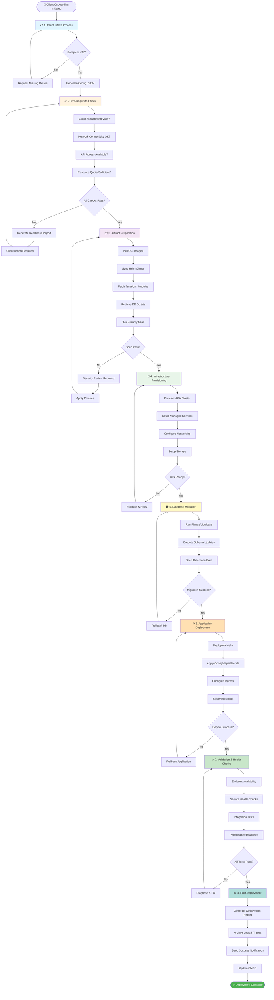
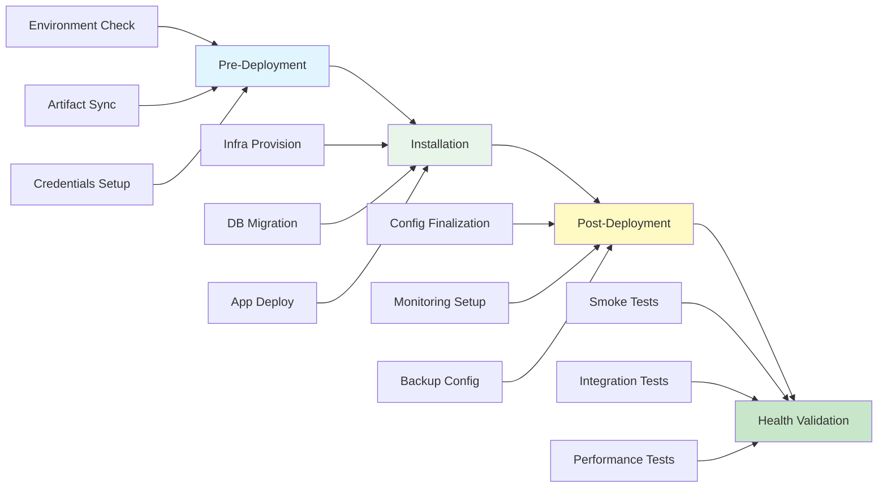
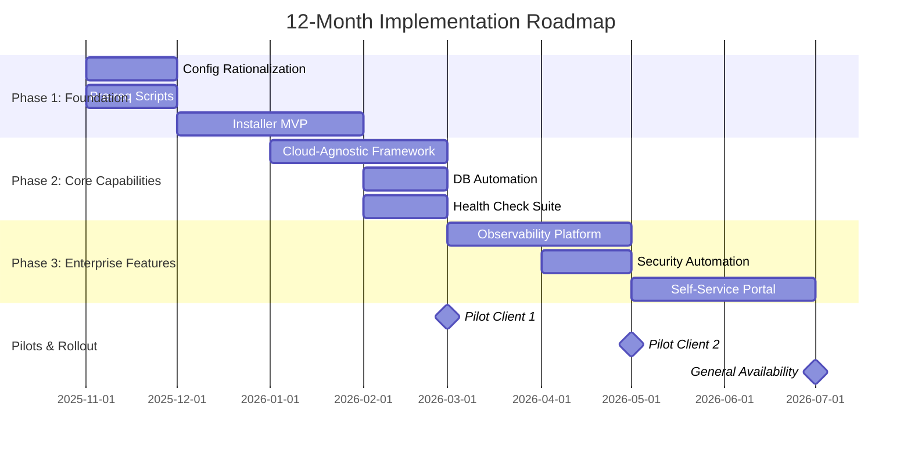

# 🚀  Enterprise Deployment Strategy

## Client Installation & Deployment Modernization Initiative

## 🎯 Executive Summary

### The Opportunity

**Goal**: Transform  client deployments from manual, time-consuming processes into a unified, automated, and cloud-agnostic installation experience.

**Business Impact**:

- 📉 Reduce deployment time from **days to hours**
- 🎯 Achieve **95%+ first-time success rate**
- 💰 Lower deployment costs by **40%**
- ⚡ Accelerate time-to-value for clients
- 🛡️ Eliminate manual errors and security risks

**North Star Vision**: *"One command, one framework — every client deployment across any cloud, any environment."*

---

## 1️⃣ Problem Statement

### Current State: The Deployment Challenge

Today,  client deployments face significant challenges:

#### Operational Complexity

- **Manual, error-prone processes** requiring multiple engineering touch-points
- **Inconsistent deployment experiences** across client environments
- **Extended onboarding cycles** lasting weeks instead of days
- **Custom configurations** for each cloud provider (AWS, Azure, GCP, on-prem)
- **No standardized validation** or health-check framework

#### Business Impact

| Impact Area | Current State | Business Consequence |
|-------------|---------------|---------------------|
| **Time-to-Deploy** | 5-10 days average | Delayed revenue recognition, client frustration |
| **Engineering Overhead** | 80-120 hours per deployment | High operational cost, team burnout |
| **Error Rate** | 30-40% require rework | Reputational risk, increased support burden |
| **Scalability** | Limited by manual processes | Cannot scale with business growth |
| **Compliance** | Manual audit trails | Regulatory risk, failed audits |
| **Client Satisfaction** | Inconsistent experience | Lower NPS, contract risk |

#### Technical Debt

- Lack of pre-requisite validation automation
- No unified artifact distribution mechanism
- Manual infrastructure provisioning steps
- Inconsistent database migration processes
- Limited observability and rollback capabilities
- Missing security and compliance automation

### The Cost of Inaction

Without modernization,  deployments will continue to:

- ❌ Consume disproportionate engineering resources
- ❌ Create bottlenecks in sales-to-delivery pipeline
- ❌ Increase risk exposure (security, compliance, operational)
- ❌ Limit our ability to scale with market demand
- ❌ Impact client satisfaction and renewal rates

---

## 2️⃣ Strategic Approach

### Dual-Track Strategy

We propose a **tactical + strategic approach** to deliver immediate value while building long-term capability:



---

### 2.1 Tactical Approach (0-3 Months)

**Goal**: Deliver immediate relief and quick wins while building momentum

#### Initiative 1: Application Configuration Rationalization

- **Objective**: Standardize and simplify configuration management
- **Actions**:
  - Audit all configuration files across environments
  - Consolidate into environment-specific templates
  - Implement configuration validation scripts
  - Create standardized naming conventions
- **Timeline**: 4 weeks
- **Impact**: 30% reduction in configuration errors

#### Initiative 2: Automated Pre-Requisite Checking

- **Objective**: Validate environment readiness before deployment
- **Actions**:
  - Build pre-flight check scripts for:
    - Cloud subscription validation (AWS/Azure/GCP)
    - Network connectivity and firewall rules
    - Required service availability (OpenAI API, databases)
    - Credential and permission verification
    - Resource quota and capacity checks
  - Generate pre-deployment readiness reports
- **Timeline**: 6 weeks
- **Impact**: Eliminate 50% of deployment failures

**Tactical Deliverables**:

- ✅ Standardized configuration templates
- ✅ Pre-requisite validation toolkit
- ✅ Environment readiness dashboard
- ✅ Quick-start deployment guides

---

### 2.2 Strategic Approach (3-12 Months)

**Goal**: Build enterprise-grade, cloud-agnostic deployment platform

#### Vision: The North Star

> *"A dump-installer enabling single-click, holistic client deployments — not piecemeal scripts, but an integrated platform."*

#### Design Principles

| Principle | Definition | Business Value |
|-----------|------------|----------------|
| **🌐 Cloud Agnostic** | Single codebase works across AWS, Azure, GCP, on-prem K8s | Flexibility, vendor independence, market reach |
| **⚡ Full Automation** | End-to-end automation: pre-, install-, post-deployment, health checks | Speed, consistency, reduced human error |
| **🔄 Idempotent Execution** | Safe to re-run; resumes from failures gracefully | Reliability, operational confidence |
| **🔒 Compliance & Security by Design** | Built-in scanning, audit logging, credential governance | Risk mitigation, regulatory compliance |
| **👁️ Observability First** | Every action logged, traced, and reported | Transparency, troubleshooting, audit trails |
| **📦 Self-Contained Delivery** | All dependencies bundled (Terraform, Helm, images) | Works in air-gapped environments, no external dependencies |

---

## 3️⃣ Architecture & Workflow

### High-Level Architecture



---

### End-to-End Deployment Workflow



---

### Workflow Phase Details

#### Phase 1: Streamlined Client Intake

**Objective**: Capture all required information upfront — no back-and-forth

- **Standardized Intake Form** covering:
  - ☁️ Cloud provider selection (AWS, Azure, GCP, on-prem)
  - 🔑 Subscription IDs and API keys
  - 🌐 Network requirements (VPN, whitelisting, firewall rules)
  - 🔐 Security and compliance requirements
  - 📊 Resource requirements (CPU, memory, storage)
  - 🤖 External service dependencies (OpenAI, third-party APIs)

- **Output**: Client Intake Configuration File (JSON format)
- **Timeline**: Complete within first client call (1 hour)

#### Phase 2: Artifact Distribution & Compliance

**Objective**: Permanently share production-ready artifacts with built-in security

- **OCI-Compliant Image Strategy**:
  - 🐳 Publish to DockerHub / GitHub Container Registry
  - 🔄 Enable client registry mirroring
  - 🛡️ Automated security scanning (Trivy, Snyk)
  - ✅ Pass through compliance pipeline before release

- **Version Control & Traceability**:
  - 📦 Helm Charts versioned in GitHub
  - 🏗️ Terraform modules with semantic versioning
  - 💾 Database scripts with migration versioning
  - 🔖 Git tags for every release

- **Distribution Mechanism**:
  - Public: DockerHub, GitHub Packages
  - Private: Client-specific registries
  - Air-gapped: Bundled artifact packages

#### Phase 3: Automated Installation

**Objective**: Single-command deployment handling fresh installs and upgrades

- **Custom Installer Capabilities**:
  - ✅ Fresh environment installations
  - ✅ In-place upgrades with zero downtime
  - ✅ Environment-specific configurations
  - ✅ Rollback to previous versions
  - ✅ Disaster recovery procedures

#### Phase 4: Validation & Health Checks

**Objective**: Ensure deployment success through comprehensive testing

- **Validation Suite**:
  - 🔍 Endpoint availability checks
  - 🏥 Service health monitoring
  - 🔗 Integration test execution
  - 📈 Performance baseline validation
  - 🛡️ Security posture verification
  - 📋 Audit trail generation

---

## 4️⃣ Key Building Blocks

### 4.1 Pre-Requisite Checker Scripts

**Purpose**: Validate environment readiness before deployment

**Capabilities**:

```yaml
Validation Checks:
  Cloud Infrastructure:
    - Subscription/account validity
    - API quota and rate limits
    - Required services enabled
    
  Network Configuration:
    - VPN connectivity
    - DNS resolution
    - Firewall rules configured
    - Load balancer availability
    
  Access & Credentials:
    - Service principal permissions
    - API key validity
    - Certificate expiration
    - Secret management setup
    
  Resource Capacity:
    - CPU/memory quotas
    - Storage availability
    - Database capacity
    - Network bandwidth
    
  Dependencies:
    - External API accessibility (OpenAI, etc.)
    - Third-party service health
    - Required software versions
```

**Output**: Pre-Deployment Readiness Report (JSON/PDF)

---

### 4.2 The Client Installer (Core Product)

**Technology Stack**: Go-based, Kubernetes-native CLI

**Architecture**:

```plaintext
┌─────────────────────────────────────────────────────────┐
│                   Client Installer CLI                  │
│                    (Single Binary)                      │
├─────────────────────────────────────────────────────────┤
│  Command Layer                                          │
│  ├─ setup          ├─ deploy       ├─ e2e-test         │
│  ├─ package-pull   ├─ post-validate                    │
│  ├─ provision-infra├─ install (orchestrator)           │
│  └─ db-migrate                                          │
├─────────────────────────────────────────────────────────┤
│  Core Engine Modules                                    │
│  ├─ Config Loader     ├─ Terraform Manager             │
│  ├─ Artifact Manager  ├─ Helm Deployer                 │
│  ├─ DB Migration      ├─ Health Check Suite            │
│  └─ Progress Tracker  └─ Report Generator              │
├─────────────────────────────────────────────────────────┤
│  Observability Layer                                    │
│  ├─ Structured Logging (Zap)                           │
│  ├─ Distributed Tracing (OpenTelemetry)                │
│  └─ Metrics Collection (Prometheus)                    │
├─────────────────────────────────────────────────────────┤
│  Dependencies (Embedded)                                │
│  ├─ Terraform       ├─ Helm CLI                        │
│  ├─ kubectl         ├─ Flyway/Liquibase                │
│  └─ OCI Image Bundles                                   │
└─────────────────────────────────────────────────────────┘
```

**Key Features**:

- 📦 **Self-Contained**: All dependencies bundled (no external downloads required)
- 🌐 **Cloud-Agnostic**: Works across AWS, Azure, GCP, OpenShift, Rancher
- 🔄 **Idempotent**: Safe to re-run at any stage; resumes from failures
- 🎯 **Config-Driven**: Single JSON/YAML file drives entire deployment
- 🔌 **Non-Interactive**: Suitable for CI/CD pipeline integration
- 🛡️ **Secure**: Credential management, secret encryption, audit logging

**Core Commands**:

| Command | Function | Example |
|---------|----------|---------|
| `setup` | Initialize workspace, validate environment | `./installer setup --config client.json` |
| `package-pull` | Sync images, Helm charts, Terraform modules | `./installer package-pull --version v1.2.3` |
| `provision-infra` | Provision K8s clusters & managed services | `./installer provision-infra --cloud aws` |
| `db-migrate` | Run database migrations (Flyway/Liquibase) | `./installer db-migrate --env production` |
| `deploy` | Install app components & perform health checks | `./installer deploy --namespace ` |
| `post-validate` | Run post-install scripts & housekeeping | `./installer post-validate --report json` |
| `e2e-test` | Execute smoke/E2E tests | `./installer e2e-test --suite full` |
| `install` | **Orchestrate entire workflow end-to-end** | `./installer install --config client.json` |

**Usage Example**:

```bash
# Complete deployment in single command
./-installer install \
  --config /path/to/client-intake.json \
  --env production \
  --cloud aws \
  --region us-east-1 \
  --verbose
```

---

### 4.3 Deployment Automation Scripts

**Components**:

- **Terraform Modules**: Cloud infrastructure provisioning
- **Helm Charts**: Application deployment and configuration
- **Ansible Playbooks**: Configuration management (if needed)
- **Shell Scripts**: Glue logic and orchestration

---

### 4.4 Validation & Health Check Automation

**Test Pyramid**:

```plaintext
              ┌─────────────┐
              │   E2E Tests │  (Comprehensive user flows)
              └─────────────┘
           ┌──────────────────┐
           │ Integration Tests │  (Service interactions)
           └──────────────────┘
      ┌──────────────────────────┐
      │    Health Checks         │  (Endpoint availability)
      └──────────────────────────┘
  ┌──────────────────────────────────┐
  │  Infrastructure Validation       │  (K8s, networking, storage)
  └──────────────────────────────────┘
```

---

### 4.5 Post-Deployment Report Automation

**Report Contents**:

- ✅ Deployment summary (what was deployed, where, when)
- 📊 Health check results (all services green)
- 🔒 Security scan results (vulnerabilities found/fixed)
- 📝 Audit trail (every action logged with timestamps)
- 🎯 Performance baselines (response times, resource usage)
- 📋 Next steps and handoff instructions

**Formats**: JSON, PDF, HTML dashboard

---

## 5️⃣ Post-Deployment Automation

### Database Migration Strategy

**Tool**: Custom DB Automation Framework (built on Flyway/Liquibase)

**Capabilities**:

- ✅ Schema versioning and migration tracking
- ✅ Rollback to previous schema version
- ✅ Data seeding for reference tables
- ✅ Migration validation and dry-run mode
- ✅ Multi-database support (PostgreSQL, MySQL, SQL Server)

**Integration**:

```bash
# Executed automatically as part of installer
./installer db-migrate \
  --changelog db/changelog-master.xml \
  --env production \
  --dry-run false
```

---

## 6️⃣ Cloud-Agnostic Design

### Multi-Cloud Support Matrix

| Capability | AWS | Azure | GCP | On-Prem K8s |
|------------|-----|-------|-----|-------------|
| **Compute** | EKS | AKS | GKE | OpenShift, Rancher |
| **Database** | RDS, Aurora | Azure SQL | Cloud SQL | PostgreSQL, MySQL |
| **Storage** | S3, EBS | Blob Storage | Cloud Storage | Ceph, NFS |
| **Networking** | VPC, ALB | VNet, App Gateway | VPC, Load Balancer | Ingress Controller |
| **Secrets** | Secrets Manager | Key Vault | Secret Manager | Sealed Secrets |
| **Monitoring** | CloudWatch | Monitor | Cloud Monitoring | Prometheus/Grafana |

**Abstraction Layer**:

- Terraform providers handle cloud-specific differences
- Helm charts remain cloud-agnostic (ConfigMaps for cloud-specific values)
- Installer CLI abstracts provider-specific commands

---

## 7️⃣ Full Automation Lifecycle

### Automation Coverage



---

## 8️⃣ Idempotent Execution

### Design Principles for Reliability

**1. State Management**:

- Maintain deployment state in versioned files (Terraform state, Helm releases)
- Track progress in persistent storage (database or file system)
- Enable resume from last successful step

**2. Failure Handling**:

```python
# Pseudo-code for idempotent execution
for step in deployment_steps:
    if step.already_completed():
        log("Skipping completed step: {}", step.name)
        continue
    
    try:
        step.execute()
        step.mark_complete()
    except Exception as e:
        log("Step failed: {}", step.name)
        if step.is_retriable():
            step.retry_with_backoff()
        else:
            step.rollback()
            raise DeploymentFailure(e)
```

**3. Graceful Resume**:

- Installer can be stopped and restarted without data loss
- Each step checks for completion before executing
- Partial deployments are properly cleaned up or completed

---

## 9️⃣ Compliance & Security by Design

### Built-In Security Features

| Layer | Security Control | Implementation |
|-------|------------------|----------------|
| **Code** | Static analysis | SonarQube, Snyk |
| **Images** | Vulnerability scanning | Trivy, Grype |
| **Secrets** | Credential management | HashiCorp Vault, Cloud KMS |
| **Network** | Encryption in transit | TLS 1.3, mTLS |
| **Storage** | Encryption at rest | Cloud-native encryption |
| **Access** | RBAC | Kubernetes RBAC, IAM policies |
| **Audit** | Logging all actions | Centralized audit logs |

### Compliance Automation

**Pre-Deployment Checks**:

- ✅ Security scanning of all container images
- ✅ License compliance verification
- ✅ Dependency vulnerability assessment

**During Deployment**:

- ✅ Encrypted communication channels
- ✅ Secure credential injection (no plaintext secrets)
- ✅ Audit logging of every action

**Post-Deployment**:

- ✅ Security posture validation
- ✅ Compliance report generation
- ✅ Audit trail archival

---

## 🔟 Observability First

### Three Pillars of Observability

#### 1. Logging

**Structured JSON logs** with:

- Timestamp, severity, component, message
- Trace ID for correlation
- Contextual metadata (client, environment, version)

**Centralized Collection**:

- ELK Stack (Elasticsearch, Logstash, Kibana)
- Cloud-native solutions (CloudWatch, Azure Monitor, Cloud Logging)

#### 2. Tracing

**Distributed Tracing** with OpenTelemetry:

- Track request flow across services
- Identify bottlenecks and failures
- Visualize deployment timeline

#### 3. Metrics

**Key Deployment Metrics**:

- Deployment duration (end-to-end time)
- Step completion times
- Resource utilization
- Error rates and types
- Retry counts

**Dashboards**:

- Real-time deployment progress
- Historical deployment analytics
- Client-specific reports

---

## 1️⃣1️⃣ Engineering Improvements

### DevOps Stack Modernization

| Current State | Target State | Benefit |
|---------------|--------------|---------|
| Self-hosted GitHub Enterprise | **GitHub SaaS Enterprise** | Reduced infra overhead, better uptime, latest features |
| Mixed CI/CD tools | **GitHub Actions (unified)** | Single pane of glass, native integration, faster builds |
| Manual security scans | **Automated shift-left security** | Earlier vulnerability detection, faster remediation |
| Limited observability | **ELK + Prometheus + Grafana** | Real-time insights, proactive issue detection |
| Monolithic deployment | **Modular, pluggable architecture** | Easier to extend, test, and maintain |

### Shift-Left Quality & Security

**Pre-Commit Checks**:

- Code linting (golangci-lint, eslint)
- Unit test execution
- Security scanning (pre-commit hooks)

**CI Pipeline**:

- Automated testing (unit, integration, E2E)
- Container image scanning
- Dependency vulnerability checks
- License compliance validation

**CD Pipeline**:

- Automated deployment to staging
- Smoke tests and health checks
- Performance benchmarking
- Rollback on failure

---

## 1️⃣2️⃣ Implementation Plan

### Phased Rollout Strategy



### Phase 1: Foundation (Months 1-3)

**Goal**: Deliver tactical improvements and MVP installer

**Deliverables**:

- ✅ Configuration rationalization complete
- ✅ Pre-requisite checking scripts deployed
- ✅ Installer MVP with basic commands (`setup`, `provision-infra`, `deploy`)
- ✅ Support for AWS (primary cloud)

**Success Criteria**:

- 30% reduction in configuration errors
- 50% reduction in pre-deployment failures
- First successful automated deployment

### Phase 2: Core Capabilities (Months 4-6)

**Goal**: Expand cloud support and add automation features

**Deliverables**:

- ✅ Multi-cloud support (AWS, Azure, GCP)
- ✅ Database migration automation
- ✅ Comprehensive health check suite
- ✅ Rollback capabilities

**Success Criteria**:

- 3 successful pilot deployments
- 70% reduction in manual interventions
- 95% first-time success rate

### Phase 3: Enterprise Features (Months 7-12)

**Goal**: Add observability, security, and self-service capabilities

**Deliverables**:

- ✅ Centralized logging and tracing
- ✅ Security scanning automation
- ✅ Self-service deployment portal
- ✅ Comprehensive documentation

**Success Criteria**:

- 10+ successful client deployments
- 40% reduction in deployment time
- 90+ NPS from clients

---

## 1️⃣3️⃣ Resource Requirements & Ask

### Team Composition

**Core Team** (Full-Time):

- 1x Engineering Lead (Architect & PM)
- 2x Senior Backend Engineers (Go, Kubernetes)
- 1x DevOps Engineer (Terraform, Helm, CI/CD)
- 1x QA Engineer (Automation, E2E testing)

**Extended Team** (Part-Time):

- 1x Security Engineer (20%, scanning & compliance)
- 1x Technical Writer (20%, documentation)
- 1x UX Designer (10%, self-service portal)

**Total FTE**: ~5.5 people

### Budget Estimate

| Category | Year 1 Cost | Notes |
|----------|-------------|-------|
| **Engineering Team** | $800K | 5.5 FTE fully loaded |
| **Cloud Infrastructure** | $50K | Dev/test environments |
| **Tooling & Licenses** | $30K | GitHub Actions, monitoring tools |
| **Pilot Support** | $40K | Travel, client engagement |
| **Contingency (15%)** | $135K | Risk buffer |
| **Total** | **$1.055M** | Year 1 investment |

### Leadership Support Required

**From SVP/GVP/EVP**:

1. ✅ **Executive Sponsorship** - Champion this initiative at leadership level
2. ✅ **Budget Approval** - Secure $1.055M Year 1 funding
3. ✅ **Resource Allocation** - Dedicate 5.5 FTE to this initiative
4. ✅ **Cross-Functional Collaboration** - Enable partnership with Security, Compliance, Client Delivery teams
5. ✅ **Strategic Alignment** - Position this as reference architecture
6. ✅ **Pilot Client Selection** - Identify 2-3 strategic clients for pilots

---

## 1️⃣4️⃣ Recommendations

### Immediate Actions (Next 30 Days)

1. **Secure Executive Approval**
   - Present this proposal to SVP/GVP/EVP leadership
   - Obtain budget and resource commitment
   - Establish governance structure

2. **Form Cross-Functional Task Force**
   - Engineering (lead)
   - DevOps
   - Security & Compliance
   - Client Delivery
   - Product Management

3. **Kick Off Phase 1**
   - Start configuration rationalization
   - Build pre-requisite checking scripts
   - Begin installer MVP development

4. **Select Pilot Clients**
   - Identify 2-3 strategic clients
   - Diverse cloud providers (AWS, Azure, GCP)
   - Mix of fresh install and upgrade scenarios

5. **Establish Success Metrics**
   - Baseline current deployment metrics
   - Define OKRs for each phase
   - Set up monitoring and reporting

### Strategic Recommendations

1. **Institutionalize the Installer**
   - Make this the **standard deployment tool** for all  projects
   - Deprecate manual deployment processes within 12 months

2. **Publish as Reference Architecture**
   - Position as **best practice** for enterprise deployments
   - Share learnings across other product lines
   - Contribute to open-source community (where appropriate)

3. **Build Center of Excellence**
   - Establish deployment automation expertise
   - Train teams across the organization
   - Host regular knowledge-sharing sessions
   - Create reusable components for other products

4. **Invest in Observability**
   - Treat deployment telemetry as first-class data
   - Build predictive analytics for deployment success
   - Enable continuous improvement through data

---

## 1️⃣5️⃣ Expected Benefits & ROI

### Quantitative Benefits

| Metric | Current State | Target State | Improvement |
|--------|---------------|--------------|-------------|
| **Deployment Time** | 5-10 days | < 4 hours | **95% reduction** |
| **Manual Effort** | 80-120 hours | 8-12 hours | **90% reduction** |
| **First-Time Success** | 60-70% | 95%+ | **+35% improvement** |
| **Deployment Cost** | ~$15K/client | ~$2K/client | **87% reduction** |
| **Time-to-Value** | 2-3 weeks | 1-2 days | **10x faster** |
| **Annual Savings** | - | $780K | (60 deployments/year) |

### Qualitative Benefits

**For Engineering**:

- ⚡ Freed up for feature development (not deployment firefighting)
- 🧠 Knowledge retention (automated processes, not tribal knowledge)
- 😊 Improved team morale (less toil, more innovation)

**For Clients**:

- 🚀 Rapid onboarding and faster time-to-value
- ✅ Predictable deployment experience
- 🔒 Enhanced security and compliance posture
- 💰 Lower total cost of ownership

**For Business**:

- 📈 Scalability to support business growth
- 💼 Competitive differentiation in the market
- ⭐ Improved client satisfaction and retention
- 🏆 Reference architecture for the organization

### Return on Investment

**Investment**: $1.055M (Year 1)  
**Annual Savings**: $780K (deployment cost reduction)  
**Payback Period**: **16 months**

**3-Year NPV** (assuming 20% growth in deployments):

- Year 1: -$275K (net of savings)
- Year 2: +$936K
- Year 3: +$1.123M
- **Total 3-Year NPV**: **$1.784M**

---

## 1️⃣6️⃣ Success Metrics & KPIs

### Deployment Efficiency

- **Deployment Duration**: < 4 hours (from 5-10 days)
- **Manual Interventions**: < 5 per deployment (from 20-30)
- **First-Time Success Rate**: > 95%
- **Rollback Rate**: < 2%

### Quality & Reliability

- **Post-Deployment Issues**: < 1 per 10 deployments
- **Mean Time to Recovery (MTTR)**: < 30 minutes
- **Configuration Errors**: < 1% (from 30%)
- **Security Vulnerabilities**: 0 critical/high in production

### Business Impact

- **Client Satisfaction (NPS)**: +30 points improvement
- **Engineering Efficiency**: 40% time saved on deployments
- **Cost Per Deployment**: < $2K (from $15K)
- **Scalability**: Support 100+ deployments/year (from 60)

### Adoption & Usage

- **Installer Adoption Rate**: 100% of new deployments by Month 12
- **Documentation Completeness**: 100% coverage of common scenarios
- **Training Completion**: 100% of deployment engineers certified

---

## 1️⃣7️⃣ Risk Mitigation

### Identified Risks & Mitigations

| Risk | Impact | Probability | Mitigation Strategy |
|------|--------|-------------|---------------------|
| **Resource Constraints** | High | Medium | Secure executive commitment early; build phased rollout for flexibility |
| **Technology Complexity** | Medium | Medium | Leverage proven tools (Terraform, Helm); extensive testing in dev/staging |
| **Client Resistance** | Medium | Low | Pilot with friendly clients; demonstrate ROI early; provide escape hatches |
| **Cloud Provider Changes** | Low | Medium | Modular architecture; version lock dependencies; continuous monitoring |
| **Security Vulnerabilities** | High | Low | Shift-left security; automated scanning; regular audits |
| **Scope Creep** | Medium | High | Strict phase gates; clear MVP definition; defer nice-to-haves |

---

## 🎯 Conclusion

### The Path Forward

's growth and success depend on our ability to deliver consistent, reliable, and fast client deployments. The current manual, inconsistent approach is not sustainable as we scale.

**This initiative represents**:

- ✅ **Strategic investment** in operational excellence
- ✅ **Competitive advantage** through automation
- ✅ **Foundation** for future growth
- ✅ **Reference architecture** for the Organization

### The Ask

We request **leadership approval** to:

1. Fund $1.055M Year 1 investment
2. Allocate 5.5 FTE to this initiative
3. Select 2-3 pilot clients for validation
4. Establish this as the standard deployment framework

### The Promise

In return, we commit to delivering:

- ✅ **95% reduction** in deployment time (days → hours)
- ✅ **90% reduction** in manual effort
- ✅ **$780K annual savings** in deployment costs
- ✅ **reference architecture** for enterprise deployments

---

**Next Steps**: Schedule executive review meeting to discuss approval and kickoff.

---

## 📚 Appendix

### A. Glossary

| Term | Definition |
|------|------------|
| **Dump-Installer** | Single-click deployment tool that handles end-to-end installation |
| **Idempotent** | Safe to re-run multiple times with same result |
| **OCI** | Open Container Initiative - standard for container images |
| **Air-Gapped** | Environment with no internet connectivity |
| **Shift-Left** | Moving quality/security checks earlier in development cycle |

### B. References

- [Kubernetes Best Practices](https://kubernetes.io/docs/concepts/configuration/overview/)
- [Terraform Documentation](https://www.terraform.io/docs)
- [Helm Documentation](https://helm.sh/docs/)
- [CNCF Cloud Native Landscape](https://landscape.cncf.io/)