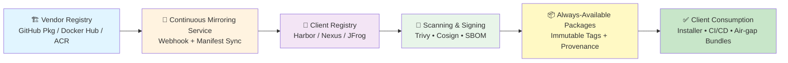

# 🛫 Slide 2 — Always-Available, Always-Trusted Artifacts

**Subtitle**: Make every version accessible and compliant — continuously mirrored, scanned, and signed for enterprise trust.

---

## 🎯 High-Level Narrative

The challenge isn't just artifact integrity — it's **secure, continuous delivery of trusted artifacts** to each client.

We eliminate dependency on vendor connectivity by building a **permanent mirroring & sharing model** for OCI-compliant assets.

Clients always have the latest verified images and charts locally, regardless of air-gap or network policy.

The installer and pipeline consume these artifacts directly, ensuring **reproducibility and compliance with zero drift**.

---

## 🧩 High-Level Approach

| Area | Objective | Outcome |
|------|-----------|---------|
| **Artifact Mirroring** | Continuously replicate OCI images from vendor (GitHub Pkg / Docker Hub / Azure ACR) → client registries | Latest versions always available, even offline |
| **Version Governance** | Tag and store immutable versions per release; maintain retention window and changelog | Full traceability of deployed assets |
| **Provenance & Signing** | Attach SBOM + Cosign signatures + build metadata to each version | Tamper-proof audit trail |
| **Client Access Model** | Allow secure registry pull with client credentials or installer-managed token | Seamless access in CI/CD or CLI |
| **Compliance Integration** | Embed scan + approval steps in vendor and client pipelines | Audit-ready artifact lineage |

---

## ⚙️ Detailed Approach

### 1️⃣ Continuous Vendor-to-Client Sync

- Host all official Slingshot images in **GitHub Packages** or **Docker Hub**
- Implement webhook-triggered mirroring to push every new tag to client registries (Harbor, Nexus, JFrog)
- Maintain a version manifest (`manifest.json`) that lists digests, SBOM links, and release notes

### 2️⃣ Always-On Version Availability

- Each release image and Helm chart is **immutable**, semantically versioned (`vX.Y.Z`)
- Provide a **"latest stable"** and **"LTS"** tag stream for production clients
- Offline bundle generation for air-gapped clients (`tar.gz` export of OCI layers + Helm + Terraform)

### 3️⃣ Security & Provenance Pipeline

- Run **Trivy scans** on publish; sign results via **Cosign + Fulcio** key chain
- Publish **SBOM** (SPDX / CycloneDX) to the same registry namespace
- Include **provenance JSON** (attestations, commit SHA, build timestamp)

### 4️⃣ Shared Access & Governance

- Clients authenticate via **registry tokens** or **OIDC-based access**
- The installer validates signatures and version manifests before pulling
- Client **SecOps dashboards** display compliance state per artifact

---

## 📈 Mini-Diagram (Visual Flow)

---

*This approach ensures clients have uninterrupted access to trusted, compliant artifacts while maintaining enterprise-grade security and auditability.*